<p align="right">
  🌐 <a href="README.md">Español</a> · <b>English</b>
</p>

<p align="center">
  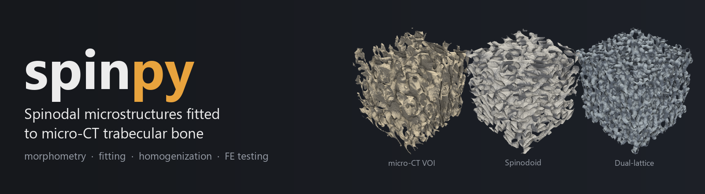
</p>

<p align="center">
  
  
  
  
  
  
  
</p>

<p align="center">
  <b>From micro-CT to mechanical model, saying how much each number is worth.</b><br>
  <a href="#what-it-does">What it does</a> ·
  <a href="#the-application-in-motion">Demo</a> ·
  <a href="#installation">Installation</a> ·
  <a href="#usage">Usage</a> ·
  <a href="#validation-against-published-results">Validation</a> ·
  <a href="#citing">Citing</a>
</p>

---

**spinpy** fits **spinodal** (and *dual-lattice*) microstructures to
**trabecular bone** volumes of interest obtained by micro-computed
tomography, and then measures and tests them: morphometry, elastic
homogenization, finite-element compression testing and a publication-ready
report. It is the Python port of the numerical half of `AppFinal_V2.m`,
verified against analytical solutions and against the original MATLAB
implementation.

Developed on equine sesamoid bones scanned at 51.489 µm, with support also
for porcine, mouse-vertebra and femur volumes.

<table>
<tr>
<td>

```
micro-CT TIFF stack
 → segmentation, PCA framing
 → cubic VOI
 → morphometry
     BV/TV, Tb.Th, DA, Conn.D,
     SMI, Ellipsoid Factor
 → fit: spinodoid
     or dual-lattice
 → elastic homogenization
 → FE compression test
     von Mises, Pistoia
 → report and export
     PDF, STL, VTU, Abaqus, ANSYS, FEBio
```

</td>
<td align="center">

</td>
</tr>
</table>

---

## The application in motion

The animations are screen captures of the interface itself pressing its own
buttons, and they are regenerated with
`python docs/media/hacer_medios.py --idioma en`: they are not mock-ups.

### 1 · Exploring the design space

Density, wave number and the three cone angles define the structure. Every
change is regenerated on the spot, from the isotropic class to the columnar,
the lamellar or one fitted to a real bone.

<p align="center">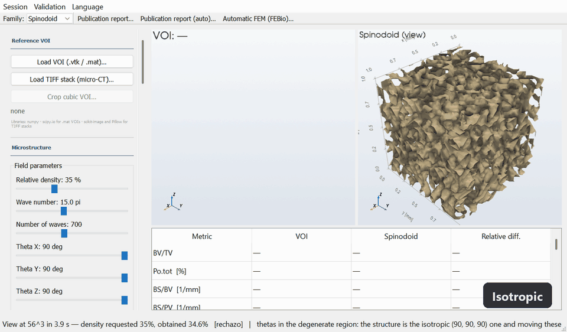</p>

### 2 · Fitting to the micro-CT VOI

The VOI is loaded (`.vtk`, `.mat`, a folder of TIFF slices or a multipage
TIFF), the microstructure is fitted by a staged search, and the table
compares bone and candidate metric by metric. Both views rotate in sync.

<p align="center">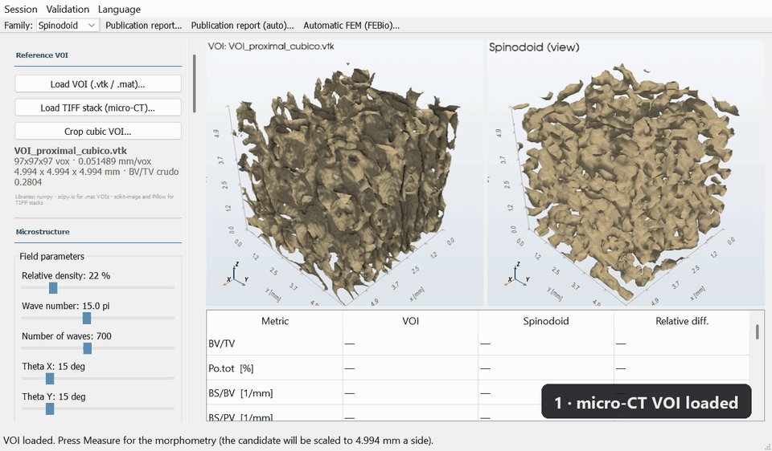</p>

### 3 · Compression testing

Finite-element test along X, Y, Z or all three axes, with effective-strain
and von Mises stress fields, **on the same colour scale for the bone and the
candidate**, and failure load by the Pistoia criterion.

<p align="center">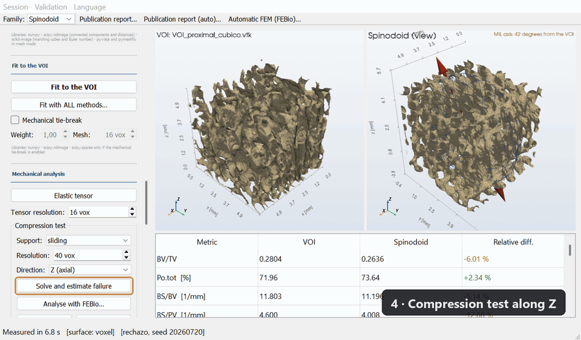</p>

---

## What it does

| Stage | What it includes |
|---|---|
| **Reads** | `.vtk` and `.mat` VOIs, and micro-CT TIFF stacks (folder of slices or multipage) with the scale read from the SkyScan *log*. Thresholds, frames by PCA and crops the cube. |
| **Generates** | Spinodoids from a Gaussian random field (Kumar et al. 2020), with both wave-sampling conventions found in the literature, and *dual-lattice* (Vafaeefar et al. 2022). |
| **Measures** | BV/TV, BS/BV, BS/PV, Tb.Th, Tb.Sp, Tb.N, MIL tensor and DA, Conn.D, SMI, local thickness, pore size, **Ellipsoid Factor** and principal curvatures of the interface. |
| **Fits** | The parameters that best reproduce a real VOI: staged search, replicas with fresh seeds, self-consistent noise floor and optional mechanical tie-break. |
| **Homogenizes** | The elastic tensor by periodic unit cell on the voxel grid, with algebraic multigrid and a residual check. |
| **Tests** | Compression along X, Y or Z with von Mises, effective-strain and displacement fields; Pistoia failure; mesh-convergence study. |
| **Simulates** | *In silico* bone loss (thinning, thin-trabeculae loss, disuse, recovery) and progressive failure on the VOI's digital twin. |
| **Reports** | A publication report in Spanish and English (Markdown and PDF): methods written from the values actually used, 600 dpi figures, a citability table and a SHA-256 fingerprint to reproduce each mask. |
| **Exports** | Hexahedral or TET10 solid to Abaqus, ANSYS APDL, VTU and STL, and the full compression test to FEBio 4 (`.feb`). |
| **Batch processing** | Decomposes variance between and within specimens, with ICC, effective N and equivalence by TOST. |

All of it with a graphical interface (`visor.py`) or from Python.

---

## What sets it apart

Most bone-morphometry tools give a number. This one also says **how much
that number is worth**:

- **Verification against manufactured solutions**, not only against another
  program: spheres, cylinders and plates with a known analytical answer,
  Backus averaging for the elastic tensor, and the MIL tensor against
  geometries of exact anisotropy.
- **Biases are measured and reported next to the number.** Local thickness
  underestimates by ~30 % at 3-4 voxels; SMI carries a −15 % discretization
  bias and is confounded by concavity; MIL has a noise floor of DA ≈ 1.07.
  The interface shows this where the value is read.
- **What is not citable is said so.** The maximum of a von Mises field does
  not converge with the mesh, so the report cites the p99 of the surface
  layer and marks every value as *citable*, *with reservations* or *not
  citable*.
- **The generator is stochastic, and that is measured**, not assumed: the
  same parameters with K seeds give the noise floor below which no difference
  means anything.
- **Replicas do not inflate N.** The statistics module computes the
  effective N and puts it before the number of rows, because treating K
  replicas as K specimens is pseudoreplication.
- **Every saved number carries its provenance**: version, family, scheme,
  seed and the wave number with both its readings, so that an exported result
  can be regenerated bit for bit.

---

## Installation

### Without Python: Windows executable

For those who only want to **use** the application there is a 64-bit
executable that needs neither Python nor any dependency. It installs into the
user's folder and **does not ask for an administrator password**, which is
what a university computer requires.

| Executable | |
|---|---|
| Installed | ~650 MB |
| Installer / zip | ~220-300 MB |
| Saves to | `Documents\spinpy` (not deleted on uninstall) |
| Licence | **GPL-3.0** (see below) |

If something does not work on a given computer, the start menu has a
shortcut **"spinpy - autocomprobación"** (self-test): it exercises every
computation path one by one and leaves a report in
`Documents/spinpy/autocomprobacion.txt`. That is what to send for diagnosis.
It can also be launched from the console:

```
spinpy.exe --autocomprobacion
```

To rebuild it, `instalador/construir.ps1` runs the whole process, and
`instalador/LEEME_DESARROLLO.md` explains the packaging pitfalls (in
Spanish).

### With Python: as a library

```
pip install -e .
```

The core only needs `numpy`, `scipy`, `scikit-image` and `pyvista`. The
extras are installed as needed:

```
pip install -e ".[elastico]"   # multigrid: homogenization and FE test
pip install -e ".[malla]"      # TET10 meshing
pip install -e ".[lote]"       # batch and statistics
pip install -e ".[gui]"        # graphical interface
pip install -e ".[informe]"    # report PDF and figures
pip install -e ".[todo]"       # everything
```

`pyamg` is listed as an extra, but it is not optional in practice: without
it the solver falls back to conjugate gradient with Jacobi, which does not
converge with the 10⁻⁶ contrast between bone and void.

---

## Usage

Graphical interface:

```
python visor.py
```

The panels follow the order of the work: reference VOI, microstructure,
visualization, morphometry, fitting, mechanical analysis, *in silico*
simulations, export and batch. The **"Publication report (auto)…"** button
chains every stage and estimates beforehand how long it will take.

### Language

The interface is in **Spanish and English** and is switched from the
*Language* menu without rebuilding the window: the loaded VOI, the metrics
and the fields are kept. Metric names (BV/TV, Tb.Th, DA, SMI…) are
deliberately not translated: they are international notation (Bouxsein et
al. 2010).

After touching any text, run the dictionary checker:

```
python idioma_revisar.py
```

### From Python

The API is in Spanish, like the rest of the code:

```python
from spinpy import leer_voi, morfometria, ajustar_spinodoide

VOI, spacing = leer_voi("VOI_medio_cubico.vtk")
m = morfometria(VOI, spacing, extra=True)
print(m["BVTV"], m["TbTh"], m["DA"], m["ConnD"])

r = ajustar_spinodoide(VOI, spacing, modo="completo")
print(r["parametros"], r["error"])
```

### Command line

```
spinpy-lote folder_with_VOIs --replicas 20 --salida results
spinpy-informe resultados_sesion.json        # rebuilds the report from a JSON
```

---

## Validation against published results

The method `spinpy` implements **is not ours**: it is that of Kumar et al.
(2020). The `Test/` folder exists to prove it, placing the published figure
next to the same figure regenerated with this code, and evaluating
falsifiable predictions from each article:

| Script | What it checks |
|---|---|
| `replicar_kumar2020.py` | The method: cone union, level set and the four classes. |
| `replicar_zheng2021.py` | Bounds: every elastic surface within Voigt and Hashin-Shtrikman, and the ρ ≥ 0.3 curve. |
| `replicar_guo2024.py` | Curvature: the (κ₁, κ₂) profile against a nodal surface with exact curvatures. |

They are opened from the application in the **Validation** menu, or from
the console:

```
python Test/replicar_kumar2020.py            # full, ~7 min
python Test/replicar_kumar2020.py --rapido   # ~1.5 min
```

> Kumar, S., Tan, S., Zheng, L., & Kochmann, D. M. (2020). Inverse-designed
> spinodoid metamaterials. *npj Computational Materials, 6*, 73.
> https://doi.org/10.1038/s41524-020-0341-6 — open access under CC BY 4.0,
> which is what allows its figure to be reproduced here with attribution.
> Provenance of every reference figure in `Test/referencia/FUENTES.md`.

---

## Verification

```
python -m pytest tests/ -q
```

22 blocks with tolerances **declared before measuring**: topology, SMI,
thickness, mechanics, Pistoia, TIFF stacks, curvature, Ellipsoid Factor,
*dual-lattice*, provenance, objective function, MIL sampling, report, von
Mises surface layer… A failure here is a finding, not a bug in the suite:
blocks 04 and 05 have known, documented failures.

Against the original MATLAB implementation (`validar_*.py`, reference
outputs in `resultados/`):

| What is checked | Result |
|---|---|
| Morphometry on real VOIs | 5.9 × 10⁻¹⁴ % in everything that does not go through marching cubes |
| Elastic tensor against Backus averaging | 2.7 × 10⁻¹⁵ relative difference |
| Error function, over 1173 pairs | 3.55 × 10⁻¹⁶ |
| Fit search grids | exact |
| von Mises under uniaxial stress | 1.000000000000 |

---

## Comparison with BoneJ

Checked against BoneJ 7.2.2 on the same volumes:

- **BV/TV agrees to machine precision**: both tools see the same mask.
- **BS differs by up to 46 %, and it is a difference of convention**: BoneJ
  closes the surface against the volume boundary and spinpy does not,
  because the cube faces are the VOI's artificial cut. With the convention
  matched, the difference drops to ±6 %.
- **DA uses different scales** in the two tools, although both agree on the
  ranking of the specimens.
- **SMI cannot be compared**: BoneJ withdrew it in version 2, for the same
  criticism of confounding with concavity that spinpy documents.

And something that changes how to read all of the above: **segmentation
uncertainty is an order of magnitude larger than the differences between
implementations.** Moving the threshold by ±15 % moves Tb.Th by 62 %, against
the ±6 % separating the two tools.

---

## Comparison with FEBio

Every mechanical analysis of the application has been solved again,
independently, with **FEBio 4.5** (Maas et al. 2012), the reference
finite-element program in biomechanics. Two campaigns:

| | structures | what was checked | report (Spanish) |
|---|---|---|---|
| **Equine H4** | 3 VOIs (BV/TV 0.28–0.77) at 32³ and 48³ + a spinodoid | the compression test | [`comparativa_febio/INFORME.pdf`](comparativa_febio/INFORME.pdf) |
| **Porcine V1** | the VOI and **both candidates fitted to it** in one session (spinodoid and *dual-lattice*) | **every** mechanical analysis of the app | [`comparativa_febio/porcino/INFORME.pdf`](comparativa_febio/porcino/INFORME.pdf) |

### The same problem, two programs

For the comparison to measure anything, both programs must solve **the same
discrete problem**, not a similar one. The app's exporter
(`escribe.escribir_febio`) writes the same mesh —one hexahedron per
load-bearing voxel, node for node—, the same support, the same load over the
gross section and the same material; FEBio solves it with Newton and a direct
factorization (Pardiso), and spinpy with algebraic multigrid and conjugate
gradient. Derived quantities (von Mises p99 on the surface layer, Pistoia
factor) are computed with the **same spinpy functions** on both fields.

FEBio is geometrically nonlinear; spinpy is linear. The linear problem is
compared by extrapolating FEBio to zero load, `u = 2·u(1 kPa) − u(2 kPa)`,
which cancels the first-order nonlinear term. And the difference is put to
use: FEBio is also run **at the test load and at the failure load**, which
measures how far the app's linear hypothesis holds.

### Porcine VOI and its two candidates: every analysis

Subchondral bone of the porcine talus (specimen V1 of Koria, Mengoni and
Brockett 2020, [doi:10.5518/787](https://doi.org/10.5518/787), CC BY 4.0;
188³ voxels of 16 µm, BV/TV 0.40). The three structures are **those of the
automatic-report session**: the VOI is checked by SHA-256, and each candidate
is regenerated from `reproduccion.json` with its fingerprint required bit for
bit.

| app analysis | configuration | worst spinpy/FEBio difference |
|---|---|---|
| Compression test + Pistoia | 40³, sliding, 20 GPa, 1 MPa | 4·10⁻⁸ |
| Compared analysis (Tapia et al.) | 40³, fixed, 18 GPa, 100 N | 4·10⁻⁸ |
| Periodic elastic tensor | 32³, 6 load cases | 2·10⁻¹⁰ |
| Mesh convergence | 22, 28, 34 and 40³ | 2·10⁻⁹ |
| Progressive failure | 32³, 10 steps, full loop with FEBio as the solver | **0 differing voxels** in 33 steps |

<p align="center">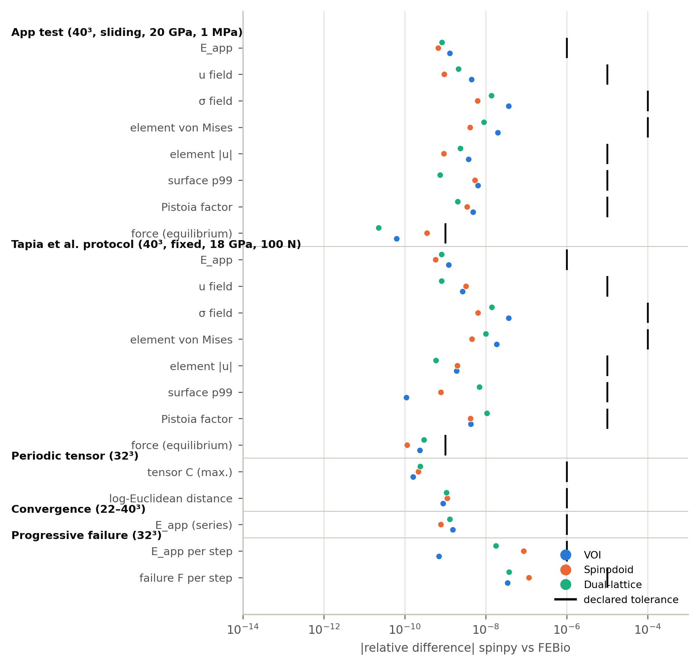</p>

All differences lie between 10⁻¹¹ and 10⁻⁷, within the tolerances declared
before the first comparison with FEBio. Three details make the result
stronger than it looks:

- **The periodic tensor too.** FEBio has no periodic conditions for a voxel
  mesh; they were written with its linear constraints
  (`u(x') = u(x) + E·(x' − x)`, eliminated from the system, not penalized),
  and the stiffness comes out of FEBio by **another route** —volume average
  of stress— than in spinpy —cell energy—.
- **Progressive failure was repeated in full.** It was not compared step by
  step on spinpy's damage: at each step FEBio decides which tissue breaks from
  its own field and builds the next step on its own damage. In the three
  structures and the 33 steps, both loops break **exactly the same
  elements**, even though the failure rule compares each element with a
  percentile, and a small error in the wrong place would have separated the
  two histories for good.
- **The session reproduces.** The regenerated structures give the numbers
  the automatic report saved, with differences ≤ 3·10⁻¹¹.

#### The colour maps

The maps are drawn with the same recipe as figure 8 of the app's report and
with **a single colour scale** for app and FEBio. Columns: the app; linear
FEBio; their difference (log scale); **nonlinear** FEBio at the test load;
and its difference from the app.

<p align="center">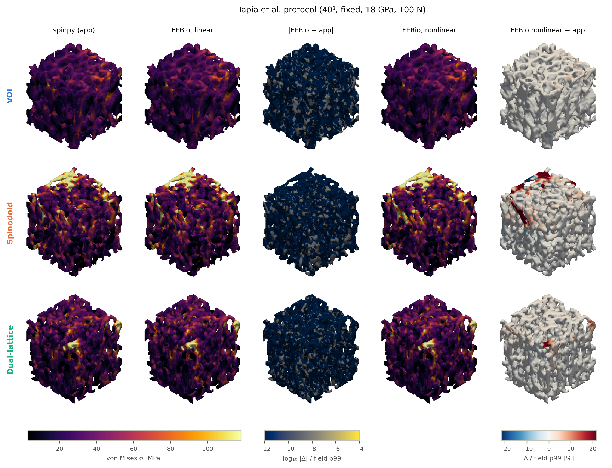</p>

The first two columns are the same image: the difference does not exceed
3·10⁻⁷ of the p99 in any element (the ceiling is set by storing in
`float32`; in double precision it is 2·10⁻⁸). The fifth is the only one that
changes: there FEBio lets the part actually deform, and what shows in red are
trabeculae on the spinodoid's loaded face that bend more than a linear
calculation predicts.

<p align="center">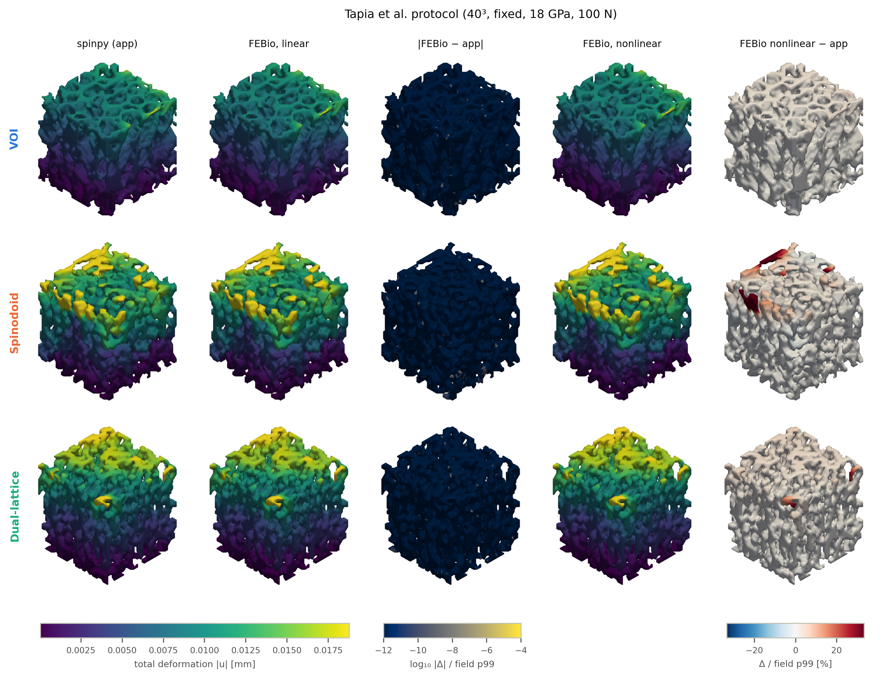</p>

<p align="center">
  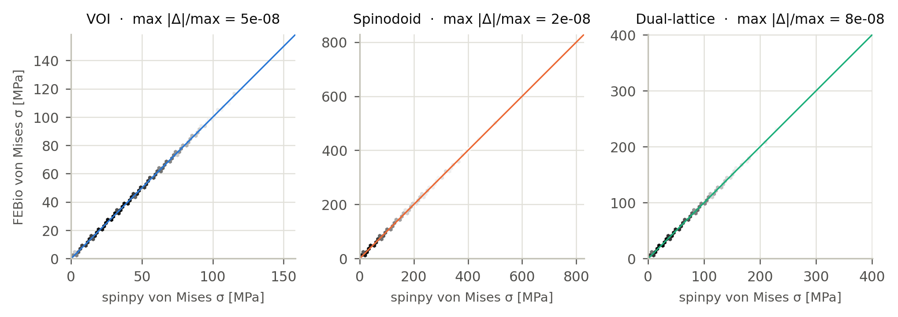
  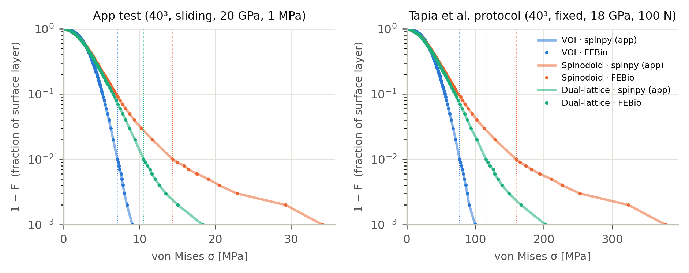
</p>

#### Tensor, convergence and progressive failure

<p align="center">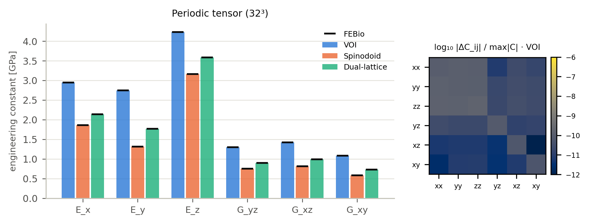</p>

<p align="center">
  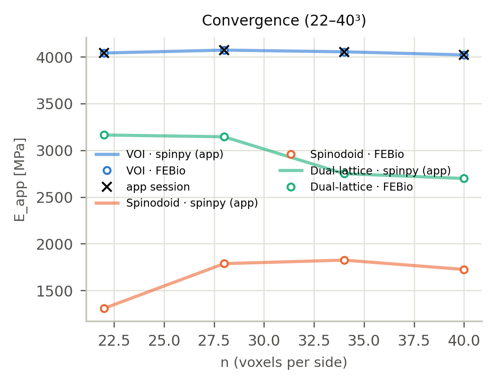
</p>
<p align="center">
  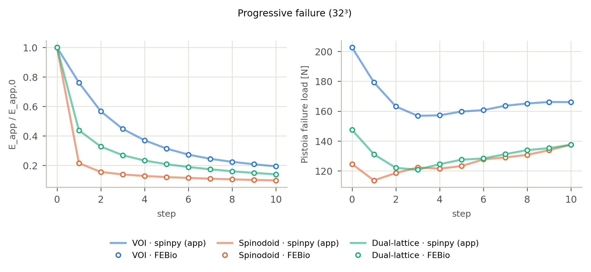
</p>

#### How far linearity holds

| structure | app E_app (MPa) | nonlinear deviation at 1 MPa | Pistoia failure load (MPa) | nonlinear deviation at that load | E_app rigid platen / force |
|---|---|---|---|---|---|
| VOI | 4021 | −0.07 % | 21.8 | −1.6 % | 1.06 |
| Spinodoid | 1725 | −0.70 % | 12.5 | **−8.0 %** | **1.69** |
| Dual-lattice | 2699 | −0.22 % | 15.4 | −3.4 % | 1.23 |

<p align="center">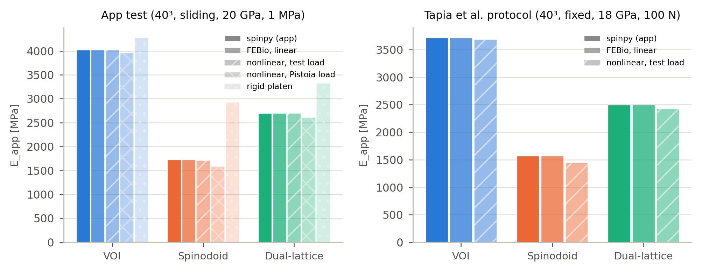</p>

- **On the VOI, the app's linear test holds up to its failure load**
  (−1.6 %; the Pistoia criterion is met at 2.07 % of the tissue instead of
  2 %).
- **On the spinodoid, not entirely.** Near its failure load it loses 8 % of
  its stiffness and its surface p99 rises by 8.7 %; with the 100 N of the
  Tapia protocol (11 MPa over a 3 mm side), the linear p99 falls 7.7 % short.
- **The cause is the loading condition, as in H4.** With force imposed on
  the bone of the top face, the trabeculae cut by the loaded face act as
  cantilevers. A rigid platen reduces the spinodoid's deviation to −2.6 % and
  raises its linear modulus by 69 %.

#### What the comparison says about the candidates

With both programs in agreement, the differences between structures belong
to the structures. With BV/TV matched to within 1 %, **the *dual-lattice*
has 0.67 times the VOI's stiffness and the spinodoid 0.43**; the spinodoid
doubles the bone's surface p99 and loses 78 % of its stiffness when the first
2 % of the tissue breaks (the VOI, 24 %). And a warning the app did not give:
**the candidates are not mesh-converged the way the VOI is** —between 34³ and
40³ the VOI moves −0.8 %, the *dual-lattice* −1.9 % and the spinodoid
−5.5 %—, so their stiffness at 40³ must be cited with reservations.

### Equine H4 VOIs

The compression test on three bone VOIs (BV/TV 0.28 to 0.77, at 32³ and
48³) and a fitted spinodoid:

- **The computation agrees to seven or eight digits**, within tolerances
  declared before measuring.
- **On the most porous VOI (BV/TV 0.28) the nonlinear response at 1 MPa
  departs by 16 % at 32³ and by 48 % at 48³**; on those with BV/TV 0.55 and
  0.77, by 0.06 %. With a rigid platen the deviation drops to 0.8 %, and the
  linear modulus itself is 2.1 times higher. The three VOIs come from a single
  specimen: it is one measured case, not a general rate. On very porous VOIs,
  the apparent modulus and the failure load must be cited stating the loading
  condition.

### What this comparison does not prove

Agreeing with FEBio proves that spinpy **solves the problems it poses
correctly**, not that those problems represent real bone. The voxel mesh,
the homogeneous isotropic tissue, the boundary conditions and the Pistoia
criterion are assumptions both programs share; only a physical test can
check them.

### Reproducing

```
python comparativa_febio/comparar_febio.py          # H4, ~90 min
python comparativa_febio/porcino/validar_porcino.py # porcine, every analysis, ~2 h
python comparativa_febio/porcino/figuras_porcino.py # figures, only reads results
python -m pytest tests/test_25_febio.py             # small version, ~10 s
```

Requires FEBio 4.5 (FEBio Studio 2). Results are left in
`comparativa_febio/**/resultados/*.jsonl` with their provenance block; the
`.feb` files and FEBio outputs are regenerated and not versioned.
`tests/test_25_febio.py` is skipped if FEBio is not installed.

> Maas, S. A., Ellis, B. J., Ateshian, G. A., & Weiss, J. A. (2012). FEBio:
> finite elements for biomechanics. *Journal of Biomechanical Engineering,
> 134*(1), 011005. https://doi.org/10.1115/1.4005694

---

## FEBio inside spinpy: "Automatic FEM" and "Analyse with FEBio"

The application also solves its tests in FEBio from the interface: the app's
test, the Tapia et al. (2026) protocol and homogenization, with the app's
brick mesh (hex8), with a **smooth mesh of quadratic tetrahedra** (TET10) or
with both, linear and nonlinear (force, rigid platen, Pistoia load). The same
computation runs from the command line:

```bash
python -m spinpy.febio VOI.vtk --protocolo app tapia2026 --malla hex8 tet10
```

**How to get FEBio.** This repository **ships no FEBio binaries**. Install
FEBio Studio 2 (free, [febio.org](https://febio.org)); spinpy finds it on its
own, or `febio4.exe` can be chosen in the window. The lab's Windows
executable includes it.

**FEBio licence: in progress.** The FEBio binaries are under the University
of Utah's FEBio Software License 4.0, which does not allow redistributing
them. A redistribution licence **is being requested** ahead of this
repository's publication; until then the copy included in the executable is
for internal lab use only. FEBio's source code is MIT
([febiosoftware/FEBio](https://github.com/febiosoftware/FEBio)).

### Report: smooth mesh (TET10) versus bricks

📄 **[Full report in PDF](comparativa_febio_tet/INFORME.pdf)** (Spanish) ·
[Markdown version](comparativa_febio_tet/INFORME.md) ·
[data](comparativa_febio_tet/resultados/cavidad.jsonl)

| result | value |
|---|---|
| FEBio reads TET10 in spinpy's node order (exact quadratic field) | 3.9·10⁻¹⁰ |
| solid block, E_app = E_s (hex8 and TET10) | ≤ 1.5·10⁻⁹ |
| FEBio hex8 versus the app, H4 proximal VOI at 32³ | 8.7·10⁻⁸ |
| spherical cavity: stiffness with smooth mesh versus analytical | < 0.5 % |
| spherical cavity: **von Mises peak** with smooth mesh, 40³ | **+12 %, does not converge** |
| H4 proximal VOI at 32³: E_app TET10 / E_app hex8 | **0.44** (2.3× softer) |

<p align="center">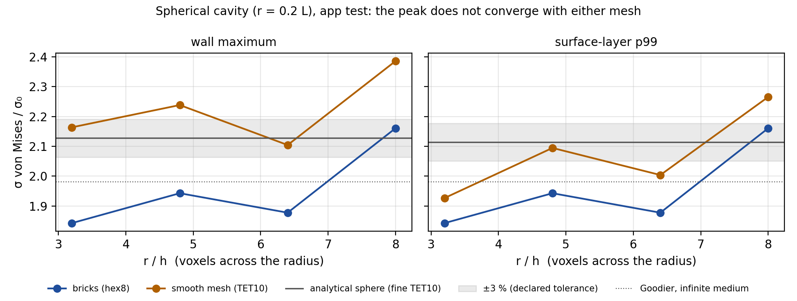</p>

Three measured conclusions:

- **With bricks, FEBio and the app solve the same problem** (≤ 10⁻⁷).
- **The smooth mesh does not make the von Mises peak converge**: on the
  spherical cavity it oscillates like the bricks' peak and depends by several
  points on the smoothing iterations. Stiffness is stable.
- **On real bone at 32³ the smooth mesh is not reliable**: with two-voxel
  struts, smoothing narrows them and the VOI comes out 2.3 times softer than
  with bricks; the nonlinear analysis does not even converge. The useful
  comparison is at 48³ or more (≈ 7 GB with TET10), pending; the window warns
  below 48³.

The work also found and fixed three bugs: `solido.malla_tet10` filled closed
pores, the volume correction made tetgen crash, and with TET10 FEBio declared
"does not converge" because of a residual criterion below the rounding floor.

---

## Documentation

The mechanical validation against FEBio is in
[`comparativa_febio/porcino/INFORME.pdf`](comparativa_febio/porcino/INFORME.pdf).

`docs/MANUAL_spinpy.pdf` documents every module and every function, and is
generated from the code itself (`python docs/generar_manual.py`). The
docstrings of this project are not a summary: they carry the design
decisions, the measured biases and the pitfalls that took effort to find.
Code, docstrings and reports are in Spanish.

---

## Limitations worth knowing

- **Segmentation is a global threshold.** It is the largest source of
  uncertainty in the whole process, which is why the application declares
  which one was applied instead of hiding it.
- **The spinodal family has a limit of its own**: a single characteristic
  length gives a uniform trabecular thickness, and bone is not uniform. A
  spinodoid matching BV/TV, Tb.Th and DA can be considerably softer than the
  bone it was fitted to; spinpy measures it and says so.
- The Pareto, Bayesian and MOBO optimizers remain in MATLAB only.
- Below ρ ≈ 0.25 (isotropic class) periodic homogenization does not reach the
  declared tolerance: it is a property of the regime near the rigidity
  threshold, and the application reports it.

---

## Citing

If you use this software, cite it with the metadata in
[`CITATION.cff`](CITATION.cff).

**Authors:** Carlos González-Torres
([ORCID](https://orcid.org/0000-0002-7765-6388)), David Ortiz-Puerta
([ORCID](https://orcid.org/0000-0001-6285-3066)) and Mauricio A.
Sarabia-Vallejos ([ORCID](https://orcid.org/0000-0001-5128-796X)) —
Universidad de Valparaíso.

Methods implemented: Kumar et al. 2020 (spinodal generator), Vafaeefar et
al. 2022 (*dual-lattice*), Andreassen & Andreasen 2014 (homogenization),
Harrigan & Mann 1984 (MIL tensor), Pistoia et al. 2002 (failure criterion),
Odgaard & Gundersen 1993 (Conn.D), Hildebrand & Rüegsegger 1997 (local
thickness and SMI), Doube 2015 (Ellipsoid Factor), Parfitt (plate model).

## Licence

**The source code is MIT.** See [`LICENSE`](LICENSE). Anyone importing the
`spinpy` package from a script or a notebook takes on no copyleft
obligation: the core does not depend on Qt.

**The Windows executable is GPL-3.0**, because it includes PyQt5, which is
GPL v3. It is a combined work and its redistribution is subject to that
licence; use, on the other hand, is unrestricted, and what you produce with it
is yours. The details, with the list of third-party components, are in
`instalador/LICENCIA_BINARIO.txt`.

Migrating the interface to PySide6 (LGPL) would not by itself be enough for a
binary without copyleft: `pymeshfix` is GPL v3 and `tetgen` derives from AGPL
code.
