<p align="right">
  🌐 <a href="README.md">Español</a> · <b>English</b>
</p>

<p align="center">
  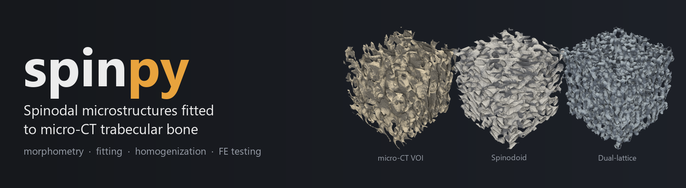
</p>

<p align="center">
  
  
  
  
  
  
  
</p>

<p align="center">
  <b>From micro-CT to mechanical model, saying how much each number is worth.</b><br>
  <a href="#what-it-does">What it does</a> ·
  <a href="#the-application-in-motion">Demo</a> ·
  <a href="#installation">Installation</a> ·
  <a href="#usage">Usage</a> ·
  <a href="#validation-against-published-results">Validation</a> ·
  <a href="#citing">Citing</a>
</p>

---

**spinpy** fits **spinodal** (and *dual-lattice*) microstructures to
**trabecular bone** volumes of interest obtained by micro-computed
tomography, and then measures and tests them: morphometry, elastic
homogenization, finite-element compression testing and a publication-ready
report. It is the Python port of the numerical half of `AppFinal_V2.m`,
verified against analytical solutions and against the original MATLAB
implementation.

Developed on equine sesamoid bones scanned at 51.489 µm, with support also
for porcine, mouse-vertebra and femur volumes.

<table>
<tr>
<td>

```
micro-CT TIFF stack
 → segmentation, PCA framing
 → cubic VOI
 → morphometry
     BV/TV, Tb.Th, DA, Conn.D,
     SMI, Ellipsoid Factor
 → fit: spinodoid
     or dual-lattice
 → elastic homogenization
 → FE compression test
     von Mises, Pistoia
 → report and export
     PDF, STL, VTU, Abaqus, ANSYS, FEBio
```

</td>
<td align="center">
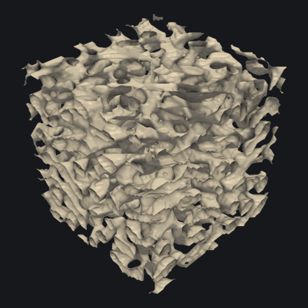
</td>
</tr>
</table>

---

## The application in motion

The animations are screen captures of the interface itself pressing its own
buttons, and they are regenerated with
`python docs/media/hacer_medios.py --idioma en`: they are not mock-ups.

### 1 · Exploring the design space

Density, wave number and the three cone angles define the structure. Every
change is regenerated on the spot, from the isotropic class to the columnar,
the lamellar or one fitted to a real bone.

<p align="center">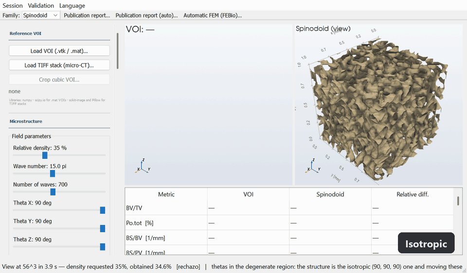</p>

### 2 · Fitting to the micro-CT VOI

The VOI is loaded (`.vtk`, `.mat`, a folder of TIFF slices or a multipage
TIFF), the microstructure is fitted by a staged search, and the table
compares bone and candidate metric by metric. Both views rotate in sync.

<p align="center">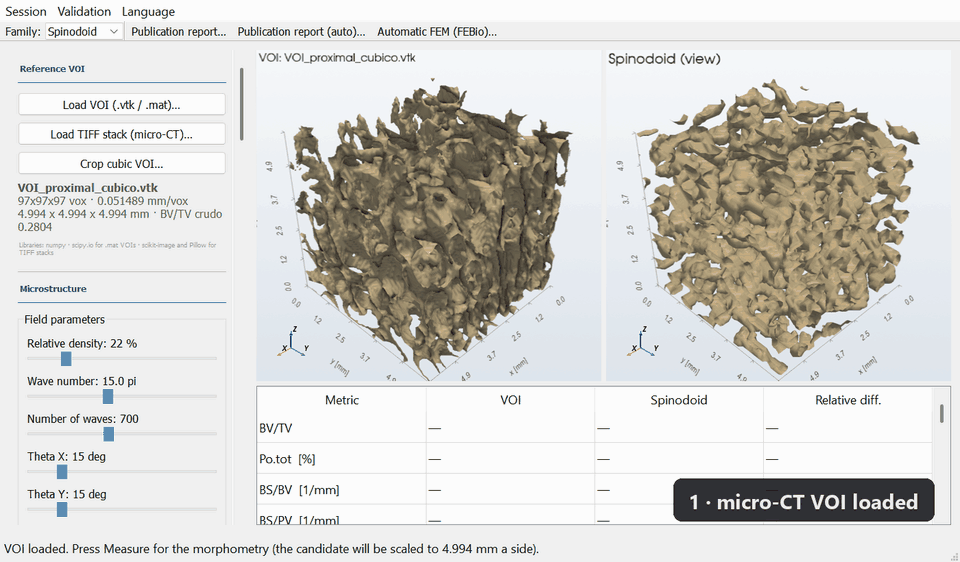</p>

### 3 · Compression testing

Finite-element test along X, Y, Z or all three axes, with effective-strain
and von Mises stress fields, **on the same colour scale for the bone and the
candidate**, and failure load by the Pistoia criterion.

<p align="center">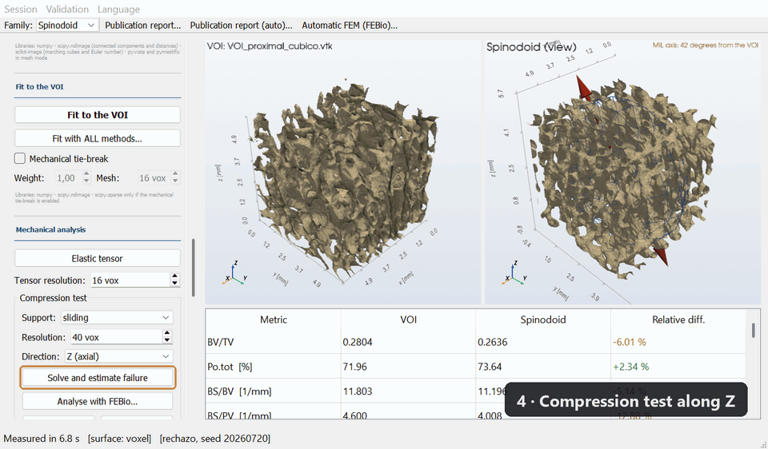</p>

---

## What it does

| Stage | What it includes |
|---|---|
| **Reads** | `.vtk` and `.mat` VOIs, and micro-CT TIFF stacks (folder of slices or multipage) with the scale read from the SkyScan *log*. Thresholds, frames by PCA and crops the cube. |
| **Generates** | Spinodoids from a Gaussian random field (Kumar et al. 2020), with both wave-sampling conventions found in the literature, and *dual-lattice* (Vafaeefar et al. 2022). |
| **Measures** | BV/TV, BS/BV, BS/PV, Tb.Th, Tb.Sp, Tb.N, MIL tensor and DA, Conn.D, SMI, local thickness, pore size, **Ellipsoid Factor** and principal curvatures of the interface. |
| **Fits** | The parameters that best reproduce a real VOI: staged search, replicas with fresh seeds, self-consistent noise floor and optional mechanical tie-break. |
| **Homogenizes** | The elastic tensor by periodic unit cell on the voxel grid, with algebraic multigrid and a residual check. |
| **Tests** | Compression along X, Y or Z with von Mises, effective-strain and displacement fields; Pistoia failure; mesh-convergence study. On bricks or on a smooth mesh of quadratic tetrahedra, linear or nonlinear, with built-in FE engines (the app, NGSolve and, if installed, FEniCSx, scikit-fem and SfePy), one or several at once. E and p99 **corrected for boundary artefacts** (rigid platen and measurement in the VOI core), validated against the same bone embedded in bone. |
| **Simulates** | *In silico* bone loss (thinning, thin-trabeculae loss, disuse, recovery) and progressive failure on the VOI's digital twin. |
| **Reports** | A publication report in Spanish and English (Markdown and PDF): methods written from the values actually used, 600 dpi figures, a citability table, a reporting checklist (Bouxsein et al. 2010 for micro-CT, Erdemir et al. 2012 for finite elements) and a SHA-256 fingerprint to reproduce each mask. |
| **Exports** | Hexahedral or TET10 solid to Abaqus, ANSYS APDL, VTU and STL, and the full compression test to FEBio 4 (`.feb`). |
| **Batch processing** | Decomposes variance between and within specimens, with ICC, effective N and equivalence by TOST. |

All of it with a graphical interface (`visor.py`) or from Python.

---

## What sets it apart

Most bone-morphometry tools give a number. This one also says **how much
that number is worth**:

- **Verification against manufactured solutions**, not only against another
  program: spheres, cylinders and plates with a known analytical answer,
  Backus averaging for the elastic tensor, and the MIL tensor against
  geometries of exact anisotropy.
- **Biases are measured and reported next to the number.** Local thickness
  underestimates by ~30 % at 3-4 voxels; SMI carries a −15 % discretization
  bias and is confounded by concavity; MIL has a noise floor of DA ≈ 1.07.
  The interface shows this where the value is read.
- **What is not citable is said so.** The maximum of a von Mises field does
  not converge with the mesh, so the report cites the p99 of the surface
  layer and marks every value as *citable*, *with reservations* or *not
  citable*.
- **The generator is stochastic, and that is measured**, not assumed: the
  same parameters with K seeds give the noise floor below which no difference
  means anything.
- **Replicas do not inflate N.** The statistics module computes the
  effective N and puts it before the number of rows, because treating K
  replicas as K specimens is pseudoreplication.
- **Every saved number carries its provenance**: version, family, scheme,
  seed and the wave number with both its readings, so that an exported result
  can be regenerated bit for bit.

---

## Installation

### Without Python: Windows executable

For those who only want to **use** the application there is a 64-bit
executable that needs neither Python nor any dependency. It installs into the
user's folder and **does not ask for an administrator password**, which is
what a university computer requires.

| Executable | |
|---|---|
| Installed | ~650 MB |
| Installer / zip | ~220-300 MB |
| Saves to | `Documents\spinpy` (not deleted on uninstall) |
| Licence | **GPL-3.0** (see below) |

If something does not work on a given computer, the start menu has a
shortcut **"spinpy - autocomprobación"** (self-test): it exercises every
computation path one by one and leaves a report in
`Documents/spinpy/autocomprobacion.txt`. That is what to send for diagnosis.
It can also be launched from the console:

```
spinpy.exe --autocomprobacion
```

To rebuild it, `instalador/construir.ps1` runs the whole process, and
`instalador/LEEME_DESARROLLO.md` explains the packaging pitfalls (in
Spanish).

### With Python: as a library

```
pip install -e .
```

The core only needs `numpy`, `scipy`, `scikit-image` and `pyvista`. The
extras are installed as needed:

```
pip install -e ".[elastico]"   # multigrid: homogenization and FE test
pip install -e ".[fem]"        # built-in FE engines: NGSolve and scikit-fem
pip install -e ".[malla]"      # TET10 meshing
pip install -e ".[lote]"       # batch and statistics
pip install -e ".[gui]"        # graphical interface
pip install -e ".[informe]"    # report PDF and figures
pip install -e ".[todo]"       # everything
```

`pyamg` is listed as an extra, but it is not optional in practice: without
it the solver falls back to conjugate gradient with Jacobi, which does not
converge with the 10⁻⁶ contrast between bone and void. Without `.[fem]` the
application runs with its own solver (bricks, linear) but cannot solve the
smooth mesh, the nonlinear analyses or the rigid platen behind the corrected
E. SfePy and FEniCSx are not required: they are detected if already
installed.

---

## Usage

Graphical interface:

```
python visor.py
```

The panels follow the order of the work: reference VOI, microstructure,
visualization, morphometry, fitting, mechanical analysis, *in silico*
simulations, export and batch. The **"Publication report (auto)…"** button
chains every stage and estimates beforehand how long it will take.

### Language

The interface is in **Spanish and English** and is switched from the
*Language* menu without rebuilding the window: the loaded VOI, the metrics
and the fields are kept. Metric names (BV/TV, Tb.Th, DA, SMI…) are
deliberately not translated: they are international notation (Bouxsein et
al. 2010).

After touching any text, run the dictionary checker:

```
python idioma_revisar.py
```

### From Python

The API is in Spanish, like the rest of the code:

```python
from spinpy import leer_voi, morfometria, ajustar_spinodoide

VOI, spacing = leer_voi("VOI_medio_cubico.vtk")
m = morfometria(VOI, spacing, extra=True)
print(m["BVTV"], m["TbTh"], m["DA"], m["ConnD"])

r = ajustar_spinodoide(VOI, spacing, modo="completo")
print(r["parametros"], r["error"])
```

### Command line

```
spinpy-lote folder_with_VOIs --replicas 20 --salida results
spinpy-informe resultados_sesion.json        # rebuilds the report from a JSON
```

---

## Validation against published results

The method `spinpy` implements **is not ours**: it is that of Kumar et al.
(2020). The `Test/` folder exists to prove it, placing the published figure
next to the same figure regenerated with this code, and evaluating
falsifiable predictions from each article:

| Script | What it checks |
|---|---|
| `replicar_kumar2020.py` | The method: cone union, level set and the four classes. |
| `replicar_zheng2021.py` | Bounds: every elastic surface within Voigt and Hashin-Shtrikman, and the ρ ≥ 0.3 curve. |
| `replicar_guo2024.py` | Curvature: the (κ₁, κ₂) profile against a nodal surface with exact curvatures. |

They are opened from the application in the **Validation** menu, or from
the console:

```
python Test/replicar_kumar2020.py            # full, ~7 min
python Test/replicar_kumar2020.py --rapido   # ~1.5 min
```

> Kumar, S., Tan, S., Zheng, L., & Kochmann, D. M. (2020). Inverse-designed
> spinodoid metamaterials. *npj Computational Materials, 6*, 73.
> https://doi.org/10.1038/s41524-020-0341-6 — open access under CC BY 4.0,
> which is what allows its figure to be reproduced here with attribution.
> Provenance of every reference figure in `Test/referencia/FUENTES.md`.

---

## Verification

```
python -m pytest tests/ -q
```

30 blocks with tolerances **declared before measuring**: topology, SMI,
thickness, mechanics, Pistoia, TIFF stacks, curvature, Ellipsoid Factor,
*dual-lattice*, provenance, objective function, MIL sampling, report, von
Mises surface layer, convergence order of every installed FE engine (block
29) and boundary-artefact corrections (block 30)… A failure here is a finding, not a bug in the suite.
The two findings already documented (the slab of block 04 comes out one voxel
thicker, and the Gibson-Ashby exponent of block 05 comes out ≈ 3.9) are
marked as strict `xfail`: the suite stays green, the log still records them
as failed and, should either start passing, the suite fails to force a review
of its documentation.

Against the original MATLAB implementation (`validar_*.py`, reference
outputs in `resultados/`):

| What is checked | Result |
|---|---|
| Morphometry on real VOIs | 5.9 × 10⁻¹⁴ % in everything that does not go through marching cubes |
| Elastic tensor against Backus averaging | 2.7 × 10⁻¹⁵ relative difference |
| Error function, over 1173 pairs | 3.55 × 10⁻¹⁶ |
| Fit search grids | exact |
| von Mises under uniaxial stress | 1.000000000000 |

---

## Comparison with BoneJ

Checked against BoneJ 7.2.2 on the same volumes:

- **BV/TV agrees to machine precision**: both tools see the same mask.
- **BS differs by up to 46 %, and it is a difference of convention**: BoneJ
  closes the surface against the volume boundary and spinpy does not,
  because the cube faces are the VOI's artificial cut. With the convention
  matched, the difference drops to ±6 %.
- **DA uses different scales** in the two tools, although both agree on the
  ranking of the specimens.
- **SMI cannot be compared**: BoneJ withdrew it in version 2, for the same
  criticism of confounding with concavity that spinpy documents.

And something that changes how to read all of the above: **segmentation
uncertainty is an order of magnitude larger than the differences between
implementations.** Moving the threshold by ±15 % moves Tb.Th by 62 %, against
the ±6 % separating the two tools.

---

## Comparison with FEBio

> Validation done with V1.0.x. Since V2.0.1 the application no longer uses
> FEBio (see "Built-in FE engines" below); these campaigns remain the external
> validation of the app's solver, and the engine comparison reproduced their
> brick-mesh cavity figures to 10⁻⁸.

Every mechanical analysis of the application has been solved again,
independently, with **FEBio 4.5** (Maas et al. 2012), the reference
finite-element program in biomechanics. Two campaigns:

| | structures | what was checked | report (Spanish) |
|---|---|---|---|
| **Equine H4** | 3 VOIs (BV/TV 0.28–0.77) at 32³ and 48³ + a spinodoid | the compression test | [`comparativa_febio/INFORME.pdf`](comparativa_febio/INFORME.pdf) |
| **Porcine V1** | the VOI and **both candidates fitted to it** in one session (spinodoid and *dual-lattice*) | **every** mechanical analysis of the app | [`comparativa_febio/porcino/INFORME.pdf`](comparativa_febio/porcino/INFORME.pdf) |

### The same problem, two programs

For the comparison to measure anything, both programs must solve **the same
discrete problem**, not a similar one. The app's exporter
(`escribe.escribir_febio`) writes the same mesh —one hexahedron per
load-bearing voxel, node for node—, the same support, the same load over the
gross section and the same material; FEBio solves it with Newton and a direct
factorization (Pardiso), and spinpy with algebraic multigrid and conjugate
gradient. Derived quantities (von Mises p99 on the surface layer, Pistoia
factor) are computed with the **same spinpy functions** on both fields.

FEBio is geometrically nonlinear; spinpy is linear. The linear problem is
compared by extrapolating FEBio to zero load, `u = 2·u(1 kPa) − u(2 kPa)`,
which cancels the first-order nonlinear term. And the difference is put to
use: FEBio is also run **at the test load and at the failure load**, which
measures how far the app's linear hypothesis holds.

### Porcine VOI and its two candidates: every analysis

Subchondral bone of the porcine talus (specimen V1 of Koria, Mengoni and
Brockett 2020, [doi:10.5518/787](https://doi.org/10.5518/787), CC BY 4.0;
188³ voxels of 16 µm, BV/TV 0.40). The three structures are **those of the
automatic-report session**: the VOI is checked by SHA-256, and each candidate
is regenerated from `reproduccion.json` with its fingerprint required bit for
bit.

| app analysis | configuration | worst spinpy/FEBio difference |
|---|---|---|
| Compression test + Pistoia | 40³, sliding, 20 GPa, 1 MPa | 4·10⁻⁸ |
| Compared analysis (Tapia et al.) | 40³, fixed, 18 GPa, 100 N | 4·10⁻⁸ |
| Periodic elastic tensor | 32³, 6 load cases | 2·10⁻¹⁰ |
| Mesh convergence | 22, 28, 34 and 40³ | 2·10⁻⁹ |
| Progressive failure | 32³, 10 steps, full loop with FEBio as the solver | **0 differing voxels** in 33 steps |

<p align="center">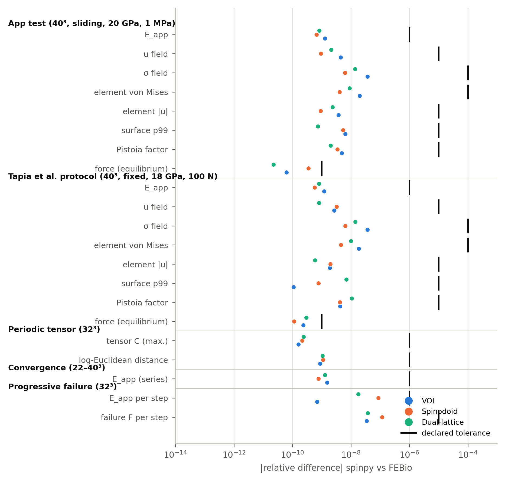</p>

All differences lie between 10⁻¹¹ and 10⁻⁷, within the tolerances declared
before the first comparison with FEBio. Three details make the result
stronger than it looks:

- **The periodic tensor too.** FEBio has no periodic conditions for a voxel
  mesh; they were written with its linear constraints
  (`u(x') = u(x) + E·(x' − x)`, eliminated from the system, not penalized),
  and the stiffness comes out of FEBio by **another route** —volume average
  of stress— than in spinpy —cell energy—.
- **Progressive failure was repeated in full.** It was not compared step by
  step on spinpy's damage: at each step FEBio decides which tissue breaks from
  its own field and builds the next step on its own damage. In the three
  structures and the 33 steps, both loops break **exactly the same
  elements**, even though the failure rule compares each element with a
  percentile, and a small error in the wrong place would have separated the
  two histories for good.
- **The session reproduces.** The regenerated structures give the numbers
  the automatic report saved, with differences ≤ 3·10⁻¹¹.

#### The colour maps

The maps are drawn with the same recipe as figure 8 of the app's report and
with **a single colour scale** for app and FEBio. Columns: the app; linear
FEBio; their difference (log scale); **nonlinear** FEBio at the test load;
and its difference from the app.

<p align="center">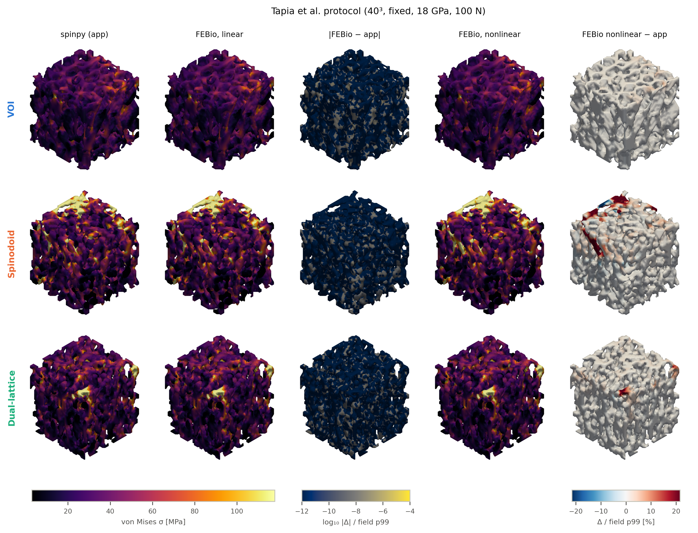</p>

The first two columns are the same image: the difference does not exceed
3·10⁻⁷ of the p99 in any element (the ceiling is set by storing in
`float32`; in double precision it is 2·10⁻⁸). The fifth is the only one that
changes: there FEBio lets the part actually deform, and what shows in red are
trabeculae on the spinodoid's loaded face that bend more than a linear
calculation predicts.

<p align="center">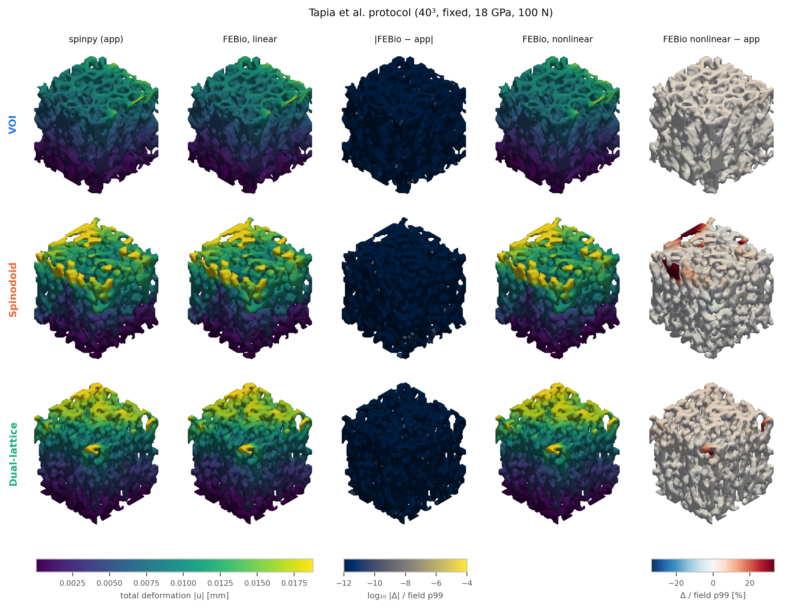</p>

<p align="center">
  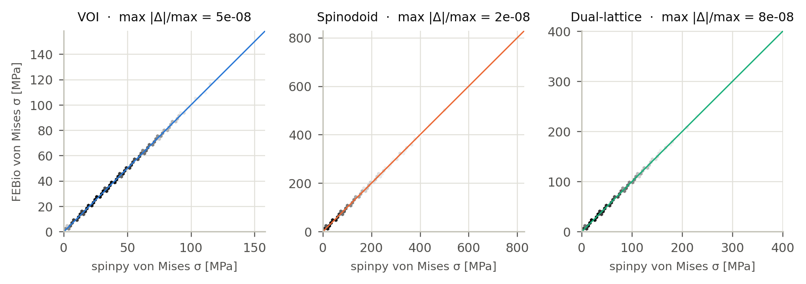
  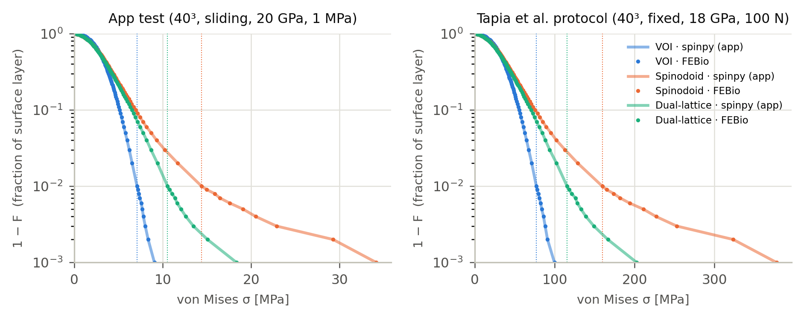
</p>

#### Tensor, convergence and progressive failure

<p align="center">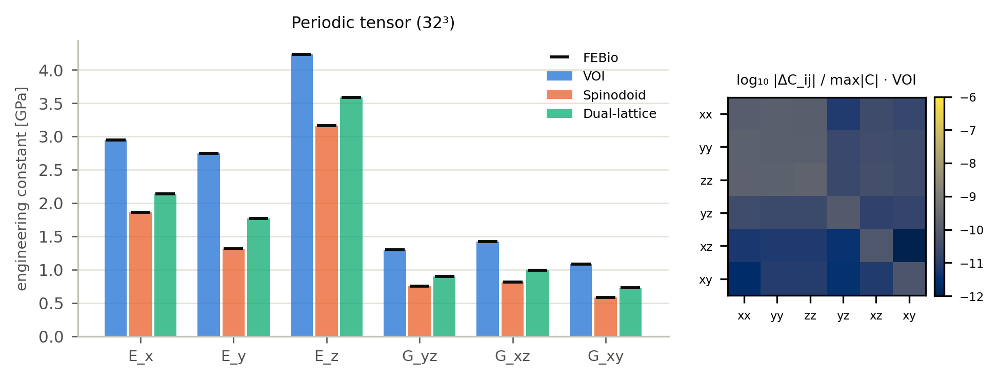</p>

<p align="center">
  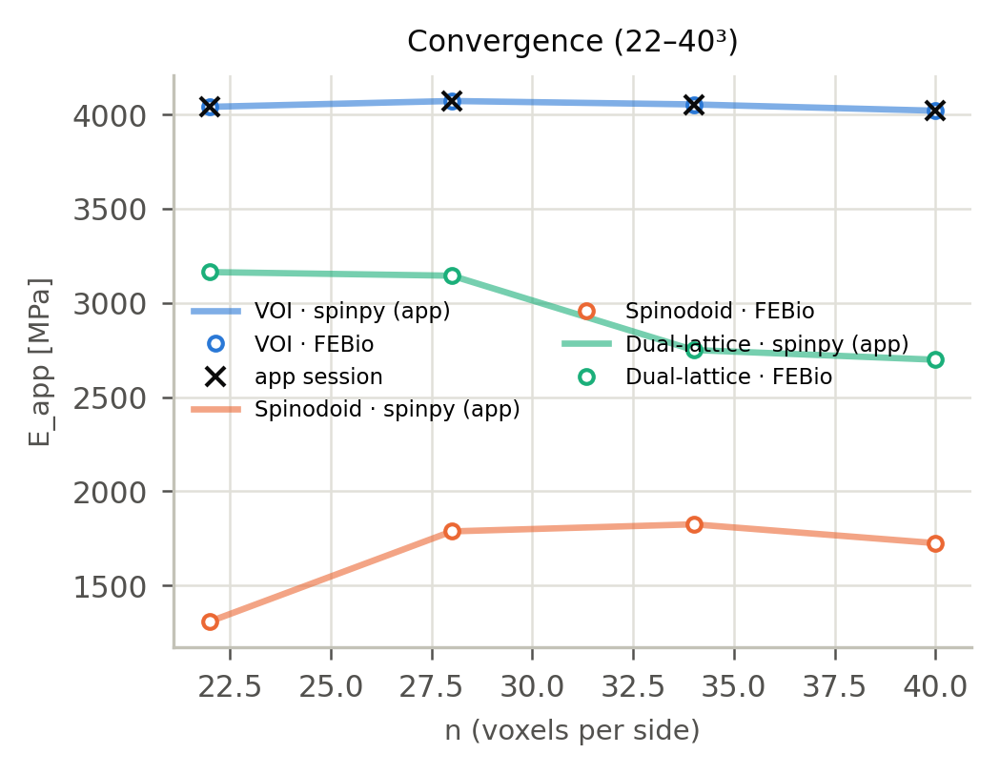
</p>
<p align="center">
  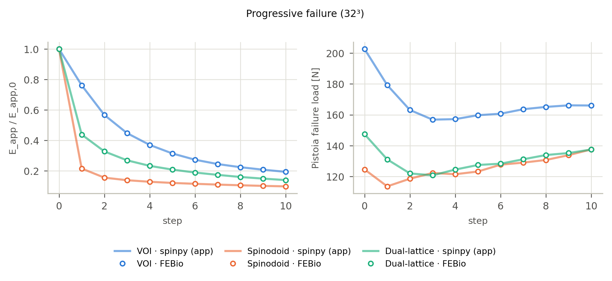
</p>

#### How far linearity holds

| structure | app E_app (MPa) | nonlinear deviation at 1 MPa | Pistoia failure load (MPa) | nonlinear deviation at that load | E_app rigid platen / force |
|---|---|---|---|---|---|
| VOI | 4021 | −0.07 % | 21.8 | −1.6 % | 1.06 |
| Spinodoid | 1725 | −0.70 % | 12.5 | **−8.0 %** | **1.69** |
| Dual-lattice | 2699 | −0.22 % | 15.4 | −3.4 % | 1.23 |

<p align="center">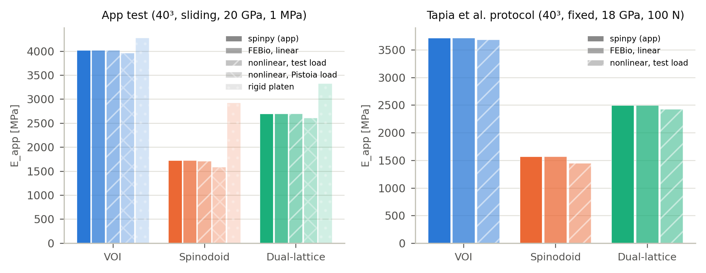</p>

- **On the VOI, the app's linear test holds up to its failure load**
  (−1.6 %; the Pistoia criterion is met at 2.07 % of the tissue instead of
  2 %).
- **On the spinodoid, not entirely.** Near its failure load it loses 8 % of
  its stiffness and its surface p99 rises by 8.7 %; with the 100 N of the
  Tapia protocol (11 MPa over a 3 mm side), the linear p99 falls 7.7 % short.
- **The cause is the loading condition, as in H4.** With force imposed on
  the bone of the top face, the trabeculae cut by the loaded face act as
  cantilevers. A rigid platen reduces the spinodoid's deviation to −2.6 % and
  raises its linear modulus by 69 %.

#### What the comparison says about the candidates

With both programs in agreement, the differences between structures belong
to the structures. With BV/TV matched to within 1 %, **the *dual-lattice*
has 0.67 times the VOI's stiffness and the spinodoid 0.43**; the spinodoid
doubles the bone's surface p99 and loses 78 % of its stiffness when the first
2 % of the tissue breaks (the VOI, 24 %). And a warning the app did not give:
**the candidates are not mesh-converged the way the VOI is** —between 34³ and
40³ the VOI moves −0.8 %, the *dual-lattice* −1.9 % and the spinodoid
−5.5 %—, so their stiffness at 40³ must be cited with reservations.

### Equine H4 VOIs

The compression test on three bone VOIs (BV/TV 0.28 to 0.77, at 32³ and
48³) and a fitted spinodoid:

- **The computation agrees to seven or eight digits**, within tolerances
  declared before measuring.
- **On the most porous VOI (BV/TV 0.28) the nonlinear response at 1 MPa
  departs by 16 % at 32³ and by 48 % at 48³**; on those with BV/TV 0.55 and
  0.77, by 0.06 %. With a rigid platen the deviation drops to 0.8 %, and the
  linear modulus itself is 2.1 times higher. The three VOIs come from a single
  specimen: it is one measured case, not a general rate. On very porous VOIs,
  the apparent modulus and the failure load must be cited stating the loading
  condition.

### What this comparison does not prove

Agreeing with FEBio proves that spinpy **solves the problems it poses
correctly**, not that those problems represent real bone. The voxel mesh,
the homogeneous isotropic tissue, the boundary conditions and the Pistoia
criterion are assumptions both programs share; only a physical test can
check them.

### Reproducing

```
python comparativa_febio/comparar_febio.py          # H4, ~90 min
python comparativa_febio/porcino/validar_porcino.py # porcine, every analysis, ~2 h
python comparativa_febio/porcino/figuras_porcino.py # figures, only reads results
python -m pytest tests/test_25_febio.py             # small version, ~10 s
```

Requires FEBio 4.5 (FEBio Studio 2). Results are left in
`comparativa_febio/**/resultados/*.jsonl` with their provenance block; the
`.feb` files and FEBio outputs are regenerated and not versioned.
`tests/test_25_febio.py` is skipped if FEBio is not installed.

> Maas, S. A., Ellis, B. J., Ateshian, G. A., & Weiss, J. A. (2012). FEBio:
> finite elements for biomechanics. *Journal of Biomechanical Engineering,
> 134*(1), 011005. https://doi.org/10.1115/1.4005694

---

## Built-in FE engines: no external programs

Since V2.0.1 every test is solved **inside spinpy**. FEBio is no longer used
or searched for; `.feb` export is kept as an exchange format. In
**Mechanical analysis**, "FE engine" chooses who solves, and "Mesh" and
"Analysis" what is solved:

| engine | meshes | analyses | in the Windows installer |
|---|---|---|---|
| **App (spinpy)** | bricks (hex8) | linear | yes (the usual, validated solver) |
| **NGSolve** (recommended) | hex8 and TET10 | linear and nonlinear (St. Venant-Kirchhoff, neo-Hookean) | yes |
| scikit-fem | hex8 and TET10 | linear and nonlinear | yes |
| FEniCSx | hex8 and TET10 | linear and nonlinear | no (conda-forge only; compiles C at run time) |
| SfePy | hex8 and TET10 | linear; nonlinear SVK only | no (no Windows wheels) |

"Compare engines…" (panel) and **"FEM report (Auto)…"** (top bar) solve the
same mesh with **several engines at once** and give a comparison table
between engines and against the app, which also goes into the publication
report. The automatic report has its own "FE engines (comparison table)" row.
Each solve runs in a child process: "Stop" kills it and running out of memory
does not close the window. The same computation runs from the command line:

```bash
python -m spinpy.fem VOI.vtk --protocolo app tapia2026 --malla hex8 tet10 --motores app ngsolve
python -m spinpy.fem VOI.vtk --analisis lineal lineal_plato --motores ngsolve   # with corrected E and p99
```

In the GUI, the analysis "Linear with rigid platen and core measurement" is
ticked by default. From the command line it has to be requested with
`--analisis lineal lineal_plato`; without it, the record only holds the
uncorrected values (see [Boundary artefacts](#boundary-artefacts-corrected-e-and-p99)).

### Report: engine comparison

📄 **[Full report (PDF, Spanish)](comparativa_motores/INFORME.pdf)** ·
[Markdown version](comparativa_motores/INFORME.md) ·
[tables](comparativa_motores/tablas.md) ·
[data](comparativa_motores/resultados/)

| result | value |
|---|---|
| solid block, E_app = E_s (hex8 and TET10, all five engines) | ≤ 10⁻¹¹ |
| nonlinear compression up to 20 %, against the closed-form solution | ≤ 4·10⁻¹² |
| cavity on bricks, engines against FEBio 4.5 (E_app, p99) | 7.7·10⁻⁹ · 1.7·10⁻⁹ |
| spinodoid, displacements between engines (direct solvers) | 10⁻¹³ to 10⁻¹¹ |
| TET10 at 790,599 DOF: NGSolve (Cholesky) · FEniCSx (MUMPS) · scikit-fem · SfePy | 45 s · 22 s · 905 s · 1010 s |
| NGSolve: its own Cholesky against MKL PARDISO | 1.4-1.6× faster, 2.3-2.8× less memory |

<p align="center">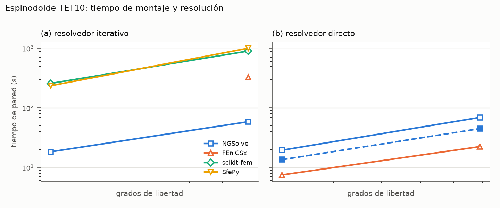</p>

Three measured reliability findings drove the configuration: SfePy's St.
Venant-Kirchhoff tangent is not the derivative of its residual (37 % error,
linear Newton convergence); FEniCSx CG + GAMG diverges on the TET10 mesh of a
real spinodoid; and scikit-fem CG + pyamg stops at a 10⁻¹⁰ residual with a
displacement error of up to 0.9 % on those meshes. Hence NGSolve solves the
smooth mesh with BDDC or its Cholesky, not with a generic algebraic
multigrid. The work also found and fixed two bugs in the app's TET10 meshing
(flat tetrahedra on the cube faces that aborted the mesh, and mid-side nodes
off their edge midpoint after snapping to the planes).

### Convergence order against an exact solution

Engines agreeing on the same mesh shows that they solve the same discrete
problem, not that this problem approaches the continuum. To measure that,
`comparativa_motores/convergencia.py` imposes a closed-form solution of the
Navier equations (Papkovich-Neuber) on the boundary of a cube and measures the
discretization error under refinement (V2.0.2; section 3.8 of the report):

| element | theoretical slope L2 / H1 | observed slope L2 / H1 |
|---|---|---|
| hex8 | 2 / 1 | 1.99 / 1.00 |
| TET4 | 2 / 1 | 1.98 / 0.99 |
| TET10 | 3 / 2 | 3.00 / 1.99 |

The figures agree across all engines to the fourth significant digit. With a
fixed mesh and increasing degree (NGSolve and FEniCSx), the L2 error falls
exponentially, from 4.4·10⁻² at p = 1 to 3.8·10⁻¹² at p = 8. Block 29 of the
suite repeats the test with every installed engine.

<p align="center">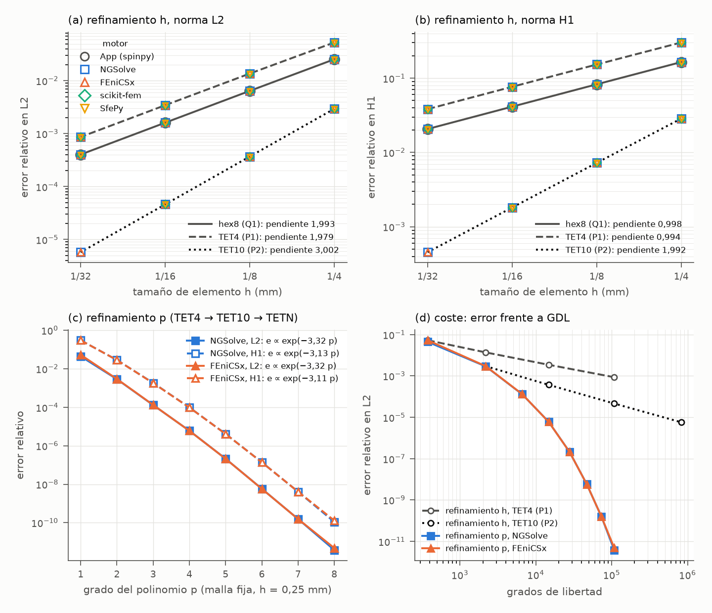</p>

This verifies the code, not the model: the cube has no edges, no smoothed
surface and no near-degenerate elements, which are what keep the stress peak
from converging in bone.

```
cd comparativa_motores
python convergencia.py h    # hex8, TET4 and TET10; n = 4 to 32
python convergencia.py p    # degree 1 to 8 on a fixed mesh
```

### Background: smooth mesh (TET10) against bricks, with FEBio

📄 [Report (PDF)](comparativa_febio_tet/INFORME.pdf) ·
[Markdown version](comparativa_febio_tet/INFORME.md) ·
[data](comparativa_febio_tet/resultados/cavidad.jsonl)

With FEBio 4.5 (V1.0.x) it was established that the smooth mesh does not make
the von Mises peak converge on the spherical cavity (stiffness is stable) and
that on real bone at 32³ two-voxel struts come out too soft: the useful
comparison is at 48³ or finer. Those conclusions concern the mesh, not the
program, and still hold with the built-in engines.

---

## Boundary artefacts: corrected E and p99

A VOI cropped from a micro-CT image has two boundaries that bone does not
have: the top face, where the load is applied to cut trabeculae, and four
lateral faces that leave trabeculae unsupported. Up to V2.0.2 these
boundaries made the application underestimate apparent stiffness and
overestimate the cited stress (von Mises p99). The V2.1 series diagnoses
them, corrects them and validates the correction in three reports (in
Spanish):

| report | question it answers | version |
|---|---|---|
| 📄 [Numerical artefacts](comparativa_motores/INFORME_ARTEFACTOS.pdf) | which part of the result comes from cropping, meshing, loading or the solver rather than from the bone | diagnosis on V2.0.2 |
| 📄 [Corrections](comparativa_motores/correcciones/INFORME_CORRECCIONES.pdf) | which correction truly improves the application, judged by a rule fixed before measuring ([preregistration](comparativa_motores/correcciones/PRERREGISTRO.md)) | V2.1.0 |
| 📄 [Real VOIs](comparativa_motores/vois_reales/INFORME_VOIS_REALES.pdf) | whether the corrections work on porcine and equine micro-CT trabecular bone | V2.1.1 |

### Diagnosis

Eight linear tests were solved on the same spinodoid (two mesh types, three
resolutions, two loading and two support conditions), and the origin of
every high von Mises value was traced. The engines add no artefacts of their
own when they solve with a direct method or with BDDC; the important ones
arise before the solver. With uniform traction on the top face, apparent
stiffness was 1.6 to 2.0 times lower than with a rigid platen, and the 6 % of
bone closest to the top held 34 % of the von Mises tail. The band within
0.3 mm of the lateral faces, 21 % of the bone, carried half the mean stress
of the core. Hot spots, on the other hand, are mostly real: 83 to 97 % of
them reappear in the same place when the resolution or element type changes.

### Correction and validation

The reference is the same spinodoid surrounded by 1.25 mm of its own bone,
tested with a rigid platen and measured only within the VOI region, which
therefore has neither a loaded top nor cut faces. A correction was accepted
if it at least halved the error in E (and by at least 5 points) without
worsening the p99 by more than 2 points, at 32³, 48³ and 64³:

| correction | error in E (32³ · 48³ · 64³) | decision |
|---|---|---|
| none: traction, whole VOI | −55 · −43 · −43 % | baseline |
| F1: rigid platen on the top face | −12 · −8 · −10 % | accepted |
| F2: measurement in the core, 0.625 mm from the faces | −7 · −6 · −10 % | accepted |
| F1 + F2: **corrected E** | **+0.8 · +1.5 · +1.5 %** | accepted |

With the rigid platen, the p99 error fell from +53 · +33 · +33 % to
+10 · +0.5 · +1 %. With the corrected protocol, the stiffness gap between the
smooth mesh and bricks at 48³ went from −27 to −5.6 % without changing the
meshing. Two changes to the smoothing or decimation of the smooth mesh were
also tried: one did not produce a valid mesh and the other gave a softer
one, and both were discarded.

On real bone (two porcine VOIs of 3 mm at 16 µm and three equine VOIs of 5 mm
at 51.5 µm), the reference was built inwards: the VOI resampled to 96³ acts
as surrounding bone and its central 64³ cube is tested. The error in the
stiffness published up to V2.0.2 (−11 to −35 %) fell to −3 to −10 % with the
rigid platen and to +0.4 to −4.7 % with platen and core in the three equine
VOIs, which are the ones large enough for a core. The p99 error went from
+17 to +54 % to −5 to +9 %.

<p align="center">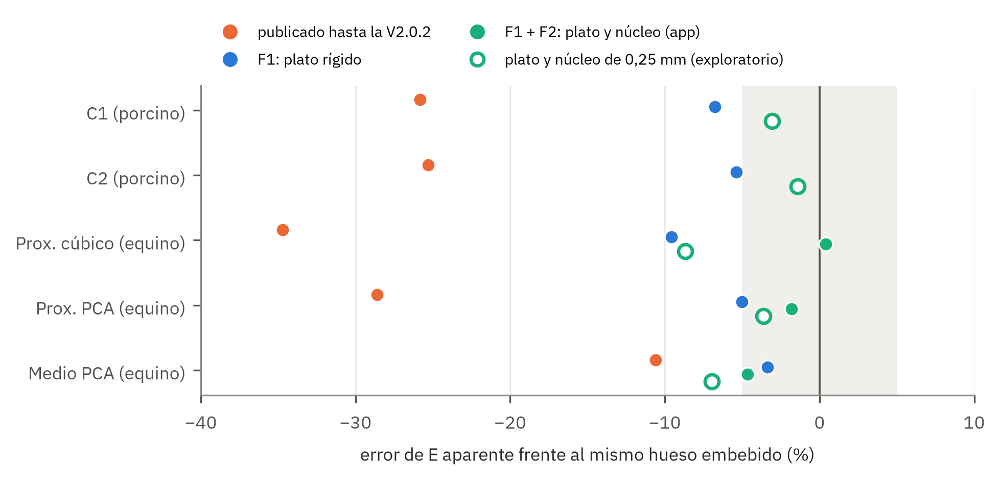</p>

### What the application shows

The results table and the publication report give the **corrected E** and
the **corrected p99** next to the usual values, and state the method used:

| quantity | method | when it is used |
|---|---|---|
| corrected E | `plato_nucleo`: rigid platen and core | by default, with NGSolve, scikit-fem, FEniCSx or SfePy |
| | `traccion_nucleo`: traction and core | with the app's engine, which does not solve the platen |
| | `plato_voi`: rigid platen on the whole VOI | VOIs smaller than 2.25 mm, where the core does not fit (V2.1.1) |
| corrected p99 | `plato_voi`: rigid platen on the whole VOI | with an engine that solves the platen |
| | `traccion_nucleo`: traction and core | with the app's engine |

The platen analysis adds one linear solve per test; the core measurement
costs no computing time.

### What it does not correct

- **Local stress on the smooth mesh** remains 25 % above that of bricks
  (artefact A4), and the element-by-element map keeps a median error of 28
  to 33 % even with the corrections. The corrected p99 is a statistic; the
  colour map is not citable element by element.
- **The Pistoia failure load with a platen** rises by 7 to 24 % and there is
  no reference to validate it: cite it with reservations.
- **Insufficient resolution.** At the default 40³, the five real VOIs had
  1.3 to 2.8 voxels per trabecular thickness. At least 4 are recommended
  (Tb.Th/h ≥ 4). In the cubic proximal equine VOI, with trabeculae 1.4 voxels
  thick, the smooth mesh stayed 27 % softer than bricks after correction.

### Reproducing

```
cd comparativa_motores && python artefactos.py                       # diagnosis
cd comparativa_motores/correcciones
python correcciones.py referencia hex8 tet10                         # embedded reference and corrections
python decision.py                                                   # applies the preregistered rule
python validar_app.py                                                # integrated code, end to end
cd comparativa_motores/vois_reales
python estudio.py VOI_FOLDER validacion practico morfometria campos
python -m pytest tests/test_30_correcciones.py                       # small version
```

The real VOIs are not shipped with the repository; their SHA-256 fingerprint
is stored in the JSON files of `comparativa_motores/vois_reales/resultados/`.

---

## Recent versions

Full notes for each version are in [`instalador/notas/`](instalador/notas/)
(in Spanish) and on the [releases](https://github.com/cgt1989/spinpy/releases)
page, together with the Windows installer and zip.

| version | date | main changes |
|---|---|---|
| [V2.1.1](instalador/notas/v2.1.1.md) | 2026-10-05 | Validation of the boundary corrections on five real VOIs. Fixes three V2.1.0 defects: the test with the app's engine no longer shows as failed, the corrected E exists for VOIs smaller than 2.25 mm (`plato_voi`), and the smooth mesh is no longer rejected because of a degenerate sliver that inverts when nodes are snapped to the faces. |
| [V2.1.0](instalador/notas/v2.1.0.md) | 2026-10-05 | E and p99 corrected for boundary artefacts (rigid platen and core measurement), artefact report and block 30 of the suite. |
| [V2.0.2](instalador/notas/v2.0.2.md) | 2026-10-01 | Convergence order of the five engines against an exact solution (h- and p-refinement) and block 29 of the suite. |
| [V2.0.1](instalador/notas/v2.0.1.md) | 2026-09-30 | Built-in FE engines instead of FEBio; Windows installer with NGSolve and scikit-fem, and a self-test that requires all engines to agree. |

---

## Documentation

| report (in Spanish) | contents |
|---|---|
| [`comparativa_febio/porcino/INFORME.pdf`](comparativa_febio/porcino/INFORME.pdf) | mechanical validation of every analysis against FEBio 4.5 |
| [`comparativa_febio/INFORME.pdf`](comparativa_febio/INFORME.pdf) | compression test against FEBio on equine H4 VOIs |
| [`comparativa_febio_tet/INFORME.pdf`](comparativa_febio_tet/INFORME.pdf) | smooth mesh (TET10) against bricks, with FEBio |
| [`comparativa_motores/INFORME.pdf`](comparativa_motores/INFORME.pdf) | comparison of the built-in FE engines and convergence order |
| [`comparativa_motores/INFORME_ARTEFACTOS.pdf`](comparativa_motores/INFORME_ARTEFACTOS.pdf) | diagnosis of the numerical artefacts of the test |
| [`comparativa_motores/correcciones/INFORME_CORRECCIONES.pdf`](comparativa_motores/correcciones/INFORME_CORRECCIONES.pdf) | correction of the boundary artefacts and its validation |
| [`comparativa_motores/vois_reales/INFORME_VOIS_REALES.pdf`](comparativa_motores/vois_reales/INFORME_VOIS_REALES.pdf) | the corrections on real porcine and equine VOIs |
| [`docs/validacion_literatura/Verificacion_spinpy.pdf`](docs/validacion_literatura/Verificacion_spinpy.pdf) | verification against published literature and closed-form solutions |

`docs/MANUAL_spinpy.pdf` documents every module and every function, and is
generated from the code itself (`python docs/generar_manual.py`). The
docstrings of this project are not a summary: they carry the design
decisions, the measured biases and the pitfalls that took effort to find.
Code, docstrings and reports are in Spanish.

---

## Limitations worth knowing

- **Segmentation is a global threshold.** It is the largest source of
  uncertainty in the whole process, which is why the application declares
  which one was applied instead of hiding it.
- **The spinodal family has a limit of its own**: a single characteristic
  length gives a uniform trabecular thickness, and bone is not uniform. A
  spinodoid matching BV/TV, Tb.Th and DA can be considerably softer than the
  bone it was fitted to; spinpy measures it and says so.
- The Pareto, Bayesian and MOBO optimizers remain in MATLAB only.
- Below ρ ≈ 0.25 (isotropic class) periodic homogenization does not reach the
  declared tolerance: it is a property of the regime near the rigidity
  threshold, and the application reports it.
- **The default resolution (40³) may fall short.** On real VOIs it leaves 1.3
  to 2.8 voxels per trabecular thickness; it should be raised to
  Tb.Th/h ≥ 4. The compression test does not yet warn when this is not met
  (the *in silico* simulations do, below 1.7).
- **The smooth mesh at 48³ does not fit on a 15 GB machine** with real VOIs
  (7.8 to 10 GB expected for the direct solver). At 32³ it comes out too soft
  on real bone, and the force-controlled nonlinear analysis does not converge
  on that mesh.
- **Tail stress depends on the mesh.** The von Mises peak does not converge,
  and the cited p99 changes by 22 % from 32³ to 64³ with bricks: report it
  with its resolution. The Pistoia failure load with a rigid platen is not
  validated.
- On one equine VOI, tetgen could not tetrahedralize the smoothed surface (it
  is not a manifold). The application reports this as a failed test, without
  giving a wrong result; the cause has not been investigated.

---

## Citing

If you use this software, cite it with the metadata in
[`CITATION.cff`](CITATION.cff).

**Authors:** Carlos González-Torres
([ORCID](https://orcid.org/0000-0002-7765-6388)), David Ortiz-Puerta
([ORCID](https://orcid.org/0000-0001-6285-3066)) and Mauricio A.
Sarabia-Vallejos ([ORCID](https://orcid.org/0000-0001-5128-796X)) —
Universidad de Valparaíso.

Methods implemented: Kumar et al. 2020 (spinodal generator), Vafaeefar et
al. 2022 (*dual-lattice*), Andreassen & Andreasen 2014 (homogenization),
Harrigan & Mann 1984 (MIL tensor), Pistoia et al. 2002 (failure criterion),
Odgaard & Gundersen 1993 (Conn.D), Hildebrand & Rüegsegger 1997 (local
thickness and SMI), Doube 2015 (Ellipsoid Factor), Parfitt (plate model).

## Licence

**The source code is MIT.** See [`LICENSE`](LICENSE). Anyone importing the
`spinpy` package from a script or a notebook takes on no copyleft
obligation: the core does not depend on Qt.

**The Windows executable is GPL-3.0**, because it includes PyQt5, which is
GPL v3. It is a combined work and its redistribution is subject to that
licence; use, on the other hand, is unrestricted, and what you produce with it
is yours. The details, with the list of third-party components, are in
`instalador/LICENCIA_BINARIO.txt`.

Migrating the interface to PySide6 (LGPL) would not by itself be enough for a
binary without copyleft: `pymeshfix` is GPL v3 and `tetgen` derives from AGPL
code.
