<p align="right">
  🌐 <b>Español</b> · <a href="README.en.md">English</a>
</p>

<p align="center">
  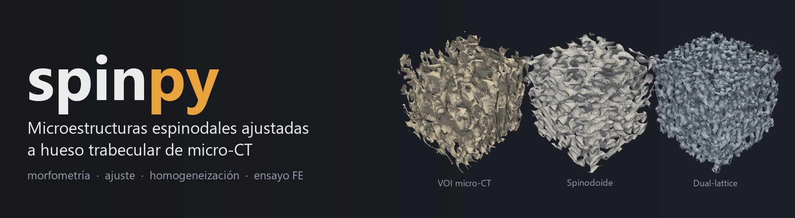
</p>

<p align="center">
  
  
  
  
  
  
  
</p>

<p align="center">
  <b>Del micro-CT al modelo mecánico, diciendo cuánto vale cada número.</b><br>
  <a href="#qué-hace">Qué hace</a> ·
  <a href="#la-aplicación-en-movimiento">Demo</a> ·
  <a href="#instalación">Instalación</a> ·
  <a href="#uso">Uso</a> ·
  <a href="#validación-contra-los-resultados-publicados">Validación</a> ·
  <a href="#citar">Citar</a>
</p>

---

**spinpy** ajusta microestructuras **espinodales** (y *dual-lattice*) a
volúmenes de interés de **hueso trabecular** obtenidos por microtomografía, y
después los mide y los ensaya: morfometría, homogeneización elástica, ensayo
de compresión por elementos finitos e informe listo para publicación. Es el
port a Python de la mitad numérica de `AppFinal_V2.m`, verificado contra
soluciones analíticas y contra la implementación MATLAB original.

Desarrollado sobre huesos sesamoideos equinos escaneados a 51,489 µm, con
soporte también para volúmenes porcinos, de vértebra de ratón y de fémur.

> *In English:* spinpy fits spinodoid and dual-lattice surrogate
> microstructures to trabecular-bone VOIs from micro-CT, then measures them
> (BV/TV, Tb.Th, DA, Conn.D, SMI, Ellipsoid Factor…), homogenizes their
> elastic tensor and runs FE compression tests. The GUI is available in
> Spanish and English. **[Read this README in English →](README.en.md)**

<table>
<tr>
<td>

```
pila TIFF de micro-CT
 → segmentación, encuadre PCA
 → VOI cúbico
 → morfometría
     BV/TV, Tb.Th, DA, Conn.D,
     SMI, Ellipsoid Factor
 → ajuste: spinodoide
     o dual-lattice
 → homogeneización elástica
 → ensayo de compresión FE
     von Mises, Pistoia
 → informe y exportación
     PDF, STL, VTU, Abaqus, ANSYS, FEBio
```

</td>
<td align="center">
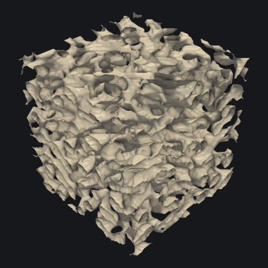
</td>
</tr>
</table>

---

## La aplicación en movimiento

Las animaciones son capturas de la propia interfaz pulsando sus botones, y se
regeneran con `python docs/media/hacer_medios.py`: no son maquetas.

### 1 · Explorar el espacio de diseño

La densidad, el número de onda y los tres ángulos de cono definen la
estructura. Cada cambio se regenera al momento, de la clase isótropa a la
columnar, la lamelar o la ajustada a un hueso real.

<p align="center">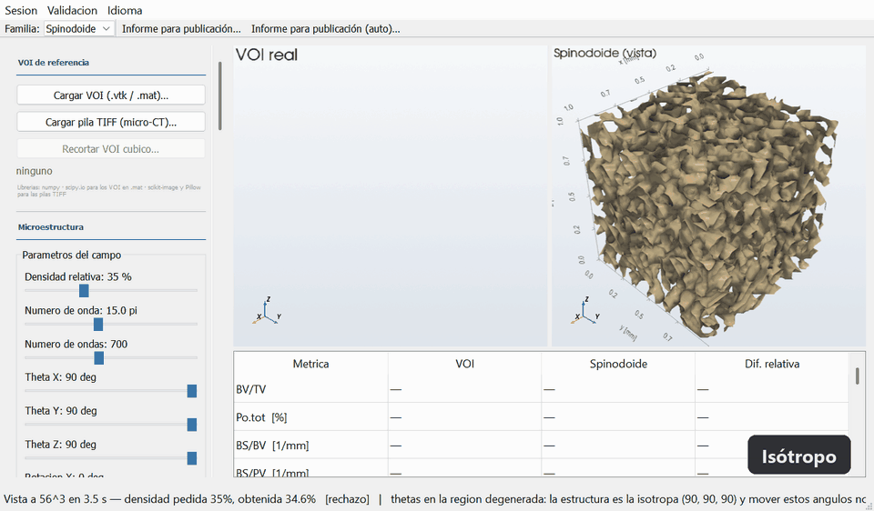</p>

### 2 · Ajustar al VOI de micro-CT

Se carga el VOI (`.vtk`, `.mat`, carpeta de rebanadas TIFF o TIFF
multipágina), se ajusta la microestructura por búsqueda escalonada y la tabla
compara métrica a métrica el hueso con su candidato. Las dos vistas giran
sincronizadas.

<p align="center">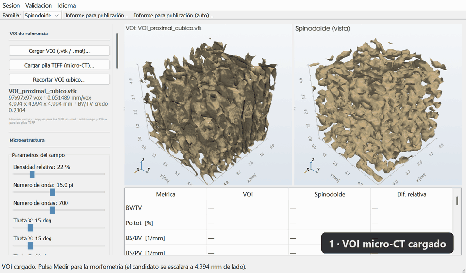</p>

### 3 · Ensayar a compresión

Ensayo de elementos finitos en X, Y, Z o los tres ejes, con campo de
deformación efectiva y de tensión de von Mises, **en la misma escala de color
para el hueso y el candidato**, y carga de fallo por el criterio de Pistoia.

<p align="center">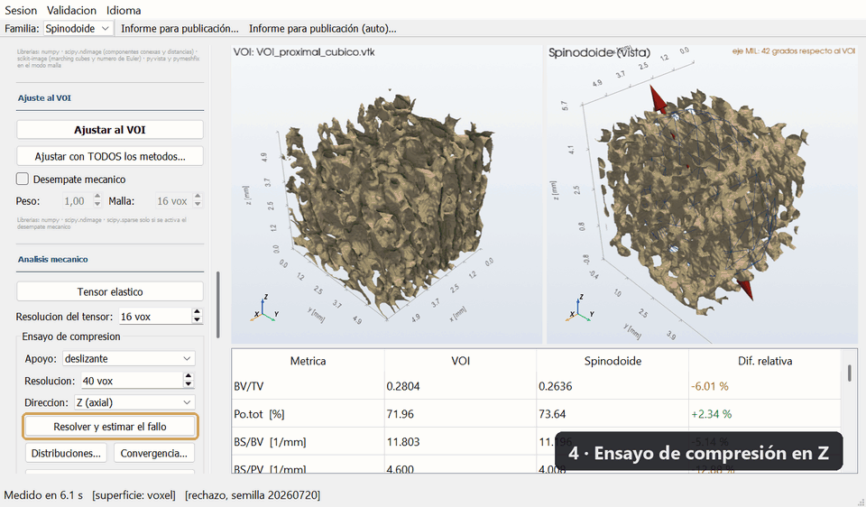</p>

---

## Qué hace

| Etapa | Qué incluye |
|---|---|
| **Lee** | VOIs `.vtk` y `.mat`, y pilas TIFF de micro-CT (carpeta de rebanadas o multipágina) con la escala leída del *log* SkyScan. Umbraliza, encuadra por PCA y recorta el cubo. |
| **Genera** | Espinodales por campo aleatorio gaussiano (Kumar et al. 2020), con las dos convenciones de muestreo de ondas de la literatura, y *dual-lattice* (Vafaeefar et al. 2022). |
| **Mide** | BV/TV, BS/BV, BS/PV, Tb.Th, Tb.Sp, Tb.N, tensor MIL y DA, Conn.D, SMI, espesor local, tamaño de poro, **Ellipsoid Factor** y curvaturas principales de la interfaz. |
| **Ajusta** | Los parámetros que mejor reproducen un VOI real: búsqueda escalonada, réplicas con semillas nuevas, suelo de ruido autoconsistente y desempate mecánico opcional. |
| **Homogeneiza** | El tensor elástico por celda unidad periódica sobre la rejilla de vóxeles, con multigrid algebraico y comprobación del residuo. |
| **Ensaya** | Compresión en X, Y o Z con campos de von Mises, deformación efectiva y desplazamiento; fallo por Pistoia; estudio de convergencia de malla. |
| **Simula** | Pérdida ósea *in silico* (adelgazamiento, trabéculas finas, desuso, recuperación) y fallo progresivo sobre el gemelo digital del VOI. |
| **Informa** | Un informe para publicación en español e inglés (Markdown y PDF): métodos redactados con los valores usados, figuras a 600 ppp, tabla de citabilidad y huella SHA-256 para reproducir cada máscara. |
| **Exporta** | Sólido hexaédrico o TET10 a Abaqus, ANSYS APDL, VTU y STL, y el ensayo de compresión completo a FEBio 4 (`.feb`). |
| **Procesa lotes** | Descompone la varianza entre y dentro de especímenes, con ICC, N efectivo y equivalencia por TOST. |

Todo con interfaz gráfica (`visor.py`) o desde Python.

---

## Qué lo distingue

La mayoría de las herramientas de morfometría ósea dan un número. Esta
además dice **cuánto vale ese número**:

- **Verificación contra soluciones manufacturadas**, no solo contra otro
  programa: esferas, cilindros y láminas de respuesta analítica conocida, el
  promedio de Backus para el tensor elástico y el tensor MIL contra geometrías
  de anisotropía exacta.
- **Los sesgos están medidos y se reportan pegados al número.** El espesor
  local subestima un ~30 % a 3-4 vóxeles; el SMI arrastra un −15 % de
  discretización y se confunde con la concavidad; el MIL tiene un suelo de
  ruido de DA ≈ 1,07. La interfaz lo muestra donde se lee el valor.
- **Lo que no es citable, se dice.** El máximo de un campo de von Mises no
  converge con la malla, así que el informe cita el p99 de la capa de
  superficie y marca cada valor como *citable*, *con reservas* o *no citable*.
- **El generador es estocástico y eso se mide**, no se supone: la misma
  parametrización con K semillas da el suelo de ruido por debajo del cual
  ninguna diferencia significa nada.
- **Las réplicas no inflan el N.** El módulo estadístico calcula el N efectivo
  y lo pone por delante del número de filas, porque tratar K réplicas como K
  especímenes es pseudorreplicación.
- **Cada número guardado lleva su procedencia**: versión, familia, esquema,
  semilla y el número de onda con sus dos lecturas, para que un resultado
  exportado se pueda regenerar bit a bit.

---

## Instalación

### Sin Python: ejecutable de Windows

Para quien solo quiere **usar** la aplicación hay un ejecutable de 64 bits que
no necesita Python ni ninguna dependencia. Se instala en la carpeta del
usuario y **no pide contraseña de administrador**, que es lo que hace falta en
un equipo de universidad.

| Ejecutable | |
|---|---|
| Instalado | ~650 MB |
| Instalador / zip | ~220-300 MB |
| Guarda en | `Documentos\spinpy` (no se borra al desinstalar) |
| Licencia | **GPL-3.0** (ver abajo) |

Si algo no funciona en ese equipo, el menú de inicio trae un acceso directo
**«spinpy - autocomprobación»**: ejercita uno por uno todos los caminos de
cálculo y deja un informe en `Documentos/spinpy/autocomprobacion.txt`. Es lo
que hay que enviar para diagnosticar. También se lanza desde la consola:

```
spinpy.exe --autocomprobacion
```

Para reconstruirlo, `instalador/construir.ps1` hace el proceso entero, y
`instalador/LEEME_DESARROLLO.md` explica las trampas del empaquetado.

### Con Python: como biblioteca

```
pip install -e .
```

El núcleo solo necesita `numpy`, `scipy`, `scikit-image` y `pyvista`. Los
extras se instalan según haga falta:

```
pip install -e ".[elastico]"   # multigrid: homogeneización y ensayo FE
pip install -e ".[malla]"      # mallado TET10
pip install -e ".[lote]"       # lote y estadística
pip install -e ".[gui]"        # interfaz gráfica
pip install -e ".[informe]"    # PDF y figuras del informe
pip install -e ".[todo]"       # todo
```

`pyamg` figura como extra, pero no es opcional en la práctica: sin él, el
solver cae a gradiente conjugado con Jacobi, que con el contraste de 10⁻⁶
entre hueso y vacío no converge.

---

## Uso

Interfaz gráfica:

```
python visor.py
```

Los paneles siguen el orden del trabajo: VOI de referencia, microestructura,
visualización, morfometría, ajuste, análisis mecánico, simulaciones *in
silico*, exportación y lote. El botón **«Informe para publicación (auto)…»**
encadena todas las etapas y estima de antemano cuánto va a tardar.

### Idioma

La interfaz está en **español e inglés** y se cambia desde el menú *Idioma*
sin reconstruir la ventana: el VOI cargado, las métricas y los campos se
conservan. No se traducen, a propósito, los nombres de métrica (BV/TV, Tb.Th,
DA, SMI…), que son notación internacional (Bouxsein et al. 2010).

Después de tocar cualquier texto hay que pasar el comprobador del diccionario:

```
python idioma_revisar.py
```

### Desde Python

```python
from spinpy import leer_voi, morfometria, ajustar_spinodoide

VOI, spacing = leer_voi("VOI_medio_cubico.vtk")
m = morfometria(VOI, spacing, extra=True)
print(m["BVTV"], m["TbTh"], m["DA"], m["ConnD"])

r = ajustar_spinodoide(VOI, spacing, modo="completo")
print(r["parametros"], r["error"])
```

### Línea de comandos

```
spinpy-lote carpeta_con_VOIs --replicas 20 --salida resultados
spinpy-informe resultados_sesion.json        # rehace el informe desde un JSON
```

---

## Validación contra los resultados publicados

El método que implementa `spinpy` **no es nuestro**: es el de Kumar et al.
(2020). La carpeta `Test/` existe para demostrarlo, poniendo la figura
publicada al lado de la misma figura regenerada con este código, y evaluando
predicciones falsables de cada artículo:

| Guion | Qué comprueba |
|---|---|
| `replicar_kumar2020.py` | El método: unión de conos, conjunto de nivel y las cuatro clases. |
| `replicar_zheng2021.py` | Cotas: cada superficie elástica dentro de Voigt y Hashin-Shtrikman, y la curva de ρ ≥ 0,3. |
| `replicar_guo2024.py` | Curvatura: el perfil (κ₁, κ₂) frente a una superficie nodal de curvaturas exactas. |

Se abren desde la aplicación en el menú **Validación**, o desde la consola:

```
python Test/replicar_kumar2020.py            # completo, ~7 min
python Test/replicar_kumar2020.py --rapido   # ~1,5 min
```

> Kumar, S., Tan, S., Zheng, L., & Kochmann, D. M. (2020). Inverse-designed
> spinodoid metamaterials. *npj Computational Materials, 6*, 73.
> https://doi.org/10.1038/s41524-020-0341-6 — acceso abierto bajo
> CC BY 4.0, que es lo que permite reproducir aquí su figura con atribución.
> Procedencia de cada figura de referencia en `Test/referencia/FUENTES.md`.

---

## Verificación

```
python -m pytest tests/ -q
```

22 bloques con tolerancias **declaradas antes de medir**: topología, SMI,
espesor, mecánica, Pistoia, pilas TIFF, curvatura, Ellipsoid Factor,
*dual-lattice*, procedencia, función objetivo, muestreo MIL, informe, capa de
superficie de von Mises… Un fallo aquí es un hallazgo, no un error de la
suite: los bloques 04 y 05 tienen fallos conocidos y documentados.

Contra la implementación MATLAB original (`validar_*.py`, salidas de
referencia en `resultados/`):

| Qué se comprueba | Resultado |
|---|---|
| Morfometría sobre VOIs reales | 5,9 × 10⁻¹⁴ % en lo que no pasa por marching cubes |
| Tensor elástico frente al promedio de Backus | 2,7 × 10⁻¹⁵ de diferencia relativa |
| Función de error, sobre 1173 pares | 3,55 × 10⁻¹⁶ |
| Rejillas de búsqueda del ajuste | exactas |
| von Mises en estado uniaxial | 1,000000000000 |

---

## Comparación con BoneJ

Contrastado con BoneJ 7.2.2 sobre los mismos volúmenes:

- **BV/TV coincide a precisión de máquina**: las dos herramientas ven la misma
  máscara.
- **BS difiere hasta un 46 %, y es una diferencia de convención**: BoneJ
  cierra la superficie contra el borde del volumen y spinpy no, porque las
  caras del cubo son el corte artificial del VOI. Igualando la convención, la
  diferencia baja a ±6 %.
- **DA usa escalas distintas** en las dos herramientas, aunque ambas coinciden
  en la ordenación de los especímenes.
- **SMI no se puede comparar**: BoneJ lo retiró en su versión 2, por la misma
  crítica de confusión con la concavidad que spinpy documenta.

Y algo que cambia cómo leer todo lo anterior: **la incertidumbre de
segmentación es un orden de magnitud mayor que las diferencias entre
implementaciones.** Mover el umbral un ±15 % mueve Tb.Th un 62 %, frente al
±6 % que separa a las dos herramientas.

---

## Comparación con FEBio

Cada análisis mecánico de la aplicación se ha resuelto otra vez, de forma
independiente, con **FEBio 4.5** (Maas et al. 2012), el programa de elementos
finitos de referencia en biomecánica. Dos campañas:

| | estructuras | qué se contrastó | informe |
|---|---|---|---|
| **H4 equino** | 3 VOIs (BV/TV 0,28–0,77) a 32³ y 48³ + un espinodoide | el ensayo de compresión | [`comparativa_febio/INFORME.pdf`](comparativa_febio/INFORME.pdf) |
| **Porcino V1** | el VOI y **los dos candidatos ajustados a él** en una misma sesión (spinodoide y *dual-lattice*) | **todos** los análisis mecánicos de la app | [`comparativa_febio/porcino/INFORME.pdf`](comparativa_febio/porcino/INFORME.pdf) |

### El mismo problema, dos programas

Para que la comparación mida algo, los dos programas tienen que resolver
**el mismo problema discreto**, no uno parecido. El exportador de la app
(`escribe.escribir_febio`) escribe la misma malla —un hexaedro por vóxel
portante, nodo a nodo—, el mismo apoyo, la misma carga sobre la sección bruta
y el mismo material; FEBio la resuelve con Newton y factorización directa
(Pardiso), y spinpy con multigrid algebraico y gradiente conjugado. Las
cantidades derivadas (p99 de von Mises en la capa superficial, factor de
Pistoia) se calculan con las **mismas funciones de spinpy** sobre los dos
campos.

FEBio es no lineal geométricamente; spinpy, lineal. El problema lineal se
contrasta extrapolando FEBio a carga nula, `u = 2·u(1 kPa) − u(2 kPa)`, que
cancela el término no lineal de primer orden. Y se aprovecha la diferencia:
FEBio se corre además **a la carga del ensayo y a la carga de fallo**, lo que
mide hasta dónde vale la hipótesis lineal de la app.

### VOI porcino y sus dos candidatos: todos los análisis

Hueso subcondral del astrágalo porcino (espécimen V1 de Koria, Mengoni y
Brockett 2020, [doi:10.5518/787](https://doi.org/10.5518/787), CC BY 4.0;
188³ vóxeles de 16 µm, BV/TV 0,40). Las tres estructuras son **las de la
sesión del informe automático**: el VOI se comprueba por SHA-256 y cada
candidato se regenera desde `reproduccion.json` y se exige su huella bit a
bit.

| análisis de la app | configuración | peor diferencia spinpy/FEBio |
|---|---|---|
| Ensayo de compresión + Pistoia | 40³, deslizante, 20 GPa, 1 MPa | 4·10⁻⁸ |
| Análisis comparado (Tapia et al.) | 40³, empotrado, 18 GPa, 100 N | 4·10⁻⁸ |
| Tensor elástico periódico | 32³, 6 casos de carga | 2·10⁻¹⁰ |
| Convergencia de malla | 22, 28, 34 y 40³ | 2·10⁻⁹ |
| Fallo progresivo | 32³, 10 pasos, bucle completo con FEBio como solver | **0 vóxeles distintos** en 33 pasos |

<p align="center">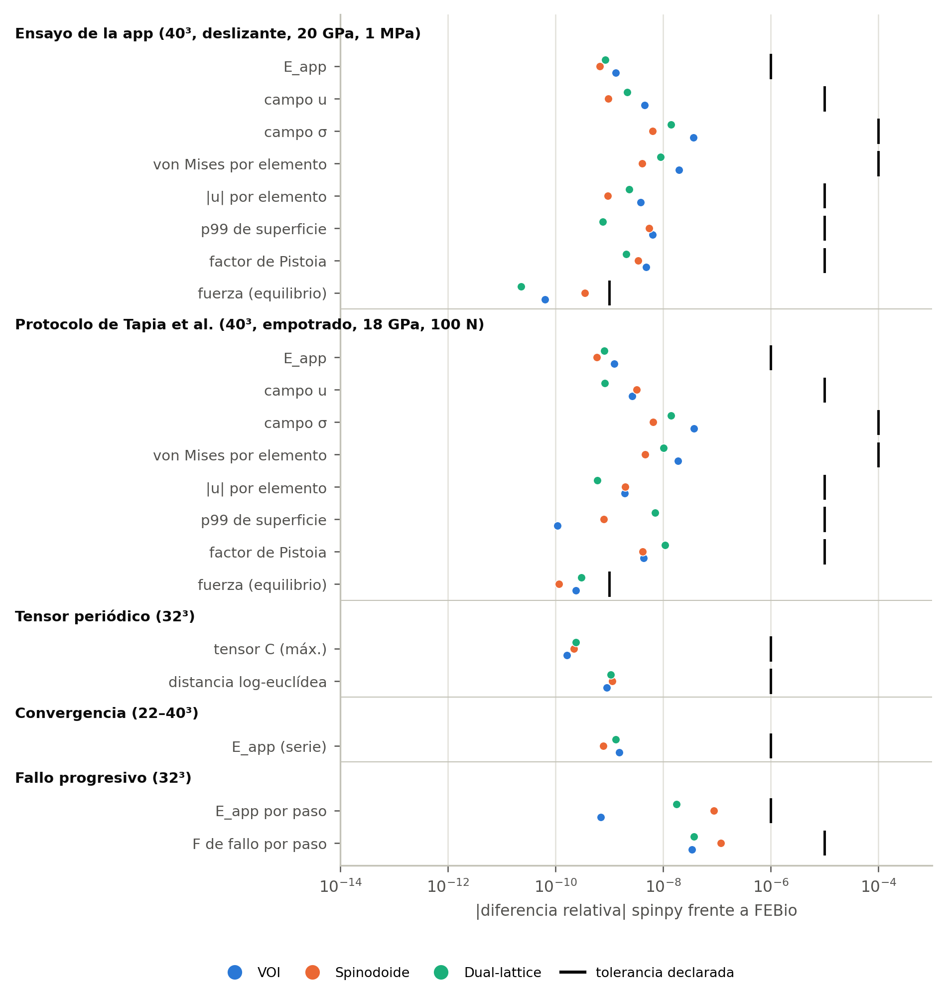</p>

Todas las diferencias están entre 10⁻¹¹ y 10⁻⁷, dentro de las tolerancias
declaradas antes de la primera comparación con FEBio. Tres detalles que hacen
el resultado más fuerte de lo que parece:

- **El tensor periódico también.** FEBio no trae condiciones periódicas para
  una malla de vóxeles; se escribieron con sus restricciones lineales
  (`u(x') = u(x) + E·(x' − x)`, eliminadas del sistema, no penalizadas), y la
  rigidez sale en FEBio por **otra vía** —promedio de volumen de la tensión—
  que en spinpy —energía de la celda—.
- **El fallo progresivo se repitió entero.** No se comparó paso a paso sobre
  el daño de spinpy: FEBio decide en cada paso qué tejido rompe a partir de su
  propio campo y construye el siguiente paso sobre su propio daño. En las tres
  estructuras y los 33 pasos, los dos bucles rompen **exactamente los mismos
  elementos**, aunque la regla de rotura compara cada elemento con un
  percentil y un error pequeño en el lugar equivocado habría separado las dos
  historias para siempre.
- **La sesión se reproduce.** Las estructuras regeneradas dan los números que
  guardó el informe automático con diferencias ≤ 3·10⁻¹¹.

#### Los mapas de color

Los mapas se pintan con la misma receta que la figura 8 del informe de la app
y con **una sola escala de color** para app y FEBio. Columnas: la app; FEBio
lineal; su diferencia (escala logarítmica); FEBio **no lineal** a la carga del
ensayo; y su diferencia con la app.

<p align="center">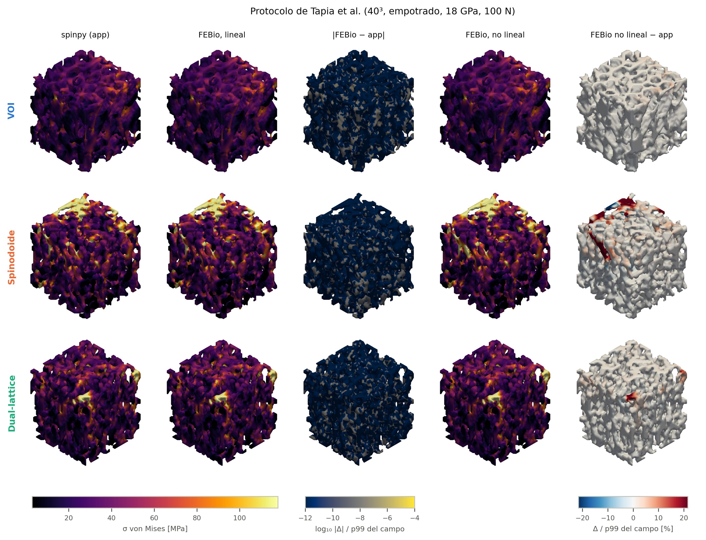</p>

Las dos primeras columnas son la misma imagen: la diferencia no pasa de
3·10⁻⁷ del p99 en ningún elemento (el techo lo pone el guardado en `float32`;
en doble precisión es 2·10⁻⁸). La quinta es la única que cambia: allí FEBio
deja que la pieza se deforme de verdad, y lo que aparece en rojo son
trabéculas de la cara cargada del spinodoide que se doblan más de lo que un
cálculo lineal predice.

<p align="center">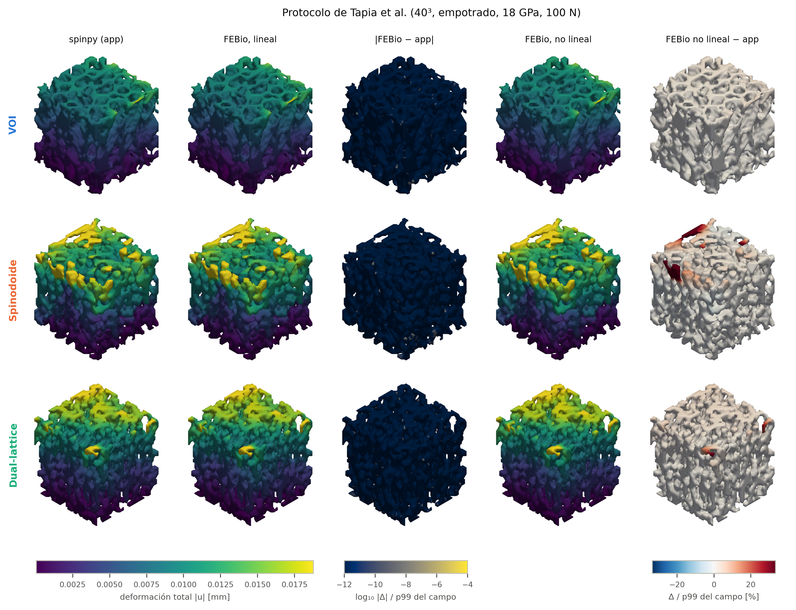</p>

<p align="center">
  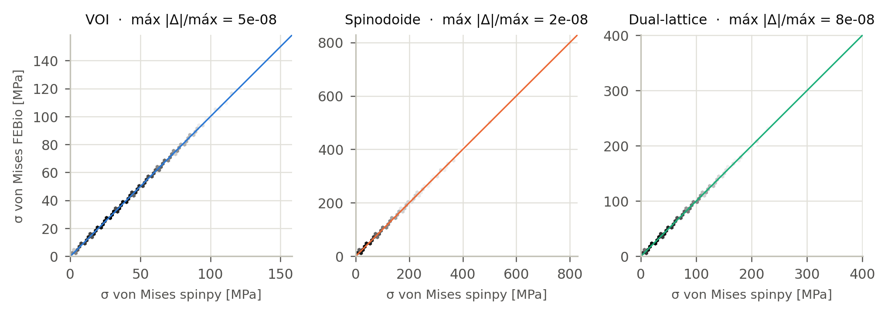
  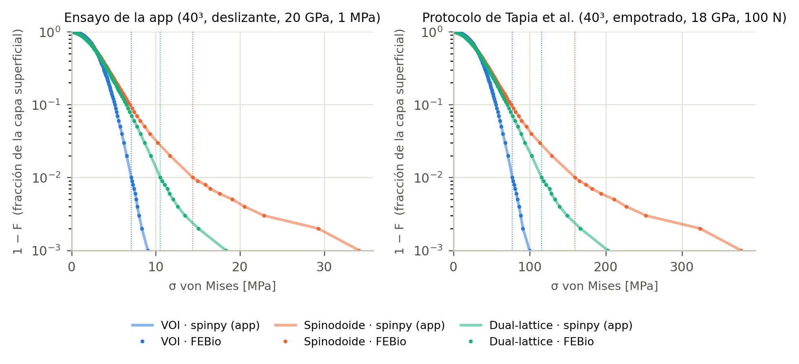
</p>

#### Tensor, convergencia y fallo progresivo

<p align="center">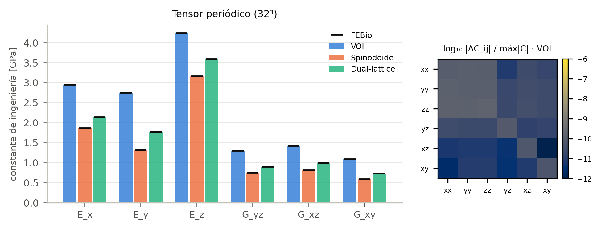</p>

<p align="center">
  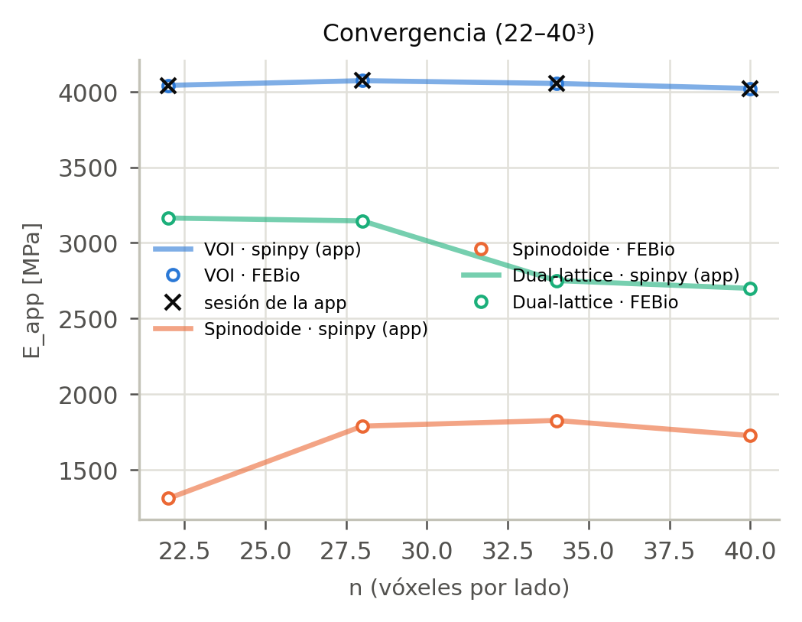
</p>
<p align="center">
  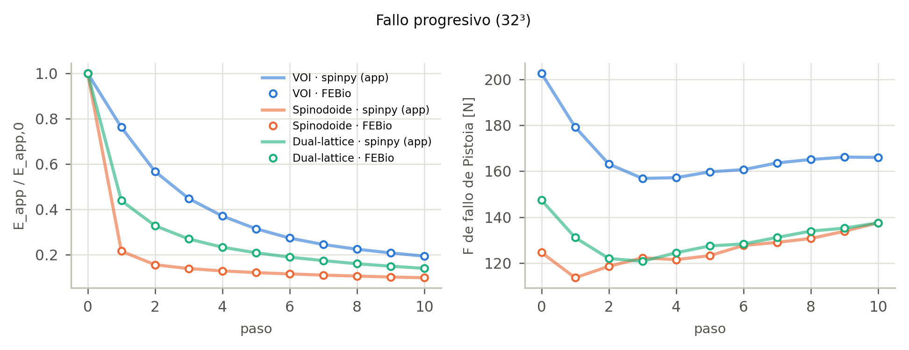
</p>

#### Hasta dónde vale lo lineal

| estructura | E_app de la app (MPa) | desvío no lineal a 1 MPa | carga de fallo de Pistoia (MPa) | desvío no lineal a esa carga | E_app con plato rígido / con fuerza |
|---|---|---|---|---|---|
| VOI | 4021 | −0,07 % | 21,8 | −1,6 % | 1,06 |
| Spinodoide | 1725 | −0,70 % | 12,5 | **−8,0 %** | **1,69** |
| Dual-lattice | 2699 | −0,22 % | 15,4 | −3,4 % | 1,23 |

<p align="center">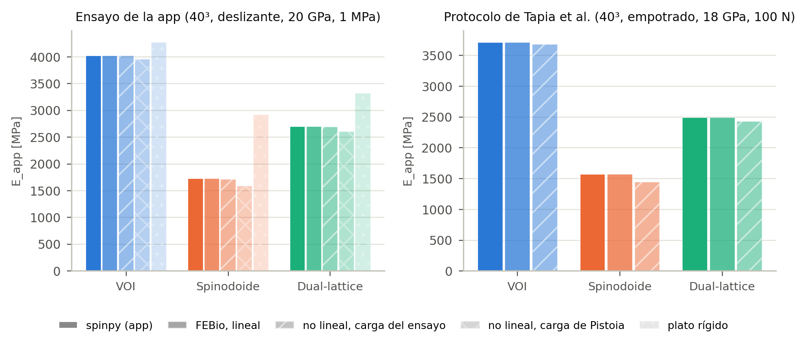</p>

- **En el VOI, el ensayo lineal de la app vale hasta su carga de fallo**
  (−1,6 %; el criterio de Pistoia se cumple al 2,07 % del tejido en lugar del
  2 %).
- **En el spinodoide, no del todo.** Cerca de su carga de fallo pierde un 8 %
  de rigidez y su p99 de superficie sube un 8,7 %; con los 100 N del protocolo
  de Tapia (11 MPa sobre 3 mm de lado), el p99 lineal queda un 7,7 % corto.
- **La causa es la condición de carga, igual que en H4.** Con fuerza impuesta
  sobre el hueso del techo, las trabéculas cortadas por la cara cargada
  trabajan como voladizos. Un plato rígido reduce el desvío del spinodoide a
  −2,6 % y sube su módulo lineal un 69 %.

#### Lo que la comparación dice de los candidatos

Con los dos programas de acuerdo, las diferencias entre estructuras son de
las estructuras. Con BV/TV igualado a menos del 1 %, **el *dual-lattice* tiene
0,67 veces la rigidez del VOI y el spinodoide 0,43**; el spinodoide duplica el
p99 de superficie del hueso y pierde el 78 % de su rigidez al romperse el
primer 2 % del tejido (el VOI, el 24 %). Y un aviso que la app no daba: **los
candidatos no convergen en malla como el VOI** —entre 34³ y 40³ el VOI se
mueve un −0,8 %, el *dual-lattice* un −1,9 % y el spinodoide un −5,5 %—, así
que su rigidez a 40³ debe citarse con reservas.

### VOIs equinos de H4

El ensayo de compresión sobre tres VOIs de hueso (BV/TV 0,28 a 0,77, a 32³ y
48³) y un espinodoide ajustado:

- **El cálculo coincide en siete u ocho cifras**, dentro de tolerancias
  declaradas antes de medir.
- **En el VOI más poroso (BV/TV 0,28) la respuesta no lineal a 1 MPa se
  aparta un 16 % a 32³ y un 48 % a 48³**; en los de BV/TV 0,55 y 0,77, un
  0,06 %. Con un plato rígido el desvío baja al 0,8 %, y el propio módulo
  lineal es 2,1 veces mayor. Los tres VOIs son de un solo espécimen: es un
  caso medido, no una tasa general. En VOIs muy porosos, el módulo aparente y
  la carga de fallo deben citarse declarando la condición de carga.

### Lo que esta comparación no demuestra

Coincidir con FEBio prueba que spinpy **resuelve bien los problemas que
plantea**, no que esos problemas representen el hueso real. La malla de
vóxeles, el tejido homogéneo e isótropo, las condiciones de contorno y el
criterio de Pistoia son supuestos que los dos programas comparten; eso solo lo
contrasta un ensayo físico.

### Reproducir

```
python comparativa_febio/comparar_febio.py          # H4, ~90 min
python comparativa_febio/porcino/validar_porcino.py # porcino, todos los análisis, ~2 h
python comparativa_febio/porcino/figuras_porcino.py # figuras, solo lee resultados
python -m pytest tests/test_25_febio.py             # versión pequeña, ~10 s
```

Necesita FEBio 4.5 (FEBio Studio 2). Los resultados quedan en
`comparativa_febio/**/resultados/*.jsonl` con su bloque de procedencia; los
`.feb` y las salidas de FEBio se regeneran y no se versionan.
`tests/test_25_febio.py` se salta si FEBio no está instalado.

> Maas, S. A., Ellis, B. J., Ateshian, G. A., & Weiss, J. A. (2012). FEBio:
> finite elements for biomechanics. *Journal of Biomechanical Engineering,
> 134*(1), 011005. https://doi.org/10.1115/1.4005694

---

## FEBio dentro de spinpy: «FEM automático» y «Analizar con FEBio»

La aplicación resuelve también sus ensayos en FEBio desde la interfaz: el
ensayo de la app, el protocolo de Tapia et al. (2026) y la homogeneización,
con la malla de ladrillos de la app (hex8), con una **malla suave de
tetraedros cuadráticos** (TET10) o con las dos, en lineal y no lineal (fuerza,
plato rígido, carga de Pistoia). El mismo cálculo corre desde la línea de
comandos:

```bash
python -m spinpy.febio VOI.vtk --protocolo app tapia2026 --malla hex8 tet10
```

**Cómo obtener FEBio.** Este repositorio **no lleva binarios de FEBio**.
Instala FEBio Studio 2 (gratuito, [febio.org](https://febio.org)); spinpy lo
encuentra solo, o se elige `febio4.exe` en la ventana. El ejecutable de Windows
del laboratorio lo trae incluido.

**Licencia de FEBio: en trámite.** Los binarios de FEBio están bajo la FEBio
Software License 4.0 de la Universidad de Utah, que no permite
redistribuirlos. La licencia de redistribución **se está tramitando** con
vistas a la publicación de este repositorio; hasta entonces la copia incluida
en el ejecutable es solo para uso interno del laboratorio. El código fuente de
FEBio es MIT ([febiosoftware/FEBio](https://github.com/febiosoftware/FEBio)).

### Informe: malla suave (TET10) frente a ladrillos

📄 **[Informe completo en PDF](comparativa_febio_tet/INFORME.pdf)** ·
[versión Markdown](comparativa_febio_tet/INFORME.md) ·
[datos](comparativa_febio_tet/resultados/cavidad.jsonl)

| resultado | valor |
|---|---|
| FEBio lee los TET10 en el orden de spinpy (campo cuadrático exacto) | 3,9·10⁻¹⁰ |
| bloque macizo, E_app = E_s (hex8 y TET10) | ≤ 1,5·10⁻⁹ |
| FEBio hex8 frente a la app, VOI proximal de H4 a 32³ | 8,7·10⁻⁸ |
| cavidad esférica: rigidez con malla suave frente a la analítica | < 0,5 % |
| cavidad esférica: **pico de von Mises** con malla suave, 40³ | **+12 %, no converge** |
| VOI proximal de H4 a 32³: E_app TET10 / E_app hex8 | **0,44** (2,3× más blanda) |

<p align="center">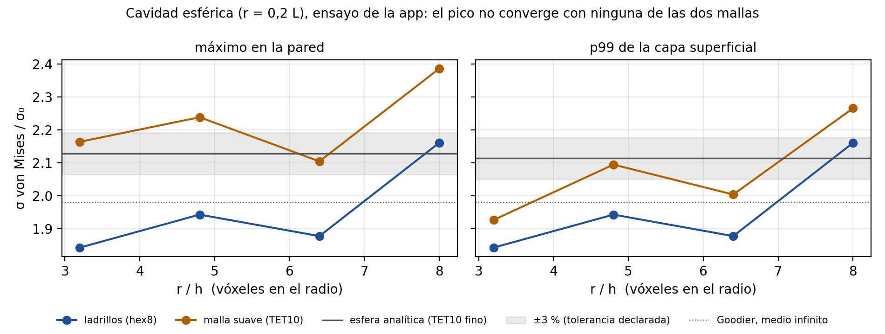</p>

Tres conclusiones medidas:

- **Con ladrillos, FEBio y la app resuelven el mismo problema** (≤ 10⁻⁷).
- **La malla suave no hace converger el pico de von Mises**: en la cavidad
  esférica oscila como el de los ladrillos y depende en varios puntos de las
  iteraciones de suavizado. La rigidez sí es estable.
- **En hueso real a 32³ la malla suave no es fiable**: con puntales de dos
  vóxeles, el suavizado los estrecha y el VOI sale 2,3 veces más blando que con
  ladrillos; el análisis no lineal ni siquiera converge. La comparación útil es
  a 48³ o más (≈ 7 GB con TET10), pendiente; la ventana avisa por debajo de 48³.

Además, el trabajo encontró y corrigió tres fallos: `solido.malla_tet10`
rellenaba los poros cerrados, la corrección de volumen dejaba caer a tetgen, y
con TET10 FEBio declaraba «no converge» por un criterio de residuo por debajo
del piso de redondeo.

---

## Documentación

La validación mecánica frente a FEBio está en
[`comparativa_febio/porcino/INFORME.pdf`](comparativa_febio/porcino/INFORME.pdf).

`docs/MANUAL_spinpy.pdf` documenta cada módulo y cada función, y se genera
del propio código (`python docs/generar_manual.py`). Los docstrings de este
proyecto no son un resumen: llevan las decisiones de diseño, los sesgos
medidos y las trampas que costó encontrar.

---

## Limitaciones que conviene conocer

- **La segmentación es un umbral global.** Es la mayor fuente de
  incertidumbre de todo el proceso, y por eso la aplicación declara cuál se
  aplicó en vez de esconderlo.
- **La familia espinodal tiene un límite propio**: una sola longitud
  característica da un espesor trabecular uniforme, y el hueso no lo es. Un
  spinodoide que iguala BV/TV, Tb.Th y DA puede ser bastante más blando que el
  hueso al que se ajustó; spinpy lo mide y lo dice.
- Los optimizadores de Pareto, bayesiano y MOBO siguen solo en MATLAB.
- Por debajo de ρ ≈ 0,25 (clase isótropa) la homogeneización periódica no
  alcanza la tolerancia declarada: es una propiedad del régimen cercano al
  umbral de rigidez, y la aplicación lo reporta.

---

## Citar

Si usas este software, cítalo con los metadatos de [`CITATION.cff`](CITATION.cff).

**Autores:** Carlos González-Torres
([ORCID](https://orcid.org/0000-0002-7765-6388)), David Ortiz-Puerta
([ORCID](https://orcid.org/0000-0001-6285-3066)) y Mauricio A.
Sarabia-Vallejos ([ORCID](https://orcid.org/0000-0001-5128-796X)) —
Universidad de Valparaíso.

Métodos implementados: Kumar et al. 2020 (generador espinodal), Vafaeefar et
al. 2022 (*dual-lattice*), Andreassen & Andreasen 2014 (homogeneización),
Harrigan & Mann 1984 (tensor MIL), Pistoia et al. 2002 (criterio de fallo),
Odgaard & Gundersen 1993 (Conn.D), Hildebrand & Rüegsegger 1997 (espesor local
y SMI), Doube 2015 (Ellipsoid Factor), Parfitt (modelo de placas).

## Licencia

**El código fuente es MIT.** Ver [`LICENSE`](LICENSE). Quien importe el
paquete `spinpy` desde un script o un cuaderno no arrastra ninguna obligación
de copyleft: el núcleo no depende de Qt.

**El ejecutable de Windows es GPL-3.0**, porque incluye PyQt5, que es GPL v3.
Es una obra combinada y su redistribución queda sujeta a esa licencia; el uso,
en cambio, no tiene restricción alguna, y lo que produzcas con él es tuyo. El
detalle, con la lista de componentes de terceros, está en
`instalador/LICENCIA_BINARIO.txt`.

Migrar la interfaz a PySide6 (LGPL) no bastaría por sí solo para tener un
binario sin copyleft: `pymeshfix` es GPL v3 y `tetgen` deriva de código AGPL.
