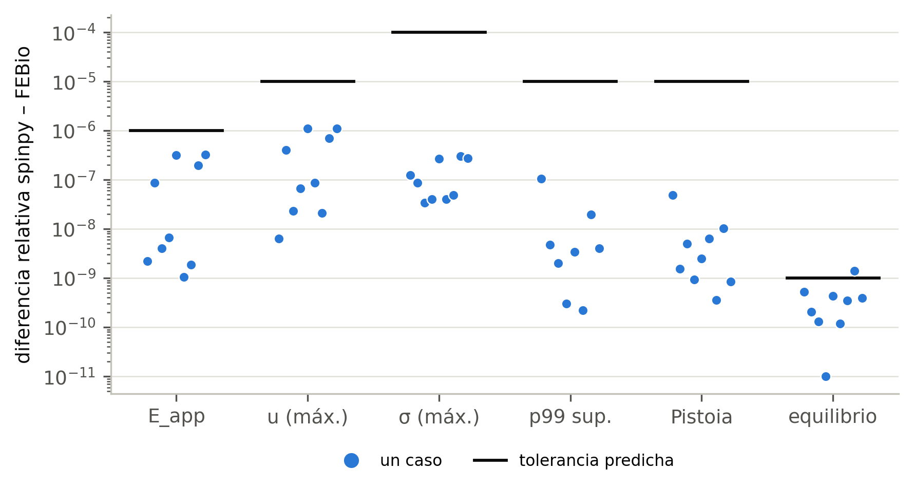
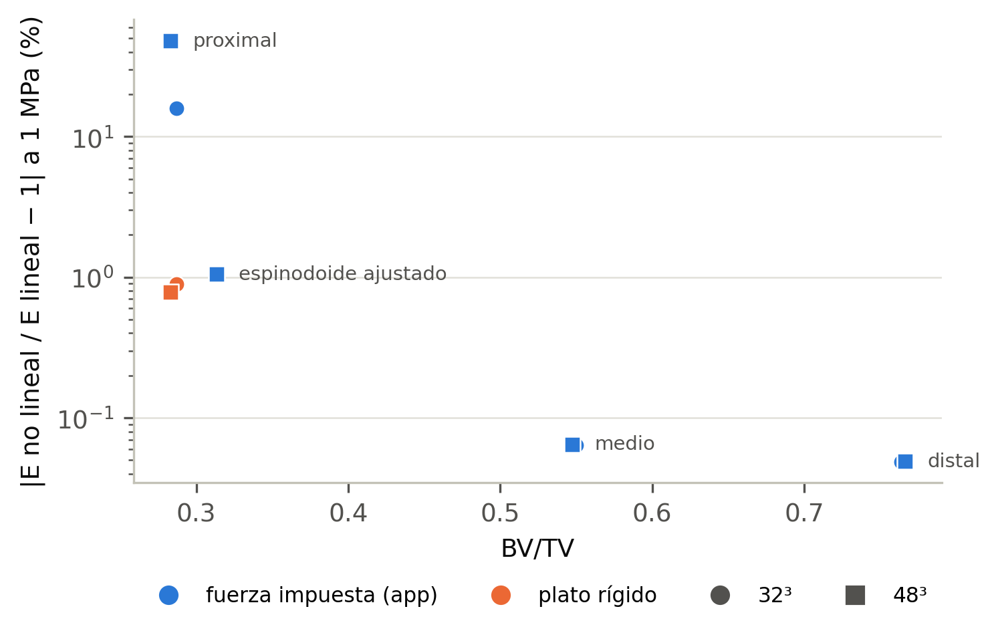
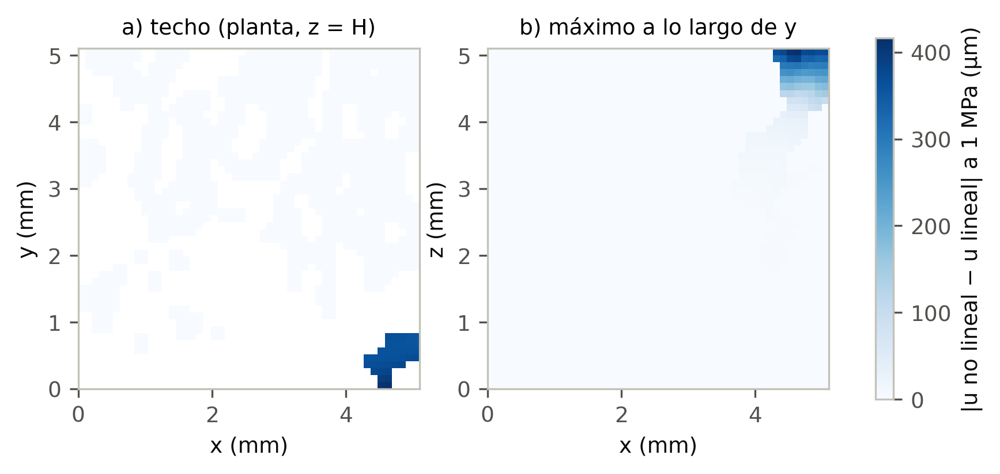

# spinpy frente a FEBio — el ensayo de compresión

Carlos González-Torres · Universidad de Valparaíso · 23 de septiembre de 2026

Validación cruzada del ensayo de compresión de spinpy 0.2.0
(`resistencia.ensayo_compresion`) con FEBio 4.5.0, sobre los tres VOIs de H4
(proximal, medio y distal, los mismos de la comparación con BoneJ) y sobre el
espinodoide ajustado al VOI proximal. Las tolerancias se escribieron en
`PREDICCIONES.md` **antes** de la primera corrida y no se han tocado.

> **En palabras sencillas.** Hicimos resolver el mismo ensayo de compresión a
> la app y a FEBio, un programa de elementos finitos de referencia en
> biomecánica. Hay dos resultados. El primero es que la app calcula bien:
> coincide con FEBio en siete u ocho cifras. El segundo, que no se esperaba,
> es que en el VOI más poroso la forma en que la app aplica la carga deja unas
> pocas trabéculas del borde trabajando como trampolines, y eso hace que el
> cálculo lineal de la app deje de ser fiable a la carga que usa. Con un plato
> rígido, como en un ensayo de laboratorio, el problema desaparece.

---

## 1. Qué se comparó y cómo

Los dos programas resuelven **el mismo problema discreto**. `escribe.escribir_febio`
(nuevo en este trabajo; el port de Python no tenía exportador a FEBio aunque la
portada de la app lo anunciaba) escribe:

| | spinpy | FEBio |
|---|---|---|
| malla | un hexaedro por vóxel portante | la misma, nodo a nodo |
| elemento | hex8, Gauss 2×2×2 | hex8, GAUSS8 |
| material | elástico lineal, E_s = 20 GPa, ν = 0,3 | St. Venant–Kirchhoff |
| carga | ¼ de la fuerza por nodo y cara del techo | presión no seguidora integrada por FEBio |
| apoyo | uz = 0 en la base, 3 GDL en dos esquinas | los mismos |
| solver | AMG con modos rígidos + CG | Newton completo, Pardiso directo |

FEBio es **no lineal geométricamente** y spinpy es lineal. Por eso cada caso se
corre en FEBio tres veces:

- a 1 kPa y a 2 kPa, extrapolando a carga nula, `u_lin = 2·u(1 kPa) − u(2 kPa)`.
  El desvío no lineal es proporcional a la carga y así se cancela a primer
  orden. Esto contrasta el **problema lineal**;
- a 1 MPa, la carga de referencia de la app. Esto mide si la **hipótesis
  lineal** se sostiene a esa carga.

Casos: un bloque macizo (solución exacta), proximal, medio y distal a 32³ y 48³
(remuestreo de vecino más próximo, el de la app), el espinodoide ajustado a 48³
(β = 15π, N = 800, θ = (15, 15, 60), ρ = 0,30848, semilla 20260720) y el
proximal a 48³ con base empotrada.

---

## 2. La parte lineal: spinpy calcula bien



| caso | BV/TV | E_app spinpy (MPa) | ΔE_app | Δu máx. | Δσ máx. | Δ p99 sup. | Δ Pistoia |
|---|---|---|---|---|---|---|---|
| bloque | 1,000 | 20 000,0 | 2e-9 | 6e-9 | 1e-7 | — | 5e-8 |
| proximal 32³ | 0,287 | 699,8 | 9e-8 | 4e-7 | 9e-8 | 1e-7 | 2e-9 |
| medio 32³ | 0,550 | 5 077,4 | 4e-9 | 2e-8 | 3e-8 | 5e-9 | 5e-9 |
| distal 32³ | 0,764 | 8 954,3 | 7e-9 | 7e-8 | 4e-8 | 2e-9 | 9e-10 |
| proximal 48³ | 0,283 | 796,9 | 3e-7 | 1e-6 | 3e-7 | 3e-10 | 3e-9 |
| medio 48³ | 0,547 | 5 132,2 | 1e-9 | 9e-8 | 4e-8 | 3e-9 | 6e-9 |
| distal 48³ | 0,766 | 9 007,2 | 2e-9 | 2e-8 | 5e-8 | 2e-10 | 4e-10 |
| espinodoide 48³ | 0,313 | 71,7 | 2e-7 | 7e-7 | 3e-7 | 2e-8 | 1e-8 |
| proximal 48³ empotrado | 0,283 | 803,4 | 3e-7 | 1e-6 | 3e-7 | 4e-9 | 9e-10 |
| **predicho** | | | **< 1e-6** | **< 1e-5** | **< 1e-4** | **< 1e-5** | **< 1e-5** |

**Todas las métricas de las cinco columnas cumplen lo predicho en los nueve
casos**, con uno a tres órdenes de margen. El bloque macizo da E_app = 20 000 MPa
en los dos programas, que es la solución exacta.

Un árbitro más: en el proximal a 32³ se resolvió también el sistema de spinpy
con LU directo en lugar de AMG. Coinciden a 8·10⁻¹⁰, y bajar la tolerancia del
AMG de 1e-8 a 1e-10 mueve E_app en 10⁻¹¹. El residuo de 1e-8 de la app basta.

**Equilibrio: un fallo marginal, y se declara.** La predicción era Σ Rz = F
con |Δ| < 1e-9. FEBio 4.5 escribe **cero** en las reacciones de los apoyos
`zero displacement` (comprobado también en el plotfile), así que la comprobación
se hizo con su equivalente exacto en el problema discreto,
Σ σ_zz·V_e = −F·H. Cumple en 8 casos (1e-11 a 5e-10) y **falla por poco en el
espinodoide: 1,4·10⁻⁹**. Esa integral arrastra el redondeo de las 12 cifras del
logfile de FEBio sobre ~34 000 elementos; no se atribuye a un error de carga,
porque E_app y el campo de desplazamientos coinciden a 2e-7.

> **En palabras sencillas.** Cuando los dos programas resuelven el mismo
> problema, llegan a la misma respuesta en siete u ocho cifras, en todos los
> VOIs y en el espinodoide. El módulo aparente, las tensiones, el percentil de
> von Mises que se cita y la carga de fallo de Pistoia son correctos como
> cálculo lineal. Además, el exportador `.feb` de la app queda validado:
> escribe exactamente el ensayo que resuelve la app.

---

## 3. La hipótesis lineal a la carga de la app

### 3.1 Lo que no se predijo

`PREDICCIONES.md` suponía que cargar FEBio con 1 kPa dejaba una no linealidad
de ~3·10⁻⁸, porque eso daba el bloque macizo. **Fue falso para los VOIs
porosos**: en el proximal a 32³ el desvío a 1 kPa fue de 4·10⁻⁴, y creció
proporcionalmente con la carga. De ahí la extrapolación a carga nula del
apartado 1, añadida después de ver este resultado y antes de correr el resto
de casos.

A 1 MPa, la respuesta no lineal se aparta de la lineal así:

| caso | BV/TV | E no lineal / E lineal − 1 a 1 MPa | σ_fallo Pistoia (MPa) |
|---|---|---|---|
| distal 32³ / 48³ | 0,76 | −0,05 % / −0,05 % | 34,8 / 34,5 |
| medio 32³ / 48³ | 0,55 | −0,06 % / −0,06 % | 22,5 / 22,2 |
| espinodoide 48³ | 0,31 | −1,1 % | 2,5 |
| proximal 32³ | 0,29 | **−16 %** | 6,6 |
| proximal 48³ | 0,28 | **−48 %** | 6,9 |
| proximal 48³ empotrado | 0,28 | **−48 %** | 6,9 |



### 3.2 Dónde está: voladizos en el techo



No es un pandeo de la probeta. La mediana del desvío por nodo es de 0,02 µm y el
máximo de **416 µm**, todo concentrado en una esquina de la cara cargada. Ahí
llegan trabéculas **cortadas por el borde del VOI** que reciben la carga en su
extremo libre. En el modelo lineal de la app, a 1 MPa, ese extremo ya se
desplaza del orden del tamaño del elemento (0,1 mm a 32³), así que la hipótesis
de giros pequeños no se sostiene. Al refinar, el voladizo se resuelve más fino y
es más flexible: de −16 % a 32³ se pasa a −48 % a 48³. Empotrar la base no
cambia nada, porque el problema está en el techo.

### 3.3 La prueba: un plato rígido

Si la explicación es correcta, un plato rígido sin fricción, que impone el mismo
desplazamiento a todo el techo, debe quitar el ablandamiento. La predicción
se escribió en `plato.py` antes de correrlo: **menos del 2 % a 1 MPa.**

| caso | fuerza impuesta (app) | plato rígido | plato a la carga de Pistoia |
|---|---|---|---|
| proximal 32³ | −16 % | **−0,9 %** | −6,1 % |
| proximal 48³ | −48 % | **−0,8 %** | −5,5 % |

Cumple. El barrido de carga lo muestra entero:


Con fuerza impuesta, la rigidez del proximal cae al 26 % a 3 MPa (32³) y FEBio
no encuentra equilibrio a 3 MPa en 48³. Con plato, la caída es del 3 % a 3 MPa
y del 6 % a la carga de fallo de Pistoia.

### 3.4 Un hallazgo más: el E_app lineal depende de la convención

Incluso en **lineal**, el proximal da con plato un E_app **2,1 veces** mayor que
con fuerza impuesta: 1 481 frente a 700 MPa a 32³ y 1 680 frente a 797 MPa a
48³. Parte de la diferencia es la esperable entre tensión uniforme y
desplazamiento uniforme, que acotan el módulo por abajo y por arriba. Otra parte
son los mismos voladizos: la app mide E_app con la **media** del desplazamiento
del techo, y esos pocos nodos que se hunden mucho arrastran la media. Esto
**no se ha medido en medio y distal**; que el cociente sea menor allí es una
expectativa, no un resultado.

> **En palabras sencillas.** La app empuja el techo del VOI con una presión
> repartida sobre el hueso, sin plato. En un VOI muy poroso, algunas trabéculas
> cortadas por el borde quedan sueltas por un extremo y la presión las dobla
> como trampolines. FEBio, que calcula sin la simplificación lineal, ve que a
> 1 MPa esos trampolines ya se han doblado tanto que el conjunto parece la
> mitad de rígido. Con un plato que empuja todo el techo por igual, como en una
> máquina de ensayos, los trampolines no pueden doblarse solos y el efecto
> desaparece. En los VOIs medio y distal, más densos, no pasa.

---

## 4. Qué significa para citar números de la app

- **Medio y distal (BV/TV ≥ 0,55): el ensayo lineal es fiable.** Coincide con
  FEBio a 10⁻⁸ y la no linealidad a 1 MPa es del 0,05–0,06 %. Lo que queda sin
  verificar es la validez lineal **hasta la carga de fallo de Pistoia**
  (22 y 35 MPa), porque el barrido solo se hizo en el proximal.
- **Proximal (BV/TV 0,28): E_app y la carga de fallo de Pistoia son correctos
  como cálculo, pero no describen la estructura.** A la carga de fallo
  (6,6–6,9 MPa) la respuesta con fuerza impuesta ya no es lineal ni converge, y
  el propio E_app lineal cambia ×2,1 con la condición de contorno. Hasta que la
  app ofrezca un ensayo con plato, estos números deben ir con reservas y
  declarando la convención.
- **Espinodoide ajustado: 11 veces más blando que su VOI también en
  compresión** (71,7 frente a 797 MPa a 48³). Es una confirmación
  independiente, con otro ensayo y otro solver, del problema abierto, que daba
  unas 9 veces por homogeneización periódica. Apenas tiene voladizos (−1,1 % a
  1 MPa), pero su carga de fallo de Pistoia, 2,5 MPa, también es baja.

**Acción propuesta:** añadir a `resistencia.ensayo_compresion` un control por
desplazamiento (plato rígido) y medir el cociente plato/fuerza en medio y
distal antes de decidir cuál citar. El exportador ya lo tiene (`eps_plato`).

---

## 5. Lo que cambió por el camino

- **La predicción del kilopascal falló** (apartado 3.1). Se añadió la
  extrapolación a carga nula; `PREDICCIONES.md` sigue como se escribió.
- **FEBio 4.5 escribe reacciones nulas** en los apoyos de desplazamiento nulo.
  La comprobación de equilibrio se hizo con la integral de volumen.
- **La presión se escribía con 12 cifras**, lo que hacía fallar por 3·10⁻¹² la
  prueba del bloque 25. Se corrigió en el escritor (17 cifras) y no en la
  tolerancia. La corrida principal empezó antes de esa corrección, lo que
  añade como mucho 5·10⁻¹² a sus diferencias.
- **Fallo encontrado de paso, en otra sesión:** con la interfaz en inglés, el
  apoyo "fixed" llegaba al ensayo como texto traducido y se resolvía como
  deslizante.

## 6. Reproducir

```
cd Port_Python
python comparativa_febio/comparar_febio.py     # los nueve casos, ~90 min
python comparativa_febio/plato.py              # plato rígido, ~10 min
python comparativa_febio/barrido.py            # barrido de carga, ~20 min
python comparativa_febio/figuras_febio.py      # figuras, solo lee resultados
python -m pytest tests/test_25_febio.py        # versión pequeña, ~10 s
```

Resultados en `resultados/febio.jsonl`, `plato.jsonl` y `barrido.jsonl`, con
bloque de procedencia. FEBio 4.5.0 de FEBio Studio 2 en
`C:\Program Files\FEBioStudio2\bin\febio4.exe`.
