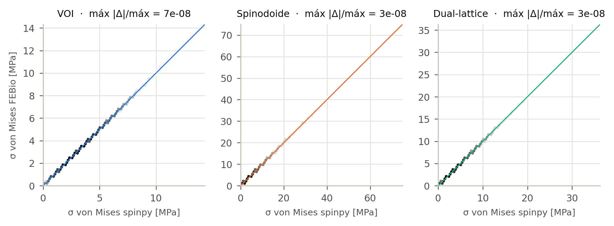

# Validación mecánica de spinpy frente a FEBio: el VOI porcino y sus dos candidatos

Carlos González-Torres · Universidad de Valparaíso · 24 de septiembre de 2026

Todos los análisis mecánicos que la app propone —ensayo de compresión con el
criterio de Pistoia, análisis comparado con el protocolo de Tapia et al.,
tensor elástico por homogeneización periódica, convergencia de malla y fallo
progresivo— repetidos sobre las **tres estructuras de una misma sesión** (el
VOI porcino V1, el spinodoide y el dual-lattice ajustados a él) y resueltos
otra vez, de forma independiente, con **FEBio 4.5.0**.

> **En palabras sencillas.** La app calcula cómo se deforma y dónde se carga
> un trozo de hueso y las dos estructuras artificiales que se le parecen. Aquí
> se le ha pedido a FEBio, un programa de elementos finitos de referencia en
> biomecánica, que haga exactamente las mismas cuentas. Las dos respuestas
> coinciden en ocho o nueve cifras en todos los análisis, incluidos los mapas
> de color de tensión. Además, FEBio sabe hacer algo que la app no hace —tener
> en cuenta que la pieza cambia de forma al cargarla— y eso sirve para medir
> hasta qué carga son fiables las cifras de la app: bien a la carga de
> referencia, con reservas cerca de la carga de rotura del spinodoide.

---

## 1. Resumen

| análisis de la app | qué se contrasta | peor diferencia spinpy/FEBio | tolerancia |
|---|---|---|---|
| ensayo de compresión (40³, 1 MPa) | E_app, campos u y σ, von Mises, p99 de superficie, Pistoia, equilibrio | 4·10⁻⁸ (σ) | 10⁻⁴ |
| análisis comparado (Tapia, 100 N) | lo mismo, con base empotrada y 18 GPa | 4·10⁻⁸ (σ) | 10⁻⁴ |
| tensor periódico (32³) | C completo, constantes de ingeniería | 2·10⁻¹⁰ | 10⁻⁶ |
| convergencia (22–40³) | E_app en cada resolución | 2·10⁻⁹ | 10⁻⁶ |
| fallo progresivo (32³, 10 pasos) | tejido roto en cada paso, E_app, carga de fallo | 0 vóxeles distintos; 1·10⁻⁷ | 10⁻⁶ / 10⁻⁵ |

Tres resultados, en este orden de importancia:

1. **La app resuelve bien todos sus análisis mecánicos.** Las diferencias
   con FEBio están entre 10⁻¹¹ y 10⁻⁷, dentro de las tolerancias que
   `../PREDICCIONES.md` declaró antes de la primera comparación con FEBio. En
   el fallo progresivo, **los dos bucles —uno con el solver de spinpy, otro con
   FEBio— rompen exactamente los mismos elementos en cada uno de los 33 pasos**.
   Y la sesión guardada se reproduce: las estructuras regeneradas desde
   `reproduccion.json` dan los números del informe automático del 23-09 con
   diferencias ≤ 3·10⁻¹¹.
2. **La hipótesis lineal se sostiene en el VOI y pierde exactitud en el
   spinodoide.** A 1 MPa el desvío no lineal es del 0,07 % (VOI), 0,22 %
   (dual-lattice) y 0,70 % (spinodoide). A su carga de fallo de Pistoia, del
   −1,6 %, −3,4 % y **−8,0 %**. La causa es la misma que en el VOI proximal de
   H4: trabéculas cortadas por la cara cargada que trabajan como voladizos.
3. **Los candidatos no convergen en malla como el VOI.** Entre 34³ y 40³ el
   VOI se mueve un −0,8 %, el dual-lattice un −1,9 % y el spinodoide un
   −5,5 %; la app solo comprobó la convergencia del VOI. Esto no es una
   discrepancia con FEBio (FEBio da la misma serie), es una propiedad de los
   candidatos a esta resolución.

---

## 2. El caso

**El VOI.** Hueso subcondral del astrágalo porcino, espécimen V1 del conjunto
público de Koria, Mengoni y Brockett (2020, Research Data Leeds,
doi:10.5518/787, CC BY 4.0): cubo de 188³ vóxeles a 16 µm (3,008 mm de lado),
segmentado por Otsu, BV/TV 0,398.

**Los candidatos**, tal como los dejó el informe automático
(`Informes_Porcino/VOI_V1_ambas_2026-09-23`, copiado en `sesion/`):

| | parámetros del ajuste | error | BV/TV | Tb.Th (mm) | DA |
|---|---|---|---|---|---|
| VOI | — | — | 0,398 | 0,139 | 1,33 |
| spinodoide | β = 15π, N = 500, θ = (15°, 30°, 50°), rechazo, semilla 20260720 | 7,1·10⁻⁴ | 0,401 | 0,136 | 1,27 |
| dual-lattice | 4,14 celdas, estiramiento (1,5; 1,0; 2,5), irregularidad 0,5 | 1,3·10⁻⁴ | 0,398 | 0,137 | 1,34 |

**Las estructuras no se redibujan.** El VOI se lee del `.mat` y se comprueba
su SHA-256; cada candidato se regenera por `informe._regenerar` —la única
traducción parámetros → generador— y se exige que su huella (forma + bits en
orden Fortran) sea la de `reproduccion.json`. Si no casa, el script se para.
Casaron las tres.

---

## 3. Cómo se comparó

### 3.1 El mismo problema discreto

Para los ensayos de compresión, `escribe.escribir_febio` —el exportador que la
app ya tiene, validado en `../INFORME.md`— escribe la misma malla que resuelve
spinpy (un hexaedro por vóxel portante, nodo a nodo), el mismo apoyo, la misma
carga sobre la sección bruta y el mismo material. FEBio la resuelve con Newton
completo y Pardiso (directo); spinpy con AMG con modos rígidos + CG (residuo
≤ 10⁻⁸). Los estadísticos derivados (p99 de von Mises en la capa superficial,
factor de Pistoia, cuantiles) se calculan **con las mismas funciones de
spinpy** sobre los dos campos: lo que se contrasta es la solución de elementos
finitos, no la implementación de un percentil.

FEBio es no lineal geométricamente y spinpy es lineal. El problema lineal se
contrasta con la extrapolación a carga nula

```math
%eq 1
u_{lin} = 2\,u(\sigma_1) - u(2\sigma_1), \qquad \sigma_1 = 1\ \mathrm{kPa}
```

reescalada a la carga del ensayo, que cancela el término no lineal de primer
orden. El desvío entre 1 y 2 kPa fue de 2·10⁻⁶ a 2·10⁻⁵ en desplazamiento: sin
la extrapolación, eso habría sido todo lo que se medía.

### 3.2 La homogeneización periódica en FEBio

`../PREDICCIONES.md` dejó fuera el tensor periódico porque FEBio no trae
condiciones periódicas para una malla de vóxeles. Aquí se escribieron con las
**restricciones lineales** de FEBio 4 (`homog_febio.py`): cada nodo de una cara
máxima es dependiente de su imagen módulo n,

```math
%eq 2
u_i(\mathbf{x}') = u_i(\mathbf{x}) + E_{ij}\,(x'_j - x_j)
```

que FEBio elimina del sistema (no es una penalización). Es la misma
conectividad periódica de `elastic.homogeneizar`, con el vacío como material
de 10⁻⁶·E_{s} en los 32³ elementos. La rigidez sale de FEBio por **otra vía**:
spinpy la calcula por energía, (u⁰ − χ)ᵀK(u⁰ − χ)/V; FEBio, como promedio de
volumen de su tensión, C·E igual a la media de volumen de σ, extrapolado a amplitud nula entre
ε = 10⁻⁵ y 2·10⁻⁵. La objeción de `PREDICCIONES.md` —que escribir las
restricciones a mano es comprobar nuestra propia implementación— es cierta a
medias: el escritor es nuestro, pero el ensamblaje, la eliminación de
restricciones, la solución y el cálculo de tensiones son de FEBio. El escritor
se probó antes contra dos casos con respuesta conocida: un bloque macizo
(tensor isótropo exacto) y una máscara aleatoria de 8×7×6 frente al LU directo
de spinpy, los dos a 10⁻⁸.

### 3.3 El fallo progresivo, dos veces

`simulacion.fallo_progresivo` ablanda en cada paso (a 0,05·E_{s}) el tejido que
el criterio de Pistoia da por roto y vuelve a cargar. `validar_porcino.py`
repite **el algoritmo entero** con FEBio como solver: en cada paso escribe la
malla con dos materiales (sano y ablandado), toma de FEBio el campo de
deformación efectiva, decide qué rompe con la misma regla y construye el paso
siguiente a partir de **su propio** daño. Los dos bucles solo comparten la
estructura de partida.

### 3.4 Tolerancias

Se usan las de `../PREDICCIONES.md`, declaradas antes de la primera corrida de
FEBio sobre H4: E_app < 10⁻⁶, campo u < 10⁻⁵, campo σ < 10⁻⁴, p99 de
superficie < 10⁻⁵, factor de Pistoia < 10⁻⁵, equilibrio < 10⁻⁹. **No se
escribió un documento de predicciones nuevo para este estudio**, y el tensor y
el fallo progresivo no tenían tolerancia previa: se les aplicó la de E_app
(10⁻⁶) y la de Pistoia (10⁻⁵), elegidas antes de ver sus resultados pero sin
constancia escrita de ello.

---

## 4. La parte lineal: los dos programas dicen lo mismo


### 4.1 Ensayo de compresión de la app

40³, apoyo deslizante, E_{s} = 20 GPa, ν = 0,3, 1 MPa sobre la sección bruta,
eje Z; exactamente la configuración de la sesión.

| estructura | BV/TV | E_app spinpy (MPa) | ΔE_app | Δu máx. | Δσ máx. | Δ von Mises | Δ p99 sup. | Δ Pistoia | ΔF | Δ sesión |
|---|---|---|---|---|---|---|---|---|---|---|
| VOI | 0,398 | 4020,8 | 1·10⁻⁹ | 4·10⁻⁹ | 4·10⁻⁸ | 2·10⁻⁸ | 6·10⁻⁹ | 5·10⁻⁹ | 6·10⁻¹¹ | 6·10⁻¹⁶ |
| Spinodoide | 0,401 | 1724,7 | 7·10⁻¹⁰ | 9·10⁻¹⁰ | 6·10⁻⁹ | 4·10⁻⁹ | 5·10⁻⁹ | 3·10⁻⁹ | 4·10⁻¹⁰ | 3·10⁻¹¹ |
| Dual-lattice | 0,397 | 2698,5 | 8·10⁻¹⁰ | 2·10⁻⁹ | 1·10⁻⁸ | 9·10⁻⁹ | 7·10⁻¹⁰ | 2·10⁻⁹ | 2·10⁻¹¹ | 1·10⁻¹¹ |

Δu y Δσ son la mayor diferencia nodal o elemental, dividida por el máximo del
campo; ΔF es el equilibrio (FEBio 4.5 escribe reacciones nulas en los apoyos
de desplazamiento nulo, así que la fuerza se obtiene de la integral de volumen
Σσ_{zz}·V_{e} = −F·H, exacta en el problema discreto); **Δ sesión** compara el
E_app que calcula hoy spinpy con el que guardó la sesión del 23-09.

Lo que la app reporta de este ensayo, idéntico en los dos programas:

| estructura | E_app (MPa) | p99 sup. (MPa) | máx. (MPa) | n capa sup. | desplaz. máx. (µm) | σ fallo (MPa) | F fallo (N) |
|---|---|---|---|---|---|---|---|
| VOI | 4020,8 | 7,09 | 14,0 | 20423 | 1,60 | 21,85 | 197,7 |
| Spinodoide | 1724,7 | 14,39 | 73,5 | 19662 | 16,02 | 12,54 | 113,5 |
| Dual-lattice | 2698,5 | 10,53 | 35,6 | 18813 | 7,92 | 15,37 | 139,0 |



### 4.2 Análisis comparado (protocolo de Tapia et al.)

40³, base **empotrada**, E_{s} = 18 GPa, ν = 0,3, **100 N** axiales (11,05 MPa
sobre la sección bruta de 9,05 mm²).

| estructura | BV/TV | E_app spinpy (MPa) | ΔE_app | Δu máx. | Δσ máx. | Δ von Mises | Δ p99 sup. | Δ Pistoia | ΔF | Δ sesión |
|---|---|---|---|---|---|---|---|---|---|---|
| VOI | 0,398 | 3714,3 | 1·10⁻⁹ | 3·10⁻⁹ | 4·10⁻⁸ | 2·10⁻⁸ | 1·10⁻¹⁰ | 4·10⁻⁹ | 2·10⁻¹⁰ | 7·10⁻¹⁴ |
| Spinodoide | 0,401 | 1569,3 | 6·10⁻¹⁰ | 3·10⁻⁹ | 6·10⁻⁹ | 5·10⁻⁹ | 8·10⁻¹⁰ | 4·10⁻⁹ | 1·10⁻¹⁰ | 9·10⁻¹² |
| Dual-lattice | 0,397 | 2494,3 | 8·10⁻¹⁰ | 8·10⁻¹⁰ | 1·10⁻⁸ | 1·10⁻⁸ | 7·10⁻⁹ | 1·10⁻⁸ | 3·10⁻¹⁰ | 4·10⁻¹² |

| estructura | E_app (MPa) | p99 sup. (MPa) | máx. (MPa) | n capa sup. | desplaz. máx. (µm) |
|---|---|---|---|---|---|
| VOI | 3714,3 | 77,15 | 155,3 | 20423 | 19,49 |
| Spinodoide | 1569,3 | 159,62 | 812,1 | 19662 | 196,54 |
| Dual-lattice | 2494,3 | 115,57 | 393,0 | 18813 | 98,31 |

### 4.3 Los mapas de color

Los mapas se pintan con las mismas piezas que la figura 8 del informe de la
app (`figuras.malla_figura`, proyección paralela con la cámara del cubo, mapa
`inferno`, cada vértice con el valor del vóxel sólido más próximo) y con **una
sola escala de color** —percentiles 1 y 99 de todo el tejido de las tres
estructuras— para app y FEBio. Columnas: (1) la app; (2) FEBio lineal; (3) su
diferencia, en log₁₀ de |Δ| dividido por el p99 del campo; (4) FEBio **no
lineal** a la carga del ensayo; (5) su diferencia con la app, en % del p99.


> **En palabras sencillas.** Las dos primeras columnas de cada mapa son la
> misma imagen porque los dos programas dan el mismo número en cada uno de los
> 25 000 elementos, hasta la octava cifra. La quinta columna es la única que
> cambia: allí FEBio deja que la pieza se deforme de verdad, y las zonas
> rojas son trabéculas del borde superior del spinodoide que, sueltas por un
> extremo, se doblan más de lo que un cálculo lineal predice.

### 4.4 Tensor periódico

32³ con el vacío a 10⁻⁶·E_{s}, E_{s} = 20 GPa, ν = 0,3 (la configuración de la
sesión). Seis casos de deformación unitaria por estructura, cada uno a dos
amplitudes: 36 corridas de FEBio sobre la rejilla completa (35 937 nodos,
3 169 nodos dependientes, 9 507 restricciones lineales por corrida).

| estructura | BV/TV | E_x (MPa) | E_y (MPa) | E_z (MPa) | G_yz (MPa) | ΔC máx. (rel.) | d log-euclídea | asimetría FEBio | Δ sesión |
|---|---|---|---|---|---|---|---|---|---|
| VOI | 0,398 | 2949,4 | 2748,5 | 4231,7 | 1296,6 | 2·10⁻¹⁰ | 9·10⁻¹⁰ | 4·10⁻¹¹ | 5·10⁻¹⁷ |
| Spinodoide | 0,400 | 1862,5 | 1315,4 | 3160,9 | 749,9 | 2·10⁻¹⁰ | 1·10⁻⁹ | 7·10⁻¹¹ | 2·10⁻¹⁴ |
| Dual-lattice | 0,396 | 2136,9 | 1771,2 | 3585,9 | 899,5 | 2·10⁻¹⁰ | 1·10⁻⁹ | 6·10⁻¹¹ | 2·10⁻¹⁴ |

ΔC máx. es la mayor diferencia entre entradas de los dos tensores, dividida
por la mayor entrada; la distancia log-euclídea (Mandel) es la que usa el
objetivo del ajuste para comparar tensores, y vale √6·ln a para dos tensores
que difieren en un factor a; la asimetría es la de la matriz que da FEBio,
que no se simetriza para medirla. Las nueve constantes de ingeniería difieren
como mucho en 8·10⁻¹⁰.


Es el acuerdo más estrecho del estudio (2·10⁻¹⁰), aunque este sistema está
peor condicionado que el del ensayo —contraste de 10⁶ con el vacío y el doble
de incógnitas—; no se ha investigado por qué.

Lo que dice el tensor de los candidatos coincide con el ensayo: el módulo
medio es 3310 MPa en el VOI, 2113 MPa en el spinodoide (0,64×) y 2498 MPa en
el dual-lattice (0,75×), y los dos candidatos son **más anisótropos** que el
hueso (E_máx/E_mín 2,40 y 2,02 frente a 1,54): concentran más rigidez en Z
y menos en Y.

### 4.5 Convergencia de malla

La sesión corrió la serie de convergencia del VOI (22, 28, 34 y 40³). Aquí se
repitió en las tres estructuras y en los dos programas.

| estructura | n | h (µm) | BV/TV | E_app spinpy (MPa) | ΔE FEBio | E_app sesión (MPa) |
|---|---|---|---|---|---|---|
| VOI | 22 | 136,7 | 0,3958 | 4041,4 | 2·10⁻¹⁰ | 4041,4 |
| VOI | 28 | 107,4 | 0,3998 | 4072,4 | 2·10⁻⁹ | 4072,4 |
| VOI | 34 | 88,5 | 0,3988 | 4054,2 | 2·10⁻⁹ | 4054,2 |
| VOI | 40 | 75,2 | 0,3983 | 4020,8 | 1·10⁻⁹ | 4020,8 |
| Spinodoide | 22 | 136,7 | 0,3989 | 1308,7 | 8·10⁻¹⁰ | — |
| Spinodoide | 28 | 107,4 | 0,3993 | 1786,9 | 6·10⁻¹⁰ | — |
| Spinodoide | 34 | 88,5 | 0,4018 | 1824,5 | 7·10⁻¹⁰ | — |
| Spinodoide | 40 | 75,2 | 0,4005 | 1724,7 | 7·10⁻¹⁰ | — |
| Dual-lattice | 22 | 136,7 | 0,3990 | 3163,8 | 2·10⁻¹⁰ | — |
| Dual-lattice | 28 | 107,4 | 0,3965 | 3144,7 | 1·10⁻⁹ | — |
| Dual-lattice | 34 | 88,5 | 0,3959 | 2750,1 | 1·10⁻⁹ | — |
| Dual-lattice | 40 | 75,2 | 0,3971 | 2698,5 | 8·10⁻¹⁰ | — |


FEBio reproduce las tres series a 10⁻⁹, así que lo que muestran es de las
estructuras, no del solver. **El VOI oscila dentro de un 1,3 %**, el veredicto
que ya dio la app. **Los candidatos no.** El spinodoide cambia un +37 % de 22³
a 28³ y un −5,5 % de 34³ a 40³; el dual-lattice un −12,5 % de 28³ a 34³ y un
−1,9 % en el último paso. Con el criterio de la app (`CONV_OSCILACION_MAX`,
3 %) ninguna de las dos series se daría por convergida. La explicación
probable es la resolución efectiva: con Tb.Th ≈ 0,136 mm y h = 75 µm, los
candidatos tienen Tb.Th/h ≈ 1,8 a 40³, el mismo que el VOI, pero sus puntales
son de sección uniforme y un remuestreo de vecino más próximo los parte o los
une de golpe; el VOI, con espesores muy variables, promedia esos saltos. Es
una expectativa, no una medida: no se ha comprobado a 48³ o más.

### 4.6 Fallo progresivo

32³, 10 pasos, ablandamiento a 0,05·E_{s}, apoyo deslizante (los valores por
omisión de la app). La tabla completa, paso a paso, está en
`resultados/fallo.jsonl`; aquí el primer, el tercer y el último paso:

| estructura | paso | daño acumulado | E/E₀ | ΔE FEBio | F de fallo (N) | ΔF FEBio | rotos spinpy / FEBio | vóxeles intactos distintos |
|---|---|---|---|---|---|---|---|---|
| VOI | 0 | 0,0 % | 1,000 | 7·10⁻¹⁰ | 202,7 | 3·10⁻⁸ | 261 / 261 | 0 |
| VOI | 2 | 4,0 % | 0,567 | 6·10⁻¹¹ | 163,1 | 3·10⁻⁸ | 251 / 251 | 0 |
| VOI | 10 | 18,3 % | 0,193 | 5·10⁻¹⁰ | 166,0 | 7·10⁻⁹ | 214 / 214 | 0 |
| Spinodoide | 0 | 0,0 % | 1,000 | 2·10⁻¹⁰ | 124,6 | 3·10⁻⁸ | 262 / 262 | 0 |
| Spinodoide | 2 | 4,0 % | 0,155 | 8·10⁻⁸ | 118,5 | 8·10⁻⁸ | 252 / 252 | 0 |
| Spinodoide | 10 | 18,3 % | 0,097 | 7·10⁻⁸ | 137,6 | 8·10⁻⁹ | 214 / 214 | 0 |
| Dual-lattice | 0 | 0,0 % | 1,000 | 5·10⁻¹⁰ | 147,4 | 3·10⁻⁹ | 260 / 260 | 0 |
| Dual-lattice | 2 | 4,0 % | 0,327 | 2·10⁻⁸ | 122,0 | 8·10⁻¹⁰ | 250 / 250 | 0 |
| Dual-lattice | 10 | 18,3 % | 0,139 | 5·10⁻⁹ | 137,5 | 2·10⁻⁸ | 213 / 213 | 0 |

**En los 33 pasos, el conjunto de tejido intacto de FEBio es idéntico vóxel a
vóxel al de spinpy.** Era lo más frágil de contrastar: la regla de rotura
compara cada elemento con un percentil, y un error de 10⁻⁸ en el campo podía
haber cambiado de lado un elemento en el umbral y separar los dos bucles para
siempre. No ocurrió. Las diferencias en E crecen a ~10⁻⁷ en el spinodoide
dañado, que tiene un contraste de rigidez de 20 entre tejido sano y roto y un
sistema peor condicionado, y siguen por debajo de la tolerancia.


> **En palabras sencillas.** La simulación de fallo de la app va rompiendo el
> tejido paso a paso, y cada paso depende de los anteriores: un error pequeño
> al principio podría llevar a romper otra trabécula y a una historia
> distinta. Se repitió la simulación entera con FEBio haciendo las cuentas, y
> en las tres estructuras se rompieron exactamente los mismos trozos, en el
> mismo orden.

---

## 5. Hasta dónde vale la hipótesis lineal

Todos los análisis de la app son lineales. FEBio permite medir cuánto se
aparta la respuesta real —con grandes desplazamientos— a las cargas que la app
usa o predice.

### 5.1 Ensayo de la app

| estructura | ΔE no lineal a 1 MPa | σ fallo (MPa) | ΔE no lineal a σ fallo | Δ p99 sup. a σ fallo | tejido > 0,7 % a σ fallo | E_app plato (MPa) | plato / fuerza | ΔE plato no lineal a ε fallo |
|---|---|---|---|---|---|---|---|---|
| VOI | −0,070 % | 21,85 | −1,57 % | +0,48 % | 2,07 % | 4272,7 | 1,063 | −1,56 % |
| Spinodoide | −0,697 % | 12,54 | −8,01 % | +8,66 % | 2,31 % | 2920,4 | 1,693 | −2,59 % |
| Dual-lattice | −0,220 % | 15,37 | −3,44 % | +2,26 % | 2,11 % | 3321,5 | 1,231 | −2,07 % |

Columnas: ΔE no lineal = E_app de FEBio con grandes desplazamientos a esa
carga, frente al lineal; «tejido > 0,7 %» es la fracción del hueso que supera
la deformación crítica de Pistoia en la solución no lineal a la carga de
fallo, que en la lineal es el 2 % **por construcción**; «plato» es un plato
rígido sin fricción (`eps_plato` del exportador) que impone el mismo
desplazamiento a todo el techo.

- **A 1 MPa la hipótesis lineal se sostiene en las tres** (≤ 0,7 %).
- **A la carga de fallo, se sostiene en el VOI** (−1,6 %; el criterio de
  Pistoia se cumple al 2,07 % en lugar del 2 %) y **pierde exactitud en el
  spinodoide**: −8 % de rigidez, +8,7 % en el p99 de superficie y 2,31 % del
  tejido sobre el umbral. Su carga de fallo lineal, 12,5 MPa, está
  sobreestimada en una cantidad de ese orden.
- **Es un efecto de la condición de carga, como en H4.** Con un plato rígido
  el desvío del spinodoide a la misma deformación baja de −8,0 % a −2,6 %, y su
  E_app lineal sube un **69 %** (2920 frente a 1725 MPa). En el VOI el plato
  solo añade un 6 %. La fuerza impuesta sobre el área ósea del techo —la
  convención de la app— deja trabéculas cortadas por la cara superior
  trabajando en voladizo, y el spinodoide, de puntales finos y uniformes,
  tiene muchas más que el VOI.

### 5.2 Protocolo de Tapia (100 N = 11,05 MPa)

| estructura | σ aparente (MPa) | ΔE no lineal a 100 N | Δ p99 sup. | Δu máx. |
|---|---|---|---|---|
| VOI | 11,052 | −0,882 % | +0,282 % | +3,096 % |
| Spinodoide | 11,052 | −7,870 % | +7,706 % | +42,491 % |
| Dual-lattice | 11,052 | −2,759 % | +1,913 % | +9,275 % |

100 N sobre 3 mm de lado son 11 MPa, la mitad de la carga de fallo del VOI y
casi la del spinodoide. En el VOI el análisis lineal de la app es fiable a esa
carga (<1 % en E y 0,3 % en el p99 citable); **en el spinodoide, la cifra
lineal del p99 de superficie (159,6 MPa) queda un 7,7 % por debajo de la no
lineal**, y el desplazamiento máximo, un 42 %. El mapa de la sección 4.3
muestra que todo ese desvío está en la cara cargada.


> **En palabras sencillas.** La app supone que la pieza apenas cambia de
> forma al cargarla. Para el hueso real eso es verdad hasta su carga de
> rotura. Para el spinodoide deja de serlo antes: al apretarlo con 100 N, las
> trabéculas sueltas de su cara superior se doblan tanto que la app subestima
> la tensión de pico en un 8 %. Con un plato que empuja toda la cara por
> igual, como en una máquina de ensayos, el problema casi desaparece.

---

## 6. Lo que dicen estos números de los candidatos

Con los dos programas de acuerdo, las diferencias entre estructuras son
diferencias de las estructuras:

- **Rigidez.** En el ensayo de la app el VOI da 4021 MPa, el dual-lattice
  2699 MPa (0,67×) y el spinodoide 1725 MPa (0,43×), con BV/TV igualado al
  0,8 %. El protocolo de Tapia da las mismas proporciones (0,67× y 0,42×).
  Ninguno de los dos candidatos, ajustados en morfometría, reproduce la
  rigidez del hueso; el dual-lattice se acerca más.
- **Tensión de pico.** El p99 de superficie del spinodoide duplica el del VOI
  (14,4 frente a 7,1 MPa a 1 MPa) y su máximo es 5 veces mayor: concentra la
  carga en menos trabéculas. Por eso su carga de fallo de Pistoia es un 43 %
  menor.
- **Fragilidad.** En el fallo progresivo el spinodoide pierde el 78 % de la
  rigidez al romper el primer 2 % del tejido; el dual-lattice, el 56 %; el
  VOI, el 24 %. Es la firma de una estructura con pocas trayectorias de carga.

Con dos reservas: los candidatos no han convergido en malla a 40³ (sección
4.5), y la no linealidad del spinodoide cerca de su fallo (sección 5) hace
que su carga de fallo lineal sea optimista.

---

## 7. Lo que esta validación no demuestra

Coincidir con FEBio prueba que spinpy **resuelve bien los problemas que
plantea**. No prueba que esos problemas representen el hueso: la malla de
vóxeles, el tejido homogéneo e isótropo, las condiciones de contorno y el
criterio de Pistoia (calibrado en radio distal humano) son supuestos que los
dos programas comparten. Eso solo lo contrasta un ensayo físico.

Tampoco es una prueba de convergencia de los candidatos (sección 4.5), ni una
validación de FEBio: FEBio es aquí un árbitro independiente, con otro
elemento de carga (presión integrada), otro solver (directo) y otra vía para
el tensor (promedio de tensiones), no una verdad.

---

## 8. Incidencias

- **FEBio 4.5.0 se cae sin `plotfile`.** Un archivo cuya sección `Output`
  solo tiene `logfile` termina con violación de acceso (0xC0000005), con o
  sin restricciones lineales. `homog_febio.py` escribe siempre un plotfile
  mínimo, y el comentario lo explica.
- **La sintaxis de las restricciones lineales** no es la de las versiones
  anteriores ni coincide con los nombres de la clase: el nodo dependiente va
  como `<node>`/`<dof>` directos y los independientes como `<child_dof>`,
  con `<offset>` para el salto (manual de FEBio 4, §3.11.19).
- **La sesión no se reproduce bit a bit en los candidatos**: E_app difiere de
  la guardada en 3·10⁻¹¹ (spinodoide) y 1·10⁻¹¹ (dual-lattice), el VOI en
  6·10⁻¹⁶. Las máscaras SÍ son idénticas (huella comprobada), así que la
  diferencia está en el solver iterativo —del orden de su residuo por su
  condicionamiento—, no en la estructura. No afecta a ninguna cifra citable.

---

## 9. Reproducir

```
cd Port_Python
python comparativa_febio/porcino/validar_porcino.py            # todo, ~2 h
python comparativa_febio/porcino/validar_porcino.py compresion --estructuras voi
python comparativa_febio/porcino/figuras_porcino.py            # figuras ES/EN
python comparativa_febio/porcino/tablas_porcino.py             # tablas de este informe
```

El VOI (`VOI_V1.mat`) se busca en la ruta que guardó la sesión o en la que se
pase con `--voi`; se comprueba su SHA-256. FEBio 4.5.0 (FEBio Studio 2) en
`C:\Program Files\FEBioStudio2\bin\febio4.exe`. Resultados en
`resultados/*.jsonl`, una línea por estructura, punto o paso, con bloque de
procedencia; los `.feb` y las salidas de FEBio quedan en `corridas/` (no se
versionan).

Tiempo de FEBio en la máquina de desarrollo (Pardiso, 16 GB): el ensayo de
la app, 7,6 min en 21 corridas; el análisis comparado, 3,0 min en 9; la
convergencia, 3,4 min en 24; el tensor, 75,6 min en 36 (la rejilla entera,
con vacío); el fallo progresivo, 66 corridas a 32³. La campaña completa,
incluidos spinpy y la lectura de los logfiles, duró unas 2 h 15 min.

## Referencias

- Andreassen E, Andreasen CS. How to determine composite material properties
  using numerical homogenization. *Comput Mater Sci* 2014;83:488–495.
  doi:10.1016/j.commatsci.2013.09.006
- Koria L, Mengoni M, Brockett C. Estimating tissue-level properties of
  porcine talar subchondral bone [conjunto de datos]. Research Data Leeds
  Repository, 2020. doi:10.5518/787
- Maas SA, Ellis BJ, Ateshian GA, Weiss JA. FEBio: finite elements for
  biomechanics. *J Biomech Eng* 2012;134(1):011005. doi:10.1115/1.4005694
- Pistoia W, van Rietbergen B, Lochmüller E-M, Lill CA, Eckstein F,
  Rüegsegger P. Estimation of distal radius failure load with micro-finite
  element analysis models based on three-dimensional peripheral quantitative
  computed tomography images. *Bone* 2002;30(6):842–848.
  doi:10.1016/S8756-3282(02)00736-6
- Tapia D, González A, Vidal F, Salinas P. A specimen-based comparative
  microCT-FEA analysis of vertebral trabecular bone microarchitecture and
  mechanical response in two South American cervids. *Biology*
  2026;15:722.
