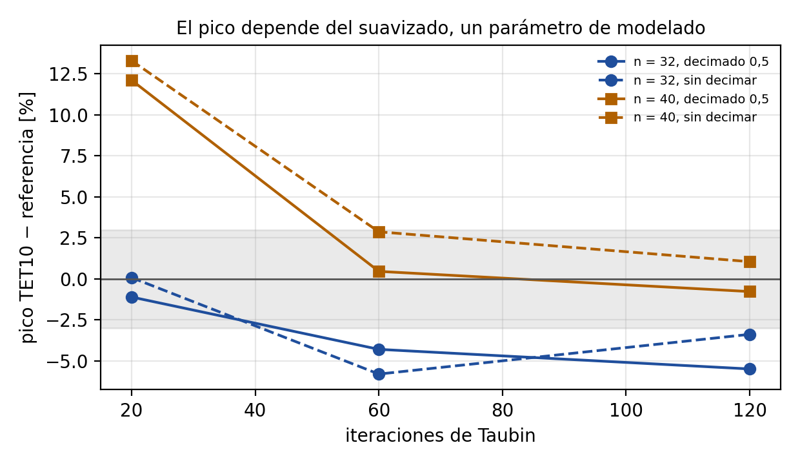
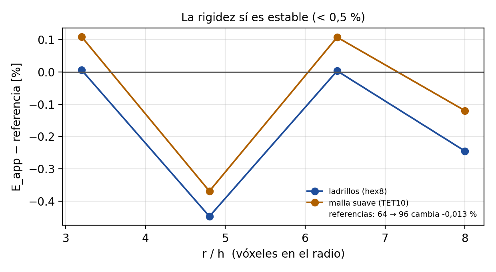

# Malla suave (TET10) en FEBio: validación

Fecha: 2026-09-24. spinpy 0.2.0, FEBio 4.5.0 (FEBio Studio 2). Código:
`spinpy/febio.py`, `spinpy/escribe.escribir_febio_ensayo`,
`spinpy/solido.malla_tet10`. Pruebas repetibles: bloque 27
(`tests/test_27_febio_tet10.py`).

Los tiempos de esta carpeta se midieron con la CPU al 100 % por procesos
ajenos y FEBio limitado a 4 hilos: **no sirven para calibrar el modelo de tiempos**
(`tiempos.py`).

## 1. Lo que se verificó con tolerancia declarada antes de medir

| prueba | tolerancia | resultado |
|---|---|---|
| Orden de nodos TET10 de FEBio (un elemento, campo cuadrático exacto) | 1e-6 | **3,9e-10** con el orden C3D10 |
| Orden erróneo detectado (intermedios permutados) | aborta o > 1e-2 | FEBio **aborta** (jacobiano negativo) |
| Bloque macizo, E_app = E_s | 1e-6 | hex8 1,1e-9 · TET10 1,5e-9 |
| Bloque macizo, fuerza por integral de volumen | 1e-6 | ≤ 5e-9 |
| Giroide 12³, FEBio hex8 = app (E_app, p99 superficie, Pistoia, vm_p99) | 1e-6 | ≤ 1,7e-9 |
| Escritor general hex8 = escritor validado (sin FEBio) | líneas iguales | iguales (fuerza, empotrado, plato) |
| Homogeneización bloque macizo, KUBC y SUBC = D isótropo | 1e-6 | 8,6e-11 y 1,6e-9 |
| Homogeneización periódica hex8 = `elastic.homogeneizar` (giroide 6³) | 1e-6 | 1,6e-10 |
| Estadísticos ponderados con pesos iguales = funciones de siempre | bit a bit | bit a bit |

> FEBio entiende los tetraedros cuadráticos en el
> mismo orden en que los escribe spinpy, y un bloque macizo sale exacto con los
> dos tipos de malla. Lo validado para los ladrillos sigue valiendo.

## 2. Dos errores encontrados en `solido.malla_tet10` (ya corregidos)

1. **Los poros cerrados se rellenaban.** PyMeshFix borra por defecto todas las
   cáscaras de la superficie menos la mayor (`remove_smallest_components=True`),
   así que la pared de una cavidad que no toca las caras del cubo desaparecía y
   tetgen la mallaba maciza. Medido en la cavidad esférica a 16³: la malla
   tenía el volumen del cubo entero (+3,4 %). Ahora se conservan las cáscaras,
   tetgen numera las regiones (`regionattrib`) y se quitan las que la máscara
   dice que son poro (voto por volumen de cada región). Afectaba también a la
   exportación TET10 que ya existía.
2. **La corrección de volumen necesitaba tapas exactas.** Al desplazar la
   superficie por su normal, las tapas se metían hacia dentro y tetgen
   abortaba (violación de segmento). Los vértices de las tapas vuelven ahora a
   su plano exacto, el desplazamiento se calcula con el área libre y la
   orientación es la saliente del sólido (con `auto_orient_normals` la pared de
   un poro quedaba mirando al hueso y la corrección engordaba el sólido).

Y uno en el post-proceso nuevo: los nodos vienen de marching cubes en float32 y
el techo quedaba a 4e-7 mm de su plano en el VOI de H4; se devuelven a su plano
exacto antes de buscar base y techo.

## 3. Pérdida de volumen del suavizado (VOI proximal de H4)

| n | sin corrección | con corrección | TET10 | GDL |
|---|---|---|---|---|
| 48 | −6,8 % | −0,15 % | 179 k | 1,0 M |
| 64 | −3,5 % | −0,05 % | 350 k | 1,9 M |

El signo depende de la estructura: el suavizado encoge lo convexo y agranda lo
cóncavo; en la cavidad esférica el sólido **gana** un 3,3 %. El umbral de
reservas (`febio.PERDIDA_VOLUMEN_MAX_PCT` = 3 %) se declaró antes de medir.

## 4. Cavidad esférica: ¿converge el pico con malla suave?

Cubo de 1 mm con cavidad central de radio 0,2 mm, ensayo de la app (1 MPa,
deslizante). Referencia: el mismo problema con TET10 sobre la **esfera
analítica**, a dos refinamientos. Goodier (medio infinito) da vm/σ₀ = 1,981;
el problema finito, 2,128 (+7,4 %, sección neta menor).

Predicciones escritas antes de correr (cabecera de `cavidad.py`) y resultado:

| | predicción | resultado |
|---|---|---|
| P1 referencia convergida | pico ≤ 1 %, E ≤ 0,1 % entre refinamientos | **cumple**: +0,53 % y −0,013 % |
| P2 pico TET10 → referencia | ≤ 3 % a la mayor n | **falla** |
| P3 p99 superficie TET10 | ≤ 3 % a la mayor n | **falla** (+7,2 %) |
| P4 E_app TET10 | ≤ 1 % | **cumple** (−0,12 %) |

Pico de von Mises en la pared (referencia 2,128):

| n (r/h) | hex8 | TET10 (Taubin 20) | Taubin 60 | Taubin 120 |
|---|---|---|---|---|
| 16 (3,2) | −13,4 % | +1,7 % | | |
| 24 (4,8) | −8,7 % | +5,2 % | | |
| 32 (6,4) | −11,8 % | −1,1 % | −4,3 % | −5,5 % |
| 40 (8,0) | +1,5 % | **+12,1 %** | +0,5 % | −0,8 % |

**Conclusión.** Con los parámetros por omisión la malla suave **no hace
converger el pico** en este caso: oscila como el de los ladrillos. Con un
número fijo de iteraciones de Taubin la rugosidad que queda escala con el
vóxel, así que su concentración de tensiones no baja al refinar. Más suavizado
acerca el pico a la referencia en n = 40 (+0,5 % / −0,8 %) pero lo aleja en
n = 32 (−4 / −6 %): el resultado depende en varios puntos de un parámetro de
modelado. E_app no (< 0,2 %). La malla suave quita los escalones, pero **su
borde sigue siendo una de muchas superficies compatibles con la imagen**; no
responde por sí sola a la objeción de regularidad para el pico.

> Alisar la superficie no basta para que la tensión
> máxima deje de depender de la malla. La rigidez sí sale estable.

Datos: `resultados/cavidad.jsonl`; registros de consola en `cavidad*.log`.
Figuras: `python comparativa_febio_tet/figuras_tet.py`.

## 5. VOI proximal de H4 a 32³ (preliminar)

Ensayo de la app, desde la línea de comandos (`python -m spinpy.febio`).

| magnitud | app (hex8) | FEBio hex8 | FEBio TET10 |
|---|---|---|---|
| E_app, definición de la app (media de nodos del techo) | 699,77 MPa | 699,77 MPa (Δ 8,7·10⁻⁸) | — |
| E_app, techo ponderado por área | — | 766,05 MPa | pendiente |
| p99 de von Mises en la superficie | 27,10 MPa | 27,10 MPa | pendiente |
| σ de fallo (Pistoia) | 6,62 MPa | 6,62 MPa | pendiente |
| no lineal, fuerza a 1 MPa, frente al lineal | — | −13,8 % | en curso |

Con ladrillos, FEBio reproduce la app (8,7·10⁻⁸ en E_app con la misma
definición). Las dos definiciones de E_app difieren un 9 % en este VOI: los
voladizos del techo se hunden más que el resto, y la media simple de nodos los
pesa distinto que la integral por área. Por eso la tabla de la aplicación
compara la implementación con la definición de la app y la malla con la
integral por área.

**Un tercer fallo encontrado y corregido.** Con TET10 el lineal a la carga
menor se declaraba no convergido: la solución había convergido en la tercera
iteración (energía 10⁻²², desplazamiento 5·10⁻¹⁴ relativos), pero el residuo
se estancó en 2,3·10⁻¹² relativo, el piso de redondeo con 360 000 GDL, por
encima de la tolerancia 10⁻¹²; FEBio agotó las 50 reformas en 9 minutos. Con
TET10 la tolerancia de residuo es ahora 10⁻¹⁰ (`escribe.RTOL`); con hex8 sigue
la validada.

> Con ladrillos, FEBio y la app dan lo mismo. La
> comparación con la malla suave en el hueso real está corriendo.
