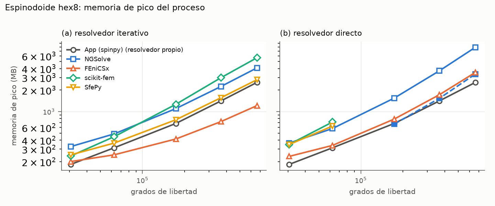
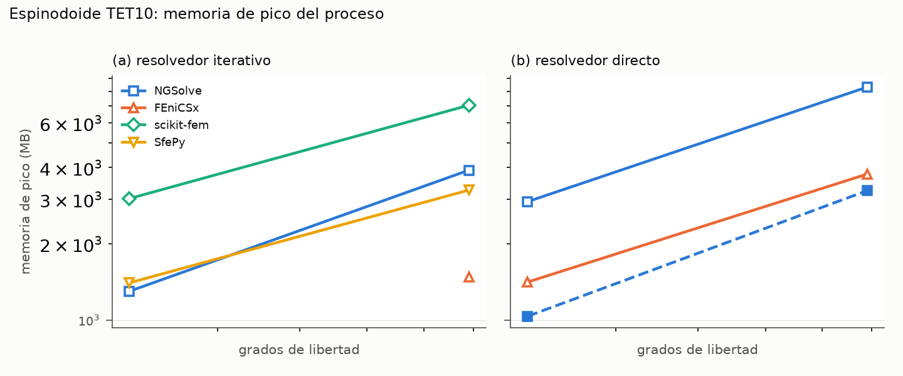
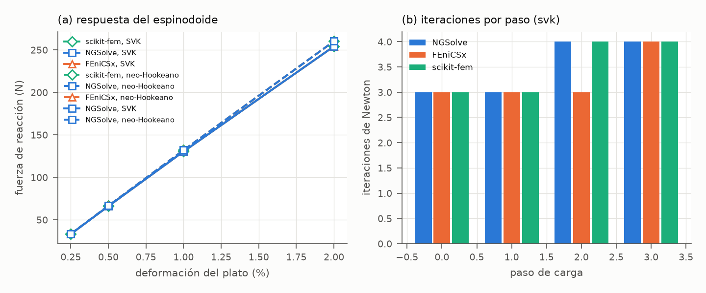

# Motores de elementos finitos internos para spinpy: comparación de NGSolve, FEniCSx, scikit-fem y SfePy con el resolvedor de la aplicación

Fecha: 2026-10-01 (revisión de la Figura 5: convergencia con refinamiento h y p). spinpy V2.1.1; los motores no cambian desde la V2.0.1 (la V2.1.0 añade las correcciones de borde de `comparativa_motores/correcciones/`). Código: `spinpy/motores/`, `spinpy/fem.py`. Banco de pruebas: `comparativa_motores/` (`correr.py`, `casos.py`, `comun.py`, `convergencia.py`, `figuras.py`). Datos: `comparativa_motores/resultados/*.jsonl`. Tablas completas: `comparativa_motores/tablas.md`. Pruebas repetibles: bloque 29 de la suite (`tests/test_29_motores.py`).

## Resumen

**Objetivo.** Eliminar la dependencia de spinpy respecto de FEBio, un ejecutable externo, sin perder la malla suave de tetraedros cuadráticos (TET10) ni los análisis no lineales, y con una fiabilidad demostrada y no supuesta.

**Métodos.** Se integraron en spinpy cuatro bibliotecas de elementos finitos que corren dentro del proceso de la aplicación (NGSolve 6.2, FEniCSx 0.11, scikit-fem 12.0 y SfePy 2026.3) y se compararon con el resolvedor propio de la aplicación sobre problemas discretos idénticos: un bloque macizo con solución exacta (hexaedros y TET10), la compresión uniaxial no lineal de un bloque con solución cerrada para St. Venant-Kirchhoff y para el neo-Hookeano de FEBio, una cavidad esférica con la referencia de FEBio guardada en el repositorio, un espinodoide trabecular de 30 672 a 661 965 grados de libertad (GDL) con hexaedros y de 314 880 a 790 599 GDL con TET10, y el mismo espinodoide en régimen no lineal. Además, en un cubo con solución analítica de las ecuaciones de Navier se midió el orden de convergencia con refinamiento h (hexaedros trilineales, TET4 y TET10) y p (tetraedros de grado 1 a 8). Se midieron la exactitud, el orden de convergencia, la concordancia entre motores, el tiempo de pared, la memoria de pico y la viabilidad de distribución.

**Resultados.** En los problemas lineales, los cinco motores dieron el mismo desplazamiento dentro de la tolerancia de sus resolvedores con todos los directos y con los iterativos, salvo una excepción descrita más abajo (diferencias máximas de 10⁻¹³ a 10⁻¹⁰; 10⁻⁹ con la app, que resuelve a 10⁻⁸). En el bloque macizo todos reprodujeron E_app = E_s a 10⁻¹¹ o mejor, y en la compresión no lineal los cuatro motores externos reprodujeron la fuerza cerrada a 4·10⁻¹² hasta el 20 % de acortamiento. Frente a FEBio, la cavidad con hexaedros coincidió a 7,7·10⁻⁹ en E_app y a 1,7·10⁻⁹ en el p99 de von Mises. Con la solución analítica, el error de los cinco motores disminuyó al ritmo que predice la teoría a priori: pendientes log-log en L2 de 1,99 (hexaedros), 1,98 (TET4) y 3,00 (TET10), y en la seminorma H1 de 1,00, 0,99 y 1,99; con la malla fija, el error L2 bajó de forma exponencial con el grado, de 4,4·10⁻² (p = 1) a 3,8·10⁻¹² (p = 8). Hubo tres excepciones de fiabilidad: la tangente de St. Venant-Kirchhoff de SfePy no es la derivada de su residuo (error de 37 %), lo que hace que Newton converja linealmente y no alcance el 2 % de deformación en el espinodoide; el iterativo de FEniCSx (CG + GAMG) divergió en la malla TET10 del espinodoide a 32³; y el CG + pyamg de scikit-fem se detuvo en un residuo de 10⁻¹⁰ con un error de desplazamiento de hasta 0,9 % en las mallas TET10 del espinodoide. En tiempo, con TET10 a 790 599 GDL, NGSolve resolvió en 45 s (Cholesky propio, 3,2 GB) o 59 s (CG + BDDC, 3,9 GB), FEniCSx en 22 s (MUMPS, 3,8 GB), y scikit-fem y SfePy en 905 y 1010 s. Solo NGSolve y scikit-fem publican ruedas para Windows en PyPI; FEniCSx requiere conda y un compilador de C en tiempo de ejecución, y SfePy solo publica ruedas para Linux.

**Conclusión.** NGSolve es el motor adecuado para lo que la aplicación no resolvía por sí misma (TET10 y no lineal): exacto en todas las pruebas, rápido, instalable sin programas externos en Windows, con licencia LGPL-2.1 y sin necesidad de MKL, porque su Cholesky propio fue más rápido y usó menos de la mitad de memoria que PARDISO en todos los casos medidos. El resolvedor propio de la app se mantiene para la malla de ladrillos en lineal, donde es competitivo y está validado. FEBio deja de ser necesario; la exportación a `.feb` se conserva como formato de intercambio.

> Con resolvedores bien convergidos, los cinco motores resuelven el mismo problema y dan el mismo resultado hasta la décima o duodécima cifra. Al refinar la malla, el error en desplazamientos baja al ritmo que predice la teoría: unas cuatro veces menos con cada malla el doble de fina en elementos lineales y unas ocho veces menos en cuadráticos. NGSolve es el que conviene integrar: resuelve la malla suave y el no lineal en segundos o en un minuto, se instala con la aplicación en Windows y no necesita ningún programa externo.

## 1. Objetivo

Hasta la versión 1.0.2, spinpy resolvía sus ensayos de compresión con dos programas: su propio resolvedor sobre hexaedros de un vóxel (`resistencia.ensayo_compresion`) y FEBio 4.5, un ejecutable externo que se lanzaba como proceso aparte para la malla suave de tetraedros cuadráticos (TET10) y para los análisis no lineales. Esa segunda vía hacía a la aplicación dependiente de un programa cuya licencia no permite redistribuirlo. Este informe evalúa cuatro bibliotecas de elementos finitos que pueden correr dentro del proceso de spinpy, sin programas externos, y las compara con el resolvedor actual de la aplicación en cinco ejes: exactitud frente a soluciones cerradas, concordancia entre motores sobre la misma malla, tiempo de cálculo, memoria de pico y viabilidad de distribución (licencia, disponibilidad en Windows, dependencias en tiempo de ejecución).

Los cinco motores comparados son:

| Motor | Versión | Licencia | Lenguaje del núcleo | Resolvedores usados |
|---|---|---|---|---|
| App (spinpy) | 1.0.2 (sin cambios en 2.0.1) | MIT | Python (numpy, scipy, pyamg) | LU de SuperLU por debajo de 6000 GDL; CG + multigrid algebraico (pyamg) con modos rígidos por encima |
| NGSolve | 6.2.2607 | LGPL-2.1 | C++ con interfaz Python | PARDISO (MKL); CG + BDDC (P2); CG + pyamg sobre su matriz (hex8) |
| FEniCSx (DOLFINx) | 0.11.0 | LGPL-3.0 | C++ con UFL y compilación JIT | Cholesky de MUMPS; CG + GAMG (PETSc) con modos rígidos |
| scikit-fem | 12.0.2 | BSD-3 | Python (numpy, scipy) | SuperLU; CG + pyamg con modos rígidos |
| SfePy | 2026.3 | BSD-3 | Python con extensiones C/Cython | SuperLU (`ls.scipy_direct`); CG (`ls.scipy_iterative`) + pyamg con modos rígidos |

## 2. Diseño de la comparación

### 2.1 Un mismo problema discreto para todos

La comparación aísla el motor. Cada caso es un problema discreto completo que construye spinpy (malla, condiciones de contorno, material y carga) y que se entrega idéntico a los cinco motores (`spinpy.motores.problema_de_malla`). Cada motor devuelve el desplazamiento nodal en el orden de nodos de spinpy; el emparejamiento se hace por coordenadas y se aborta si algún nodo no tiene pareja a 10⁻⁹ del tamaño de la malla. El postproceso (tensión por elemento, módulo aparente, capa superficial, criterio de Pistoia) es único y se aplica al desplazamiento de cada motor, de modo que cualquier diferencia entre motores procede de su montaje, su cuadratura, sus condiciones de contorno o su resolvedor, nunca de la malla ni de la definición de las magnitudes.

Los motores que construyen su propio espacio P2 sobre las esquinas del tetraedro (todos salvo la app, que no resuelve TET10) necesitan aristas rectas. En las mallas TET10 de spinpy, el ajuste de los nodos a los planos del cubo (`fem.preparar_tet10`) mueve esquinas situadas a menos de 10⁻³ h de un plano sin mover el nodo intermedio de sus aristas; se midió un desplazamiento de hasta 8,4·10⁻⁴ h respecto del punto medio. Antes de resolver, cada nodo intermedio se recoloca en el punto medio de su arista (ecuación 1), y el desplazamiento máximo aplicado se registra con cada problema.

```math
%eq 1
\mathbf{x}_{ij}=\frac{1}{2}\left(\mathbf{x}_{i}+\mathbf{x}_{j}\right),\quad (i,j)\in\{(0,1),(1,2),(0,2),(0,3),(1,3),(2,3)\}
```

### 2.2 Casos

1. **Bloque macizo** de 8 × 8 × 12 vóxeles (h = 0,05 mm), con hexaedros y con TET10 (tetgen sobre el mismo cubo). El ensayo lineal tiene solución exacta del problema discreto: deformación uniforme y E_app = E_s.
2. **Bloque en compresión uniaxial no lineal** (4 × 4 × 6 vóxeles) con plato rígido sin fricción hasta el 20 % de acortamiento, con St. Venant-Kirchhoff y con el neo-Hookeano compresible de FEBio. La deformación es homogénea y la fuerza tiene expresión cerrada (sección 3.6).
3. **Cavidad esférica**: cubo de 1 mm con una cavidad centrada de radio 0,2 mm. Con hexaedros a 32³ (vóxeles) y con TET10 sobre la esfera analítica (la malla de referencia de `comparativa_febio_tet/cavidad.py`, la misma función y los mismos argumentos), para contrastar con el resultado de FEBio guardado en el repositorio.
4. **Espinodoide** trabecular (ρ = 0,30, número de onda 12π, 700 ondas, conos de 30°, 30° y 90°, semilla 1, lado de 5 mm) con hexaedros a 24³, 32³, 48³, 64³ y 80³. Con la misma semilla el campo aleatorio es el mismo a cualquier resolución; al subir n cambia la discretización, no la estructura.
5. **Espinodoide con malla suave TET10** a 32³ y 48³ (`fem.mallar`, opciones por omisión: 20 iteraciones de Taubin, decimado 0,5, corrección de volumen).
6. **Espinodoide no lineal** a 24³ con hexaedros, plato rígido al 0,25 %, 0,5 %, 1 % y 2 %, con los dos materiales.
7. **Cubo con solución exacta** (`comparativa_motores/convergencia.py`): cubo unidad sin fuerzas de volumen, con el desplazamiento de una solución cerrada de las ecuaciones de Navier impuesto en todo el contorno (sección 3.8). Refinamiento h con hex8, TET4 y TET10 a n = 4, 8, 16 y 32 celdas por lado; refinamiento p con tetraedros de grado 1 a 8 sobre la malla fija de n = 4.

Material: E_s = 20 GPa, ν = 0,30. Ensayo de la app: tensión aparente de 1 MPa sobre la sección bruta, apoyo deslizante.

### 2.3 Medida

Cada resolución corre en un proceso hijo (`comparativa_motores/correr.py`), con 4 hilos permitidos (`OMP_NUM_THREADS = MKL_NUM_THREADS = 4`) en un equipo de 4 núcleos y 15 GB, sin otra carga durante la campaña. El tiempo es de reloj de pared por etapas (malla del motor, compilación JIT, montaje, resolución, extracción) y excluye la importación del motor. En FEniCSx, la compilación JIT de las formas se informa aparte y solo ocurre la primera vez que se usa cada forma (después queda en caché en disco). La memoria es el pico de memoria residente del proceso hijo leído de `VmHWM` (no de `ru_maxrss`, que en Linux se hereda a través de `exec` y daría el del proceso lanzador). Un vigilante detiene el hijo por encima de 13 GB o de una hora.

## 3. Formulación matemática

### 3.1 Elasticidad lineal

Con desplazamiento **u**, deformación infinitesimal y ley de Hooke isótropa (Lamé λ, μ):

```math
%eq 2
\varepsilon(\mathbf{u})=\frac{1}{2}\left(\nabla\mathbf{u}+\nabla\mathbf{u}^{T}\right),\qquad \sigma=\lambda\,\mathrm{tr}(\varepsilon)\,\mathbf{I}+2\mu\,\varepsilon,\qquad \lambda=\frac{E\nu}{(1+\nu)(1-2\nu)},\quad \mu=\frac{E}{2(1+\nu)}
```

En notación de Voigt (orden xx, yy, zz, yz, xz, xy, con distorsiones de ingeniería γ = 2ε), σ = **D** ε con

```math
%eq 3
\mathbf{D}=\left[\begin{array}{cccccc}\lambda+2\mu&\lambda&\lambda&0&0&0\\ \lambda&\lambda+2\mu&\lambda&0&0&0\\ \lambda&\lambda&\lambda+2\mu&0&0&0\\ 0&0&0&\mu&0&0\\ 0&0&0&0&\mu&0\\ 0&0&0&0&0&\mu\end{array}\right]
```

La forma débil del ensayo de compresión es: hallar **u** que cumpla las condiciones esenciales tal que, para todo **v** admisible,

```math
%eq 4
\int_{\Omega}\sigma(\mathbf{u}):\varepsilon(\mathbf{v})\,d\Omega=\int_{\Gamma_{t}}\mathbf{t}\cdot\mathbf{v}\,d\Gamma,\qquad \mathbf{t}=-p\,\mathbf{e}_{z},\qquad p=\frac{\sigma_{0}A_{b}}{A_{t}}
```

donde σ₀ es la tensión aparente sobre la sección bruta A_b y A_t es el área ósea de las caras del techo, de modo que la fuerza total es σ₀ A_b, la convención de la app.

**Condiciones de contorno.** Apoyo deslizante: u_z = 0 en todos los nodos de la base (intermedios incluidos con TET10); u_x = u_y = 0 en el nodo de la base que minimiza x + y y u_y = 0 en el que maximiza x − y, lo mínimo para eliminar los movimientos de sólido rígido. Con TET10 las dos anclas se eligen entre las esquinas. Apoyo empotrado: los tres componentes en toda la base. Plato rígido sin fricción: además, u_z = −ε_p H en todos los nodos del techo.

### 3.2 Elementos

**Hexaedro trilineal (hex8).** Sobre el cubo de referencia ξ, η, ζ ∈ [−1, 1], con los vértices en el orden C3D8 (ξ_a, η_a, ζ_a ∈ {−1, 1}):

```math
%eq 5
N_{a}(\xi,\eta,\zeta)=\frac{1}{8}(1+\xi_{a}\xi)(1+\eta_{a}\eta)(1+\zeta_{a}\zeta),\qquad a=1,\dots,8
```

Integración de Gauss 2 × 2 × 2 (puntos ±1/√3, pesos 1). En un vóxel el jacobiano es constante, J = diag(h_x, h_y, h_z)/2.

**Tetraedro cuadrático (TET10).** Con las coordenadas baricéntricas L_i (i = 0, …, 3) y el orden C3D10 (aristas 01, 12, 02, 03, 13, 23):

```math
%eq 6
N_{i}=L_{i}(2L_{i}-1),\qquad N_{ij}=4L_{i}L_{j}
```

Con aristas rectas el mapeo es afín, la deformación es lineal en el elemento y la matriz de rigidez (integrando de grado 2) se integra exactamente con cualquier regla de grado ≥ 2. Cada motor usa la suya: scikit-fem, FEniCSx y SfePy, grado 2; NGSolve, grado 4. Todas son exactas para este integrando, así que el sistema lineal es el mismo. Con hexaedros de un vóxel el mapeo también es afín y el integrando es de grado 2 en cada dirección; todos los motores usan Gauss con dos puntos por dirección, exacto hasta grado 3.

**Matriz de rigidez y carga.** Con **B** la matriz de derivadas de forma en Voigt,

```math
%eq 7
\mathbf{K}=\sum_{e}\int_{\Omega_{e}}\mathbf{B}^{T}\mathbf{D}\,\mathbf{B}\,d\Omega,\qquad \mathbf{f}_{a}=\int_{\Gamma_{t}}N_{a}\,\mathbf{t}\,d\Gamma
```

En una cara cuadrada del techo cada uno de sus cuatro nodos recibe p A/4 (el reparto por área tributaria de la app); en una cara tri6 las esquinas reciben cero y cada nodo intermedio p A/3.

### 3.3 Sistema reducido y resolvedores

Con los grados de libertad particionados en libres (f) y prescritos (d), el sistema que se resuelve es

```math
%eq 8
\mathbf{K}_{ff}\,\mathbf{u}_{f}=\mathbf{f}_{f}-\mathbf{K}_{fd}\,\mathbf{u}_{d}
```

Los resolvedores directos factorizan K_ff (LU de SuperLU con ordenación COLAMD; Cholesky de MUMPS; LDLᵀ de PARDISO con disección anidada). Los iterativos usan gradiente conjugado precondicionado por multigrid: agregación suavizada (pyamg, GAMG de PETSc) con los seis modos de sólido rígido como espacio casi nulo, o BDDC (NGSolve, con TET10). Los modos rígidos son las tres traslaciones y los tres giros infinitesimales:

```math
%eq 9
\mathbf{r}_{1..3}=\mathbf{e}_{x},\,\mathbf{e}_{y},\,\mathbf{e}_{z};\qquad \mathbf{r}_{4}=(-y,\,x,\,0),\quad \mathbf{r}_{5}=(0,\,-z,\,y),\quad \mathbf{r}_{6}=(z,\,0,\,-x)
```

El criterio de parada es el residuo relativo no precondicionado (ecuación 10), 10⁻¹⁰ en los motores externos y 10⁻⁸ en la app (su valor de siempre). En PETSc se fijó explícitamente la norma no precondicionada, que no es la que usa por omisión.

```math
%eq 10
r=\frac{\|\mathbf{f}_{f}-\mathbf{K}_{ff}\mathbf{u}_{f}\|_{2}}{\|\mathbf{f}_{f}\|_{2}}
```

### 3.4 Postproceso común

La deformación de cada elemento se evalúa en su centro (hex8, la convención de la app, igual a la media de volumen en un vóxel) o en su centroide (TET10, igual a la media de volumen porque la deformación es lineal); la tensión es σ_e = **D** ε_e. De ella salen la tensión de von Mises y la deformación efectiva de Pistoia:

```math
%eq 11
\sigma_{vM}=\sqrt{\frac{1}{2}\left[(\sigma_{xx}-\sigma_{yy})^{2}+(\sigma_{yy}-\sigma_{zz})^{2}+(\sigma_{zz}-\sigma_{xx})^{2}\right]+3\left(\tau_{yz}^{2}+\tau_{xz}^{2}+\tau_{xy}^{2}\right)}
```

```math
%eq 12
U_{e}=\frac{1}{2}\,\sigma_{e}\cdot\varepsilon_{e},\qquad \varepsilon_{eff,e}=\sqrt{\frac{2\,U_{e}}{E_{s}}}
```

El módulo aparente usa el desplazamiento vertical medio del techo: la media simple de sus nodos (la definición de la app con vóxeles) o la media ponderada por área de sus caras cargadas (la que se usa con TET10):

```math
%eq 13
E_{app}=\frac{\sigma_{0}}{|\bar{u}_{z}|/H},\qquad \bar{u}_{z}^{nodal}=\frac{1}{n_{t}}\sum_{k\in\mathrm{techo}}u_{z,k},\qquad \bar{u}_{z}^{\acute{a}rea}=\frac{\sum_{c}A_{c}\,\bar{u}_{z,c}}{\sum_{c}A_{c}}
```

El equilibrio se comprueba, con independencia del motor, por la integral de volumen de la tensión (exacta en el problema discreto lineal, con el desplazamiento virtual v = z e_z):

```math
%eq 14
F=-\frac{1}{H}\sum_{e}\sigma_{zz,e}\,V_{e},\qquad dF=\frac{|F-\sigma_{0}A_{b}|}{\sigma_{0}A_{b}}
```

El criterio de Pistoia et al. (2002) busca el factor k que lleva el percentil 98 (en volumen) de ε_eff a la deformación crítica, y el p99 de von Mises se toma en la capa superficial (elementos con una cara hacia el poro, sin contar las caras del cubo), ambos ponderados por volumen con TET10:

```math
%eq 15
k=\frac{\varepsilon_{crit}}{P_{98}(\varepsilon_{eff})},\qquad \sigma_{fallo}=k\,\sigma_{0},\qquad \varepsilon_{crit}=0.007
```

### 3.5 Análisis no lineal (lagrangiano total)

Con el gradiente de deformación **F**, el tensor de Cauchy-Green derecho **C** y el de Green-Lagrange **E**:

```math
%eq 16
\mathbf{F}=\mathbf{I}+\nabla_{0}\mathbf{u},\qquad \mathbf{C}=\mathbf{F}^{T}\mathbf{F},\qquad \mathbf{E}=\frac{1}{2}(\mathbf{C}-\mathbf{I}),\qquad J=\det\mathbf{F}
```

Los dos materiales hiperelásticos comparados son St. Venant-Kirchhoff (el `isotropic elastic` de FEBio) y el neo-Hookeano compresible de FEBio:

```math
%eq 17
W_{SVK}=\frac{\lambda}{2}(\mathrm{tr}\,\mathbf{E})^{2}+\mu\,\mathbf{E}:\mathbf{E},\qquad W_{NH}=\frac{\mu}{2}(\mathrm{tr}\,\mathbf{C}-3)-\mu\ln J+\frac{\lambda}{2}(\ln J)^{2}
```

Sus segundos tensores de Piola-Kirchhoff **S** = ∂W/∂**E** son

```math
%eq 18
\mathbf{S}_{SVK}=\lambda\,\mathrm{tr}(\mathbf{E})\,\mathbf{I}+2\mu\,\mathbf{E},\qquad \mathbf{S}_{NH}=\mu(\mathbf{I}-\mathbf{C}^{-1})+\lambda\ln J\,\mathbf{C}^{-1}
```

El residuo (fuerzas internas menos externas) con el primer tensor de Piola-Kirchhoff **P** = **F S** es

```math
%eq 19
\mathbf{R}(\mathbf{u})\cdot\mathbf{v}=\int_{\Omega_{0}}\mathbf{F}\mathbf{S}:\nabla_{0}\mathbf{v}\,d\Omega_{0}-\int_{\Gamma_{t}}\mathbf{t}\cdot\mathbf{v}\,d\Gamma
```

y su linealización consistente en la dirección δ**u**, con δ**E** = sym(**F**ᵀ∇₀δ**u**), es

```math
%eq 20
D\mathbf{R}[\delta\mathbf{u}]\cdot\mathbf{v}=\int_{\Omega_{0}}\left(\nabla_{0}\delta\mathbf{u}\,\mathbf{S}+\mathbf{F}\,\delta\mathbf{S}\right):\nabla_{0}\mathbf{v}\,d\Omega_{0}
```

```math
%eq 21
\delta\mathbf{S}_{SVK}=\lambda\,\mathrm{tr}(\delta\mathbf{E})\,\mathbf{I}+2\mu\,\delta\mathbf{E},\qquad \delta\mathbf{S}_{NH}=\lambda(\mathbf{C}^{-1}:\delta\mathbf{E})\,\mathbf{C}^{-1}+2(\mu-\lambda\ln J)\,\mathbf{C}^{-1}\delta\mathbf{E}\,\mathbf{C}^{-1}
```

El primer término de la ecuación 20 es la rigidez geométrica. scikit-fem recibe las ecuaciones 18 a 21 escritas a mano; NGSolve y FEniCSx derivan la energía W automáticamente (`Variation` y `derivative` de UFL); SfePy usa su término `dw_tl_he_svk`. Cada paso de carga se resuelve por Newton-Raphson,

```math
%eq 22
\mathbf{K}_{T}(\mathbf{u}^{k})\,\Delta\mathbf{u}=-\mathbf{R}(\mathbf{u}^{k}),\qquad \mathbf{u}^{k+1}=\mathbf{u}^{k}+\Delta\mathbf{u},\qquad \frac{\|\mathbf{R}_{f}\|}{\|\mathbf{f}_{int,techo}\|}\leq10^{-10}
```

**Predictor consistente del plato.** Con control por desplazamiento, imponer el incremento Δu_d solo en los nodos del techo deja una primera iteración muy distorsionada. En el bloque al 20 % con St. Venant-Kirchhoff, cuya energía no es convexa, el Newton que se escribió así para NGSolve convergió en 22 iteraciones a otra rama de equilibrio (fuerza de −133,4 N en lugar de 115,2 N). La primera iteración de cada paso se hace, por eso, con el incremento del plato dentro del sistema linealizado, el mismo esquema que aplica SNES de PETSc con las condiciones de contorno por elevación:

```math
%eq 23
\mathbf{K}_{T,ff}\,\Delta\mathbf{u}_{f}=-\mathbf{R}_{f}-\mathbf{K}_{T,fd}\,\Delta\mathbf{u}_{d}
```

**Fuerza de reacción.** Es la suma de las fuerzas internas en z sobre los nodos del techo, positiva en compresión:

```math
%eq 24
F_{reac}=-\sum_{k\in\mathrm{techo}}f_{int,z,k}
```

**Carga muerta frente a presión seguidora.** Con control por fuerza, los motores internos aplican una tracción muerta (fija en la configuración de referencia); la presión de FEBio sigue a la cara deformada. La diferencia es del orden de la rotación de las caras del techo y se declara en el informe de la aplicación.

### 3.6 Soluciones cerradas del bloque uniaxial

Con plato sin fricción, base deslizante y laterales libres, la deformación es homogénea, **F** = diag(a, a, λ_z), y S_xx = S_yy = 0 fija el estiramiento lateral a. Para St. Venant-Kirchhoff la solución es explícita:

```math
%eq 25
E_{xx}=-\nu\,E_{zz},\qquad E_{zz}=\frac{\lambda_{z}^{2}-1}{2},\qquad P_{zz}=\lambda_{z}\,E\,\frac{\lambda_{z}^{2}-1}{2},\qquad F=-P_{zz}A_{0}
```

Para el neo-Hookeano de FEBio, a es la raíz de la ecuación 26 (resuelta por el método de Brent a 10⁻¹⁵) y la tensión nominal es la ecuación 27:

```math
%eq 26
\mu(a^{2}-1)+\lambda\ln(a^{2}\lambda_{z})=0
```

```math
%eq 27
P_{zz}=\lambda_{z}\left[\mu\left(1-\lambda_{z}^{-2}\right)+\lambda\,\ln J\,\lambda_{z}^{-2}\right],\qquad J=a^{2}\lambda_{z}
```

### 3.7 Métricas de comparación

Entre dos soluciones del mismo problema discreto (un motor frente a la referencia del caso, que es una solución por resolvedor directo; la de NGSolve si existe, si no la de FEniCSx, SfePy o scikit-fem):

```math
%eq 28
\Delta u=\frac{\max_{k}|\mathbf{u}_{k}-\mathbf{u}_{k}^{ref}|}{\max_{k}|\mathbf{u}_{k}^{ref}|},\qquad \Delta\sigma_{vM}=\frac{\max_{e}|\sigma_{vM,e}-\sigma_{vM,e}^{ref}|}{\max_{e}|\sigma_{vM,e}^{ref}|},\qquad \Delta E=\frac{E_{app}}{E_{app}^{ref}}-1
```

Para comprobar la tangente de un motor se comparó su matriz tangente con la derivada numérica centrada de su propio residuo, en un estado aleatorio **x** y una dirección aleatoria **d**:

```math
%eq 29
e_{T}=\frac{\left\|\mathbf{K}_{T}(\mathbf{x})\,\mathbf{d}-\frac{\mathbf{R}(\mathbf{x}+h\mathbf{d})-\mathbf{R}(\mathbf{x}-h\mathbf{d})}{2h}\right\|}{\left\|\frac{\mathbf{R}(\mathbf{x}+h\mathbf{d})-\mathbf{R}(\mathbf{x}-h\mathbf{d})}{2h}\right\|},\qquad h=10^{-7}H
```

Una tangente consistente da e_T del orden del error de truncamiento de la diferencia centrada (≲ 10⁻⁸); un valor de orden uno indica una tangente que no es la derivada del residuo, y con ella Newton pierde la convergencia cuadrática.

### 3.8 Solución exacta y orden de convergencia

Las métricas de la sección 3.7 comparan dos soluciones del mismo problema discreto; no informan de cuánto se aleja la solución discreta de la del problema continuo ni de la velocidad con que ese error disminuye al refinar. Para medirlo se resolvió un problema con solución cerrada, siguiendo la lógica de la verificación de código por soluciones conocidas (Roache, 2002). En el cubo Ω = [0, 1]³ mm, sin fuerzas de volumen, se impuso en todo el contorno el desplazamiento de Papkovich-Neuber (Barber, 2010)

```math
%eq 30
2\mu\,\mathbf{u}=4(1-\nu)\,\boldsymbol{\psi}-\nabla\left(\mathbf{x}\cdot\boldsymbol{\psi}+\phi\right),\qquad \boldsymbol{\psi}=\left(0,\,0,\,\sin(ax)\cos(by)\,e^{cz}\right),\qquad \phi=e^{dy}\cos(dz)
```

con a = 1,2, b = 1,6, c = (a² + b²)^(1/2) = 2 y d = 1,5 mm⁻¹. Como ψ y φ son armónicas, **u** satisface μΔ**u** + (λ + μ)∇(∇·**u**) = **0**; se comprobó de forma simbólica y, en el propio script, por diferencias centradas (residuo relativo de 3·10⁻⁸, del orden del truncamiento). La solución depende de ν, tiene divergencia no nula y no es polinómica, de modo que ningún espacio de elementos finitos la contiene y el error de discretización no se anula con ningún grado.

**Refinamiento h.** El cubo se dividió en n³ celdas (h = 1/n mm, n = 4, 8, 16 y 32): hexaedros de un vóxel (hex8), o cada celda en los seis tetraedros de Kuhn que comparten su diagonal, con elementos lineales (TET4, P1) o cuadráticos (TET10, P2). Todos los motores recibieron la misma malla y los mismos valores nodales en el contorno (interpolación lagrangiana de **u**); NGSolve, cuya base de orden 2 es jerárquica, convierte el valor del punto medio de cada arista de contorno en el coeficiente de su función burbuja. NGSolve y FEniCSx resolvieron con sus directos (Cholesky propio; MUMPS), salvo TET10 a n = 32 (8,2·10⁵ GDL): en el cubo macizo el factor de Cholesky de NGSolve agotó los 15 GB del equipo, y en ese tamaño los dos usaron su iterativo (CG + BDDC; CG + GAMG con los modos rígidos) a 10⁻¹². La app resolvió los hexaedros con su matriz elemental (`elastic.hex8_ke`) y su receta de resolución (LU por debajo de 6 000 GDL; CG con multigrid algebraico a 10⁻⁸ por encima). scikit-fem y SfePy usaron SuperLU hasta 20 000 GDL y, por encima, CG con pyamg a 10⁻¹², y con TET10 se corrieron hasta n = 16 porque su montaje en Python y su iterativo tardan de 15 a 17 min a 8·10⁵ GDL (Tabla 2). El error se calculó con el postproceso común, a partir del desplazamiento nodal de cada motor interpolado con las funciones de forma del elemento (ecuaciones 5 y 6, y las lineales del TET4) y con una cuadratura de Gauss de 6 puntos por dirección (colapsada en los tetraedros):

```math
%eq 31
e_{L2}=\frac{\|\mathbf{u}-\mathbf{u}_{h}\|_{L^{2}(\Omega)}}{\|\mathbf{u}\|_{L^{2}(\Omega)}},\qquad e_{H1}=\frac{|\mathbf{u}-\mathbf{u}_{h}|_{H^{1}(\Omega)}}{|\mathbf{u}|_{H^{1}(\Omega)}},\qquad |\mathbf{v}|_{H^{1}(\Omega)}^{2}=\int_{\Omega}\nabla\mathbf{v}:\nabla\mathbf{v}\,d\Omega
```

Para elementos de grado k y una solución suficientemente regular, la teoría a priori acota el error en la seminorma H1 (energía) y, en un dominio convexo como el cubo, también en L2 mediante el argumento de dualidad de Aubin-Nitsche (Brenner y Scott, 2008):

```math
%eq 32
|\mathbf{u}-\mathbf{u}_{h}|_{H^{1}(\Omega)}\le C\,h^{k}\,|\mathbf{u}|_{H^{k+1}(\Omega)},\qquad \|\mathbf{u}-\mathbf{u}_{h}\|_{L^{2}(\Omega)}\le C\,h^{k+1}\,|\mathbf{u}|_{H^{k+1}(\Omega)}
```

En escala logarítmica, log e frente a log h es entonces una recta de pendiente k (H1) o k + 1 (L2): 1 y 2 con hex8 y TET4, 2 y 3 con TET10. El orden observado se estimó como la pendiente de la recta de mínimos cuadrados sobre las cuatro mallas y, localmente, entre mallas consecutivas:

```math
%eq 33
p_{obs,i}=\frac{\ln\left(e_{i}/e_{i+1}\right)}{\ln\left(h_{i}/h_{i+1}\right)}
```

**Refinamiento p.** Con la malla fija de n = 4 (384 tetraedros, h = 0,25 mm) se aumentó el grado del polinomio de p = 1 (TET4) y p = 2 (TET10) hasta p = 8 (TETN), con los dos motores que admiten grado arbitrario: NGSolve (base jerárquica) y FEniCSx (Lagrange con nodos de Gauss-Lobatto-Legendre deformados, la variante bien condicionada para grados altos). Para una solución analítica en todo el dominio, la versión p converge de forma exponencial (Babuška y Suri, 1994):

```math
%eq 34
\|\mathbf{u}-\mathbf{u}_{p}\|\le C\,e^{-\beta p}\;\Longleftrightarrow\;\ln\|\mathbf{u}-\mathbf{u}_{p}\|\le\ln C-\beta p
```

de modo que la recta aparece en escala semilogarítmica (log e frente a p) y no en log-log; frente al número de GDL N ∝ p³, el error baja como exp(−γ N^(1/3)) y la curva log-log se inclina cada vez más. Aquí cada motor impuso el contorno con su propia interpolación (proyección de NGSolve, `Set`; interpolación en los nodos de FEniCSx) e integró el error con sus herramientas, con una regla de grado 2p + 8. En el refinamiento h, NGSolve calculó además el error con su propia integración; su coincidencia con el postproceso común (sección 4.5) valida los dos cálculos.
## 4. Resultados

Las tablas completas, una fila por caso, motor y resolvedor, con tiempo por etapas, memoria, residuo, iteraciones y magnitudes, están en `tablas.md`. Aquí se resumen.

### 4.1 Soluciones exactas

**Bloque macizo, lineal.** Con hexaedros (3 159 GDL) y con TET10 (13 446 GDL), los cinco motores y todos sus resolvedores dieron E_app = 20 000 MPa, con una diferencia máxima de desplazamientos frente a la referencia de 1,6·10⁻¹⁰ (CG + GAMG de FEniCSx, TET10) y de 10⁻¹³ a 10⁻¹⁵ con los directos. La fuerza de equilibrio (ecuación 14) coincidió con la aplicada a 1,3·10⁻¹² o mejor en todos los casos. La app resolvió el bloque de hexaedros con su LU directo a 3,4·10⁻¹³ de la referencia.

**Compresión uniaxial no lineal.** En el bloque de 4 × 4 × 6 vóxeles con plato hasta el 20 %, las fuerzas de reacción fueron 37,05; 68,40; 94,35 y 115,20 N con St. Venant-Kirchhoff y 41,6387; 86,9777; 136,776 y 192,004 N con el neo-Hookeano, iguales a las cerradas (ecuaciones 25 a 27) con un error máximo de 4,1·10⁻¹² (tolerancia de Newton) en scikit-fem, NGSolve y FEniCSx, y de 4,4·10⁻¹⁶ en SfePy. scikit-fem, NGSolve y FEniCSx necesitaron tres iteraciones de Newton por paso; SfePy, entre 22 y 27 (sección 4.7).

### 4.2 Cavidad esférica frente a FEBio

Con hexaedros a 32³ (105 558 GDL), los cinco motores dieron E_app = 18 645,20434 MPa (definición por área) y un p99 de von Mises en la pared de 1,8775142 σ₀, con diferencias entre motores por debajo de 10⁻¹². FEBio 4.5, sobre la misma malla, había dado 18 645,20420 MPa y 1,8775142 σ₀ (`comparativa_febio_tet/resultados/cavidad.jsonl`): diferencias de 7,7·10⁻⁹ y 1,7·10⁻⁹, compatibles con la extrapolación a carga nula que exigía FEBio.

Con TET10 sobre la esfera analítica (206 142 GDL), los motores coincidieron entre sí a 4·10⁻¹⁰ en desplazamientos y dieron E_app = 18 647,0456 MPa y un p99 de 2,0965 σ₀. La referencia de FEBio con la misma función de mallado fue 18 647,0964 MPa y 2,0944 σ₀. La malla no es idéntica (43 690 elementos aquí, 43 230 en la corrida de FEBio: la versión de tetgen es otra), de modo que la diferencia (−2,7·10⁻⁶ en E_app, +0,10 % en el p99) mezcla malla y motor; su magnitud es la de dos mallas distintas de la misma geometría, no la de un error de implementación.

### 4.3 Espinodoide con malla de ladrillos

La Tabla 1 resume el tiempo de montaje y resolución (sin importar el motor) y la memoria de pico. Los seis tamaños dan el mismo E_app en todos los motores hasta la sexta cifra (326,534; 261,146; 298,888; 280,474 y 264,850 MPa de 24³ a 80³), y la diferencia de desplazamientos frente a la referencia directa quedó entre 2·10⁻¹³ y 4·10⁻¹¹ en los motores externos y entre 4·10⁻¹⁰ y 9·10⁻¹⁰ en la app, que resuelve a 10⁻⁸ (`tablas.md`; la gráfica de estas diferencias, en `figs/concordancia_motores.png`).

**Tabla 1.** Espinodoide hex8: tiempo (s) y memoria de pico (GB) por motor y resolvedor.

| GDL | App (CG + AMG) | NGSolve Cholesky | NGSolve PARDISO | NGSolve CG + pyamg | FEniCSx MUMPS | FEniCSx CG + GAMG | SfePy CG + pyamg | scikit-fem CG + pyamg |
|---:|---:|---:|---:|---:|---:|---:|---:|---:|
| 30 672 | 3,9 / 0,18 | | 1,1 / 0,36 | 5,1 / 0,33 | 0,6 / 0,24 | 3,4 / 0,20 | 4,8 / 0,25 | 8,3 / 0,24 |
| 62 595 | 8,0 / 0,31 | | 2,1 / 0,58 | 10,8 / 0,49 | 1,6 / 0,34 | 7,0 / 0,25 | 11,1 / 0,36 | 19,3 / 0,45 |
| 173 484 | 28,6 / 0,68 | 5,3 / 0,67 | 7,6 / 1,55 | 42,9 / 1,10 | 5,2 / 0,79 | 29,3 / 0,42 | 43,8 / 0,77 | 81,4 / 1,27 |
| 365 655 | 60,1 / 1,41 | 14,4 / 1,54 | 19,6 / 3,72 | 70,4 / 2,25 | 13,2 / 1,72 | 62,5 / 0,73 | 69,6 / 1,57 | 165,9 / 2,98 |
| 661 965 | 128,0 / 2,56 | 32,7 / 3,35 | 51,7 / 7,92 | 141,2 / 4,09 | 27,7 / 3,53 | 118,0 / 1,21 | 149,3 / 2,79 | 388,5 / 5,66 |

Con SuperLU (el directo de scikit-fem y SfePy), el tiempo creció de 7 y 5 s a 30 672 GDL a 516 y 923 s, con 7,3 y 7,0 GB, en la cavidad de 105 558 GDL; por encima de 1,5·10⁵ GDL no se corrió.




### 4.4 Espinodoide con malla suave (TET10)

**Tabla 2.** Espinodoide TET10: tiempo (s), memoria de pico (GB) y diferencia de desplazamientos frente a la referencia directa.

| Motor y resolvedor | 314 880 GDL (32³) | 790 599 GDL (48³) |
|---|---|---|
| NGSolve, Cholesky propio | 13,5 s · 1,04 GB · 0 (ref.) | 44,8 s · 3,24 GB · 0 (ref.) |
| NGSolve, CG + BDDC | 18,3 s · 1,30 GB · 5,6·10⁻¹² | 58,7 s · 3,90 GB · 1,5·10⁻¹² |
| NGSolve, PARDISO | 19,5 s · 2,94 GB · 0 (ref.) | 69,2 s · 8,31 GB · 0 (ref.) |
| FEniCSx, MUMPS | 7,5 s · 1,41 GB · 4,1·10⁻¹² | 22,3 s · 3,77 GB · 6,9·10⁻¹² |
| FEniCSx, CG + GAMG | **no converge** (precondicionador indefinido) | 325,0 s · 1,48 GB · 5,7·10⁻¹² |
| SfePy, CG + pyamg | 236,2 s · 1,40 GB · 1,8·10⁻¹¹ | 1009,7 s · 3,26 GB · 8,2·10⁻¹² |
| scikit-fem, CG + pyamg | 258,4 s · 3,02 GB · **8,9·10⁻³** | 905,1 s · 7,05 GB · **1,6·10⁻³** |

Los motores que convergieron coinciden en E_app (156,683 MPa a 32³ y 219,024 MPa a 48³), en el p99 de von Mises de la capa superficial (85,767 y 79,029 MPa) y en la tensión de fallo de Pistoia (2,7196 y 3,0729 MPa). scikit-fem con su iterativo se apartó: 157,039 MPa (+0,23 %) y un error de von Mises de hasta 7 % en algún elemento (sección 4.7).




**Calidad de las mallas TET10.** La Tabla 3 resume la forma de los tetraedros, medida sobre sus cuatro esquinas: la relación radio-arista (radio de la esfera circunscrita dividido por la arista más corta; 0,612 en el tetraedro regular) y el menor ángulo diedro de cada elemento. En ambas resoluciones la mediana de la relación radio-arista fue 1,04 y la del diedro mínimo, de 37° a 38°; alrededor del 4 % de los elementos superó una relación de 2 y el 1 % tuvo un diedro menor de 5°. Hubo astillas aisladas (diedro mínimo de 0,47° a 0,68°; menos de seis elementos por debajo de 1°). La malla de 32³ contiene además 577 tetraedros con volumen inferior a 10⁻⁶ veces la mediana; no son planos (mediana de su diedro mínimo, 34,9°) sino diminutos, con aristas del orden del 0,4 % de la arista típica. La de 48³ no tiene ninguno.

**Tabla 3.** Calidad de las mallas TET10 del espinodoide (esquinas de cada tetraedro).

| Medida | 32³ (54 741 TET10) | 48³ (143 208 TET10) |
|---|---:|---:|
| Relación radio-arista: mediana; p95; p99; máximo | 1,04; 1,91; 3,29; 65,0 | 1,04; 1,86; 3,31; 91,5 |
| Elementos con relación radio-arista > 2 / > 10 | 4,1 % / 0,11 % | 3,6 % / 0,11 % |
| Diedro mínimo: menor; p1; p5; mediana | 0,68°; 5,0°; 12,5°; 37,1° | 0,47°; 4,7°; 13,0°; 38,2° |
| Elementos con diedro mínimo < 5° / < 1° | 1,0 % / 1 elemento | 1,1 % / 5 elementos |
| Elementos con volumen < 10⁻⁶ × mediana | 577 | 0 |


### 4.5 Convergencia con el refinamiento h y p

**El error medido es el de la discretización.** En cada malla del cubo, los motores dieron el mismo desplazamiento nodal: la diferencia máxima frente a la referencia fue de 2,2·10⁻¹² en los motores externos y de 2,1·10⁻⁸ en la app, que resuelve a 10⁻⁸, y el error L2 difirió entre motores menos de 4·10⁻⁷ en términos relativos. Los valores nodales del contorno coincidieron con los de la solución exacta a 7·10⁻¹³ (relativo). La integración propia de NGSolve reprodujo el error del postproceso común a 3·10⁻⁹ (L2) y 3·10⁻¹¹ (H1). En consecuencia, lo que se observa al refinar es el error de aproximación del espacio de elementos finitos, no una diferencia de implementación.

**Refinamiento h.** En escala log-log, el error frente a h fue una recta para los tres elementos y en las dos normas (Figura 5a y 5b). Las pendientes de mínimos cuadrados sobre las cuatro mallas fueron 1,993 (hex8), 1,979 (TET4) y 3,002 (TET10) en L2, y 0,998, 0,994 y 1,992 en la seminorma H1, frente a los valores teóricos de 2, 2 y 3, y de 1, 1 y 2 (ecuación 32). El orden local se acercó al teórico al refinar (Tabla 4): entre las dos mallas más finas fue 1,999, 1,996 y 3,002 en L2, y 1,000, 0,999 y 1,999 en H1. Con la misma malla de nodos, el TET4 tuvo un error 2,1 veces mayor que el hex8 en L2 y 1,9 veces mayor en H1, con el mismo orden. Con el mismo número de GDL (107 811), el TET10 a n = 16 dio un error L2 de 4,6·10⁻⁵, 19 veces menor que el TET4 a n = 32 (8,7·10⁻⁴; Figura 5d).

**Tabla 4.** Orden de convergencia observado con la solución exacta (cubo unidad, h = 1/4 a 1/32 mm). hex8: los cinco motores; TET4 y TET10: NGSolve, FEniCSx, scikit-fem y SfePy (estos dos, con TET10, hasta n = 16). El error es relativo a la norma de la solución exacta, y las cifras coinciden en todos los motores hasta la cuarta cifra significativa. Orden local entre n = 4 y 8, 8 y 16, y 16 y 32. Detalle por motor y malla en `tablas.md`.

| Elemento | Pendiente teórica L2 / H1 | Pendiente observada L2 / H1 | Orden local L2 | Orden local H1 | Error a n = 32, L2 / H1 |
|---|---:|---:|---|---|---|
| hex8 (Q1) | 2 / 1 | 1,993 / 0,998 | 1,983; 1,996; 1,999 | 0,995; 0,999; 1,000 | 4,04·10⁻⁴ / 2,07·10⁻² |
| TET4 (P1) | 2 / 1 | 1,979 / 0,994 | 1,954; 1,986; 1,996 | 0,985; 0,996; 0,999 | 8,66·10⁻⁴ / 3,83·10⁻² |
| TET10 (P2) | 3 / 2 | 3,002 / 1,992 | 2,998; 3,005; 3,002 | 1,980; 1,995; 1,999 | 5,75·10⁻⁶ / 4,55·10⁻⁴ |

**Refinamiento p.** Con la malla fija de 384 tetraedros, el error L2 bajó de 4,4·10⁻² (p = 1) a 3,8·10⁻¹² (p = 8) con NGSolve, y de 5,3·10⁻² a 4,8·10⁻¹² con FEniCSx; en H1, de 3,0·10⁻¹ a 1,1·10⁻¹⁰ y 1,3·10⁻¹⁰. En escala semilogarítmica la relación fue prácticamente lineal (Figura 5c), con una tasa ajustada β de 3,32 en L2 en los dos motores y de 3,13 y 3,11 en H1, es decir, una reducción media del error de unas 23 a 28 veces por grado. La reducción por grado creció de 15 a 41 en L2 entre p = 1 y p = 8 (NGSolve), de modo que la curva se inclina ligeramente hacia abajo; una convergencia algo más rápida que la exponencial pura es compatible con una solución analítica en todo el dominio. Las diferencias entre NGSolve y FEniCSx se deben a la imposición del contorno, que cada uno hace con su propia interpolación: fueron del 19 % en L2 con p = 1, y entre el 0,3 % y el 1,6 % de p = 3 a p = 7. A p = 8 la diferencia creció al 26 %, con errores relativos de 4·10⁻¹², ya cerca del límite que imponen la aritmética de doble precisión y el número de condición de estas matrices; por eso no se probaron grados mayores. Frente al número de GDL (Figura 5d), el refinamiento p alcanzó con 107 811 GDL un error de 3,8·10⁻¹², siete órdenes de magnitud menor que el del TET10 y ocho menor que el del TET4 con los mismos GDL.

![Figura 5. Convergencia de los motores hacia la solución exacta del cubo. (a, b) Error relativo en L2 y en la seminorma H1 frente al tamaño de elemento h (refinamiento h), con la pendiente de mínimos cuadrados de cada elemento; los marcadores de los cinco motores se superponen porque resuelven el mismo problema discreto. Las pendientes teóricas son k + 1 en L2 y k en H1 (k = 1 para hex8 y TET4; k = 2 para TET10). (c) Refinamiento p con la malla fija (h = 0,25 mm): el logaritmo del error decrece linealmente con el grado; trazo continuo, L2; discontinuo, H1. (d) Error L2 frente a los grados de libertad: el refinamiento h da rectas en log-log y el refinamiento p, una curva que se inclina cada vez más (convergencia exponencial).](figs/fig5_convergencia.png)

### 4.6 Espinodoide no lineal

Con el plato al 0,25 %, 0,5 %, 1 % y 2 % de acortamiento (30 672 GDL), scikit-fem, NGSolve y FEniCSx dieron las mismas fuerzas: 33,2523; 66,0776; 130,454 y 254,156 N con St. Venant-Kirchhoff y 33,3520; 66,4736; 132,016 y 260,223 N con el neo-Hookeano, con diferencias entre motores de 10⁻¹⁴ a 10⁻¹⁰ (la mayor, en FEniCSx, es la tolerancia relativa de SNES). Todos necesitaron tres o cuatro iteraciones por paso (Figura 6). Los tiempos fueron 4,2 s (FEniCSx, sin la compilación JIT), 9,1 s (NGSolve, Cholesky propio y energía compilada), 18,4 s (NGSolve con PARDISO y energía sin compilar) y 189 s (scikit-fem, que monta en Python). SfePy agotó las 30 iteraciones al 2 % y no dio resultado.



La respuesta se aparta de la proporcional ya a estas deformaciones: extrapolando linealmente el primer paso, la fuerza al 2 % sería 8 × 33,25 = 266,0 N con St. Venant-Kirchhoff y 8 × 33,35 = 266,8 N con el neo-Hookeano, frente a los 254,2 N (−4,5 %) y 260,2 N (−2,5 %) calculados. La diferencia entre los dos materiales, que coinciden en pequeñas deformaciones, indica que parte del ablandamiento procede de la ley constitutiva y no solo de la geometría; este diseño no permite separar ambas contribuciones con más precisión.

### 4.7 Fiabilidad: lo que falló y por qué

1. **Tangente de SfePy.** La comparación de la matriz tangente de `dw_tl_he_svk` con la derivada numérica de su propio residuo (ecuación 29) dio e_T = 0,37, frente a 2·10⁻¹¹ para `dw_lin_elastic` en el mismo estado (`verificar_tangente_sfepy.py`). El residuo es correcto (la fuerza converge a la cerrada), pero la tangente no es su derivada y Newton converge linealmente, con un factor de contracción del residuo de ≈ 0,45 por iteración. En el espinodoide eso no basta para converger en 30 iteraciones al 2 %. Además, el neo-Hookeano de SfePy es la variante desacoplada (μ/2 (J^{−2/3} I₁ − 3) + K/2 (J − 1)²), que no es el de FEBio, y se declaró no disponible para no mezclar modelos.
2. **GAMG de FEniCSx con TET10.** Con la receta de los ejemplos de elasticidad de DOLFINx (CG, GAMG con modos rígidos, suavizador de Chebyshev), la malla TET10 del espinodoide a 32³ dio un precondicionador indefinido (KSP_DIVERGED_INDEFINITE_PC). La malla contiene tetraedros casi degenerados junto a la superficie suavizada (volumen mínimo de 1,5·10⁻¹³ mm³ frente a una mediana de 5·10⁻⁴). En el motor integrado, el modo automático pasa entonces a MUMPS.
3. **CG + pyamg de scikit-fem con TET10.** En las mallas TET10 del espinodoide se detuvo en el residuo pedido (9·10⁻¹¹) con un error de desplazamiento de 8,9·10⁻³ a 32³ y de 1,6·10⁻³ a 48³. El mismo precondicionador dentro del CG de SfePy convergió a 10⁻¹¹. La cota ‖e‖/‖u‖ ≤ κ(K) ‖r‖/‖f‖ admite ese error cuando el sistema está mal condicionado, y el criterio de residuo, por sí solo, no lo detecta. Un experimento adicional sobre la malla de 32³ lo confirma. La malla contiene 577 tetraedros diminutos, con volumen inferior a 10⁻⁶ veces la mediana (el menor, 2,9·10⁻¹⁰ veces), además de algunas astillas (Tabla 3). Con tolerancia 10⁻¹⁰ el CG terminó en 397 iteraciones con residuo 1,0·10⁻¹⁰ y el mismo error de 8,9·10⁻³; al exigir 10⁻¹² no convergió (residuo final 3,6·10⁴ tras el máximo de iteraciones). Endurecer la tolerancia no corrige, por tanto, el error: el sistema está demasiado mal condicionado para ese precondicionador. El error fue menor a 48³ (1,6·10⁻³), donde no hay tetraedros diminutos pero sí astillas; los datos son compatibles con que ambos contribuyan, sin permitir separar su efecto. Con malla suave, el iterativo de scikit-fem no es fiable; el directo lo es, pero no escala. Los tetraedros diminutos y las astillas son una limitación de la propia malla TET10, independiente del motor.
4. **Espacio jerárquico de NGSolve.** El H1 de orden 2 de NGSolve no es lagrangiano nodal: las funciones de arista son burbujas y solo las de vértice forman partición de la unidad. En la primera versión del adaptador, la reacción sumaba también los GDL de burbuja (0,035 N en lugar de 0,040 N en un bloque TET10) y el plato los imponía, lo que curvaba el techo. La prueba del bloque 29 lo detectó; el adaptador impone el plato y suma la reacción solo en los GDL de vértice (los de burbuja del techo quedan fijos a cero).
5. **Newton con plato.** Imponer el incremento del plato solo en el techo llevó a NGSolve, en el bloque al 20 % con St. Venant-Kirchhoff, a otra rama de equilibrio (−133,4 N en lugar de 115,2 N). Con el predictor consistente (ecuación 23) los tres motores con Newton propio convergen en tres iteraciones a la solución cerrada.

Dos fallos del mallado TET10 de la propia app aparecieron por el camino y se corrigieron en `fem.preparar_tet10`. El primero: tetgen deja tetraedros «astilla» con sus cuatro esquinas sobre una cara del cubo, y al llevar los nodos a su plano exacto su volumen se hacía cero y la malla se rechazaba (29 elementos en el espinodoide a 32³; la ruta de FEBio habría abortado igual). Se retiran y se declara cuántos. El segundo: los nodos intermedios de las aristas con una esquina ajustada a un plano quedaban hasta 9·10⁻⁴ h fuera del punto medio; los motores reciben las aristas rectificadas (ecuación 1).

### 4.8 Distribución e independencia

**Tabla 5.** Viabilidad de cada motor dentro del instalador de Windows de spinpy.

| Motor | Rueda para Windows en PyPI | Tamaño instalado | Importación | Requisitos en tiempo de ejecución | Licencia |
|---|---|---:|---:|---|---|
| App (spinpy) | sí (numpy, scipy, pyamg) | ya incluida | ya incluida | ninguno | MIT |
| NGSolve | sí (6.2.2607, cp313) | 134 MB | 0,48 s | ninguno (MKL opcional, 672 MB, innecesario) | LGPL-2.1 |
| scikit-fem | sí (Python puro) | 1,4 MB | 0,54 s | ninguno | BSD-3 |
| SfePy | **no** (solo Linux) | 43 MB | 0,96 s | compilar desde las fuentes en Windows | BSD-3 |
| FEniCSx | **no** (solo conda-forge) | 3,6 GB (entorno conda) | 0,54 s | compilador de C (JIT de FFCx/CFFI) y MPI | LGPL-3.0 |

La compilación JIT de FEniCSx costó entre 1,5 y 3,4 s la primera vez que se usó cada forma (después queda en caché en disco). En un ejecutable congelado para un usuario sin herramientas de desarrollo, ese paso exige incluir un compilador de C, lo que no es razonable.

**Instalador de Windows.** El instalador de la V2.0.1, con NGSolve y scikit-fem, se construyó en el servicio de integración continua (Windows, Python 3.13, versiones fijadas en `instalador/requisitos_build.txt`) y su ejecutable pasó la autocomprobación, que resuelve un mismo ensayo lineal con hexaedros y con TET10 con todos los motores presentes y exige que coincidan. Llegar a ello exigió resolver dos problemas de empaquetado que no aparecen al instalar las ruedas en Linux. El primero: PyQt5-Qt5 5.15.2 trae el runtime de C++ `msvcp140.dll` en su versión 14.26 y netgen, el mallador en que se apoya NGSolve, trae la 14.50 con el mismo nombre; Windows reutiliza la primera que se carga, y como la interfaz carga PyQt5 al arrancar, NGSolve terminaba con una violación de acceso al importarse. La aplicación carga ahora la versión más reciente antes que PyQt5, y el ejecutable lleva una sola copia del runtime, la más reciente disponible al compilar. El segundo: netgen necesita las 47 bibliotecas de OpenCASCADE del paquete `netgen-occt` (unos 49 MB), que se instalan fuera de `site-packages` y que PyInstaller no recoge solo. La carpeta del programa ocupa 860 MB.
## 5. Discusión

**Exactitud.** Ninguno de los cuatro motores introdujo un sesgo detectable frente al resolvedor de la app ni frente a FEBio. Cuando el sistema se resolvió con un directo, las diferencias fueron del orden del redondeo (10⁻¹³ a 10⁻¹¹); cuando se resolvió con un iterativo convergido, del orden de su tolerancia. Esto era lo esperable si cada motor monta la misma matriz, y confirma que el emparejamiento de nodos, la orientación de las caras, la carga consistente y los apoyos se trasladaron bien a cada biblioteca, algo que no se puede dar por supuesto: dos de esos pasos (el espacio jerárquico de NGSolve y las aristas curvas de las mallas de spinpy) habrían producido resultados erróneos sin ningún mensaje de error. Las soluciones cerradas del bloque, lineal y no lineal, y la coincidencia con FEBio en la cavidad sitúan la verificación del código en el nivel que Erdemir et al. (2012) piden a un análisis de elementos finitos en biomecánica: comparación con soluciones analíticas y con otro código verificado.

**Convergencia.** Que los motores coincidan sobre una misma malla demuestra que resuelven el mismo problema discreto, pero no que ese problema aproxime bien el continuo. El estudio con solución analítica cubre ese hueco: los órdenes observados coincidieron con los teóricos, en los cinco motores y con los tres elementos, a menos de 0,025 con la pendiente global y a 0,005 o menos entre las dos mallas más finas de cada motor. Reproducir el orden teórico es la prueba más exigente de la verificación de código (Roache, 2002), porque un error en las funciones de forma, en la cuadratura o en la imposición del contorno suele degradarlo aunque la solución parezca razonable. Para el uso de la aplicación, el resultado tiene dos lecturas. Con elementos cuadráticos, reducir h a la mitad divide el error de desplazamientos por ocho y el de su gradiente, del que salen deformaciones y tensiones, por cuatro; con hexaedros o TET4, por cuatro y por dos. Además, el orden de las tensiones es menor que el de los desplazamientos, y su máximo local depende de la regularidad de la solución cerca de aristas y entallas, de la superficie suavizada y de los elementos casi degenerados, factores que el cubo no contiene. Esto es coherente con lo medido en la cavidad esférica, donde E_app, una magnitud integral, convergió y el pico de von Mises no (sección 6), aunque este estudio no permite separar la contribución de cada factor.

**Fiabilidad frente a exactitud.** Las tres excepciones no son errores de exactitud del motor sino de su comportamiento en condiciones difíciles, y las tres se detectaron porque la comparación no se limitó a comprobar que cada resolvedor declarase convergencia. El caso de scikit-fem ilustra el riesgo: un residuo relativo de 9·10⁻¹¹, que cualquier criterio habitual aceptaría, convivió con un error del 0,9 % en desplazamientos y del 7 % en von Mises, porque las mallas suaves de hueso real contienen elementos casi degenerados que elevan el número de condición. En la aplicación, esto justifica usar por omisión un resolvedor directo o un precondicionador de subestructuración robusto (BDDC) con TET10, y no un multigrid algebraico genérico. El caso de SfePy recuerda que una tangente inconsistente no altera el resultado cuando el Newton converge, pero sí su convergencia, y en una estructura trabecular basta para no llegar a la carga pedida.

**Rendimiento.** Con hexaedros, el resolvedor de la app (CG con multigrid algebraico en un solo hilo) queda a la par de los iterativos de los demás motores y solo lo superan los directos multihilo: a 661 965 GDL, 128 s frente a 28 s (MUMPS) y 33 s (Cholesky de NGSolve), con una memoria de 2,6 GB frente a 3,5 y 3,4 GB. Con TET10, donde la app no llega, los directos y BDDC resuelven 790 599 GDL en menos de un minuto, mientras que el CG con pyamg tarda un orden de magnitud más. La comparación entre los dos directos de NGSolve fue inesperada: su Cholesky propio fue más rápido que PARDISO en todos los casos (de 1,4 a 1,6 veces) y usó entre 2,3 y 2,8 veces menos memoria. No se investigó la causa; puede depender de la configuración con que NGSolve llama a PARDISO y no debe generalizarse a otros programas. En el no lineal, FEniCSx fue dos veces más rápido que NGSolve una vez compilada su forma; NGSolve redujo a la mitad su tiempo al compilar el árbol de expresiones de la energía, sin compilador externo.

**Independencia.** El criterio que decide entre los dos motores más rápidos no es numérico. FEniCSx necesita un compilador de C en tiempo de ejecución y solo se distribuye por conda-forge; incluirlo en el instalador de una aplicación de escritorio equivale a volver a depender de herramientas externas, justo lo que se quería evitar. NGSolve se instala desde PyPI en Windows con sus ruedas binarias (134 MB instalado, con netgen), no necesita compilar nada al ejecutarse y su licencia (LGPL-2.1) es compatible con la distribución del ejecutable. Por eso la aplicación usa NGSolve como motor recomendado y conserva los demás como opcionales: si el usuario los tiene instalados en su Python, la aplicación los detecta y los ofrece en «Motor FEM», «Comparar motores» e «Informe FEM (Auto)», lo que permite repetir cualquier ensayo con otro código como verificación cruzada.

## 6. Limitaciones

- Las medidas se hicieron en un único equipo Linux de 4 núcleos y 15 GB. Los tiempos absolutos cambiarán en otro equipo, y en Windows no se midieron; las proporciones entre motores deberían mantenerse, pero no se comprobó.
- En Windows solo se comprobó que el ejecutable resuelve correctamente un ensayo pequeño con cada motor (autocomprobación, sección 4.8); los tiempos y la memoria no se midieron allí.
- El orden de convergencia se verificó en un cubo con solución analítica (sección 4.5). Eso establece que cada motor y cada elemento convergen al ritmo teórico, pero no cuantifica el error de discretización de las mallas de hueso: en ellas la geometría cambia con la resolución (escalones de vóxel, superficie suavizada) y las aristas y entallas concentran tensiones, de modo que no cabe esperar el orden teórico. Lo medido al respecto está en `comparativa_febio_tet/INFORME.md` (sección 4): en la cavidad esférica, E_app de la malla suave quedó a menos del 0,2 % de la referencia analítica en todos los refinamientos, mientras que el pico de von Mises no convergió (osciló entre −1,1 % y +12,1 % con los parámetros de suavizado por omisión). Los resultados de rigidez son, por tanto, más robustos a la discretización que los de tensión máxima.
- Se evaluó un material elástico isótropo y dos hiperelásticos; no se evaluaron plasticidad, contacto ni daño, que ninguno de los flujos de la app usa.
- Las cotas de homogeneización KUBC/SUBC con TET10 que daba la ruta de FEBio no se reimplementaron; la homogeneización periódica con hexaedros de la app no cambia.
- Con control por fuerza, los motores aplican una tracción muerta y FEBio una presión seguidora; a las cargas de los protocolos la diferencia es del orden de la rotación de las caras del techo, pero no se cuantificó.
- El refinamiento p (grados 3 a 8) se midió con NGSolve y FEniCSx para mostrar el comportamiento de los motores; la aplicación usa como máximo elementos cuadráticos (TET10), y scikit-fem y SfePy no se evaluaron con grados mayores que 2.
- La tolerancia de los resolvedores iterativos (10⁻¹⁰) se fijó antes de medir; con malla suave no garantiza por sí sola la exactitud (sección 4.7).

## 7. Reproducir

```bash
pip install -r requirements.txt                    # app + NGSolve + scikit-fem
pip install sfepy                                  # opcional (Linux)
# FEniCSx, opcional: conda create -c conda-forge -n fx fenics-dolfinx
cd comparativa_motores
FENICSX_PYTHON=/ruta/al/python/de/fx python correr.py exactos nl cavidad espinodoide_hex espinodoide_tet
SPINPY_SIN_PARDISO=1 python correr.py espinodoide_hex --n-hex 48 64 80 --motores ngsolve --solvers directo --gdl-directo-hex 1e7
python calidad_tet10.py        # Tabla 3: calidad de las mallas TET10
FENICSX_PYTHON=/ruta/al/python/de/fx python convergencia.py h p --nuevo   # Figura 5 y Tabla 4
python figuras.py                                  # tablas.md y figs/
python -m pytest ../tests/test_29_motores.py       # versión pequeña, ~1,5 min
```

La campaña completa tardó unas tres horas en el equipo descrito. Los resultados quedan en `resultados/*.jsonl`, una línea por corrida.

## 8. Referencias

Verificadas en PubMed (metadatos y DOI):

1. Erdemir A, Guess TM, Halloran J, Tadepalli SC, Morrison TM. Considerations for reporting finite element analysis studies in biomechanics. J Biomech. 2012;45(4):625-33. doi:10.1016/j.jbiomech.2011.11.038
2. Maas SA, Ellis BJ, Ateshian GA, Weiss JA. FEBio: finite elements for biomechanics. J Biomech Eng. 2012;134(1):011005. doi:10.1115/1.4005694
3. Pistoia W, van Rietbergen B, Lochmüller EM, Lill CA, Eckstein F, Rüegsegger P. Estimation of distal radius failure load with micro-finite element analysis models based on three-dimensional peripheral quantitative computed tomography images. Bone. 2002;30(6):842-8. doi:10.1016/s8756-3282(02)00736-6
4. van Rietbergen B, Weinans H, Huiskes R, Odgaard A. A new method to determine trabecular bone elastic properties and loading using micromechanical finite-element models. J Biomech. 1995;28(1):69-81. doi:10.1016/0021-9290(95)80008-5

Verificada con su texto completo en arXiv (1810.00674, preprint enviado a Advances in Computational Mathematics); el volumen, las páginas y el DOI de la versión publicada no pudieron comprobarse en línea:

5. Cimrman R, Lukeš V, Rohan E. Multiscale finite element calculations in Python using SfePy. Adv Comput Math. 2019;45:1897-921. doi:10.1007/s10444-019-09666-0

Publicaciones de los motores y algoritmos usados. Título, autores, revista, año y DOI se cotejaron en el índice de SciSpace (6 a 10); volumen y páginas proceden de la cita original y no pudieron cotejarse en línea, porque Crossref y doi.org no fueron accesibles desde el entorno de trabajo:

6. Baratta IA, Dean JP, Dokken JS, Habera M, Hale JS, Richardson CN, et al. DOLFINx: the next generation FEniCS problem solving environment. Zenodo; 2023. doi:10.5281/zenodo.10447666
7. Gustafsson T, McBain GD. scikit-fem: a Python package for finite element assembly. J Open Source Softw. 2020;5(52):2369. doi:10.21105/joss.02369
8. Vaněk P, Mandel J, Brezina M. Algebraic multigrid by smoothed aggregation for second and fourth order elliptic problems. Computing. 1996;56(3):179-96. doi:10.1007/BF02238511
9. Dohrmann CR. A preconditioner for substructuring based on constrained energy minimization. SIAM J Sci Comput. 2003;25(1):246-58. doi:10.1137/S1064827502412887
10. Amestoy PR, Duff IS, L'Excellent JY, Koster J. A fully asynchronous multifrontal solver using distributed dynamic scheduling. SIAM J Matrix Anal Appl. 2001;23(1):15-41. doi:10.1137/S0895479899358194

No encontradas en los índices consultados (PubMed, SciSpace); deben cotejarse antes de citarlas en un manuscrito:

11. Schöberl J. C++11 implementation of finite elements in NGSolve. ASC Report 30/2014. Vienna: Institute for Analysis and Scientific Computing, Vienna University of Technology; 2014.
12. Bonet J, Wood RD. Nonlinear continuum mechanics for finite element analysis. 2nd ed. Cambridge: Cambridge University Press; 2008.

Teoría de la convergencia y verificación por soluciones conocidas. Babuška y Suri se cotejó en Consensus y en la ficha del editor; las demás, en las fichas del editor localizadas por búsqueda web (título, autores, año, volumen, páginas y DOI):

13. Babuška I, Suri M. The p and h-p versions of the finite element method, basic principles and properties. SIAM Rev. 1994;36(4):578-632. doi:10.1137/1036141
14. Roache PJ. Code verification by the method of manufactured solutions. J Fluids Eng. 2002;124(1):4-10. doi:10.1115/1.1436090
15. Brenner SC, Scott LR. The mathematical theory of finite element methods. 3rd ed. New York: Springer; 2008. (Texts in Applied Mathematics; 15). doi:10.1007/978-0-387-75934-0
16. Barber JR. Elasticity. 3rd ed. Dordrecht: Springer; 2010. (Solid Mechanics and Its Applications; 172). doi:10.1007/978-90-481-3809-8

## 9. Lista de chequeo de la guía de reporte

**Diseño.** Estudio computacional de verificación de código y comparación de desempeño entre programas de elementos finitos, sin participantes humanos ni animales. Las guías de reporte de la red EQUATOR para estudios clínicos u observacionales (CONSORT, STROBE, PRISMA, STARD, TRIPOD) no se aplican. La guía pertinente es la de consideraciones para el reporte de análisis de elementos finitos en biomecánica (Erdemir et al., 2012), cuyas categorías (identificación del modelo, estructura del modelo, estructura de la simulación, verificación, validación y disponibilidad) se revisan a continuación.

| Categoría e ítem (Erdemir et al., 2012) | Estado | Dónde / modificación necesaria |
|---|---|---|
| **Identificación del modelo** | | |
| Propósito del modelo y de la simulación | Cumple | Sección 1 |
| Identificador y versión del modelo y de los programas | Cumple | Sección 1 (tabla de motores y versiones); spinpy V2.1.1 |
| **Estructura del modelo** | | |
| Geometría y su origen (imagen, generación) | Cumple | Sección 2.2 (espinodoide con parámetros y semilla; bloque; cavidad; cubo de la solución exacta) |
| Discretización: tipo de elemento, orden, número de elementos y GDL | Cumple | Secciones 2.2, 3.2, 3.8 y Tablas 1, 2 y 4 |
| Calidad de malla (ángulos, relación de aspecto) | Cumple | Sección 4.4 y Tabla 3 (relación radio-arista, diedro mínimo, elementos diminutos); datos en `resultados/calidad_tet10.json` |
| Propiedades de los materiales y ley constitutiva | Cumple | Secciones 2.2 y 3.5 (E, ν, SVK, neo-Hookeano) |
| Condiciones de contorno y cargas | Cumple | Sección 3.1 |
| Interacciones y contacto | No aplica | No hay contacto; el plato se modela como desplazamiento impuesto |
| **Estructura de la simulación** | | |
| Tipo de análisis (estático, lineal o no lineal) | Cumple | Secciones 3.1 y 3.5 |
| Resolvedores y tolerancias | Cumple | Secciones 3.3 y 3.5 |
| Plataforma de cálculo (hardware, hilos) | Cumple | Sección 2.3 |
| **Verificación** | | |
| Verificación del código frente a soluciones analíticas | Cumple | Secciones 4.1 y 3.6; bloque 29 de la suite |
| Verificación frente a otro código verificado | Cumple | Sección 4.2 (FEBio) y concordancia entre cinco motores |
| Verificación del código: orden de convergencia con refinamiento h y p | Cumple | Secciones 3.8 y 4.5, Figura 5 y Tabla 4: solución analítica de Papkovich-Neuber, órdenes observados iguales a los teóricos en los cinco motores; bloque 29 de la suite |
| Verificación del cálculo: convergencia de malla en el espécimen | Cumple parcialmente | El orden de convergencia se verificó en un cubo con solución exacta, no en las mallas de hueso; la sección 6 resume la convergencia medida en `comparativa_febio_tet/INFORME.md` (E_app estable a < 0,2 %; el pico de tensión no converge). Para un manuscrito, correr `resistencia.estudio_convergencia` sobre el espécimen analizado |
| Convergencia del resolvedor (residuo, Newton) | Cumple | Secciones 3.3, 4.6 y 4.7; residuo e iteraciones por corrida en `tablas.md` |
| **Validación** | | |
| Comparación con datos experimentales | No aplica | El objetivo es verificar la implementación de los motores, no validar el modelo de hueso; la validación frente a resultados publicados está en `Test/` y `docs/validacion_literatura/` |
| **Disponibilidad** | | |
| Modelo, datos de entrada y resultados accesibles | Cumple | `comparativa_motores/` (código, casos, resultados JSONL, figuras) en el repositorio |
| Programas y licencias | Cumple | Sección 4.8 (Tabla 5) |
| **Otros** | | |
| Incertidumbre y sensibilidad de los resultados | Cumple parcialmente | Se informa la dependencia de la tolerancia del resolvedor y el efecto de la malla en la cavidad; no se estudió la sensibilidad a los hilos ni la variabilidad de tiempo entre repeticiones. Repetir cada medida de tiempo tres veces e informar la mediana y el rango |
| Limitaciones | Cumple | Sección 6 |
