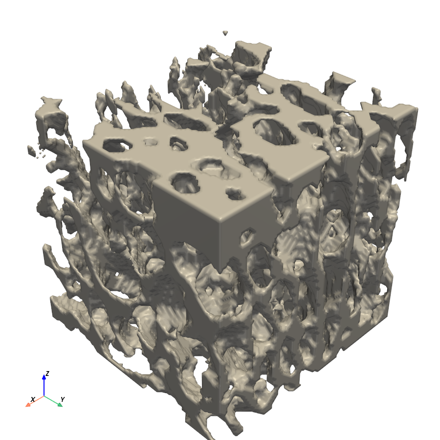
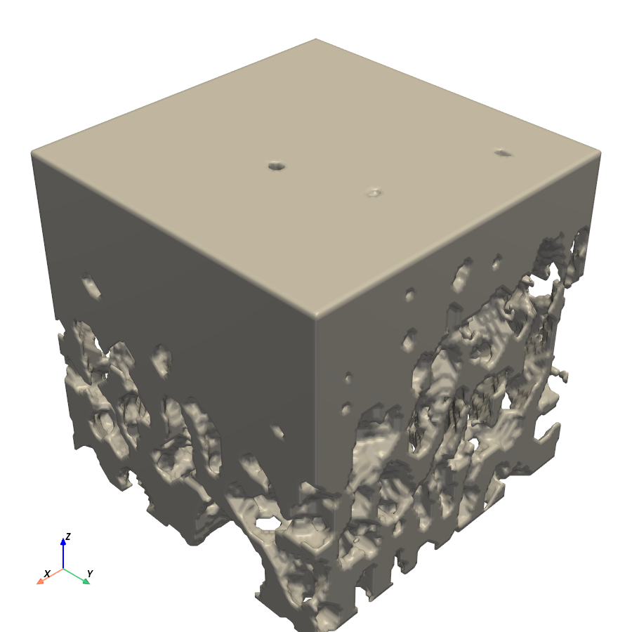
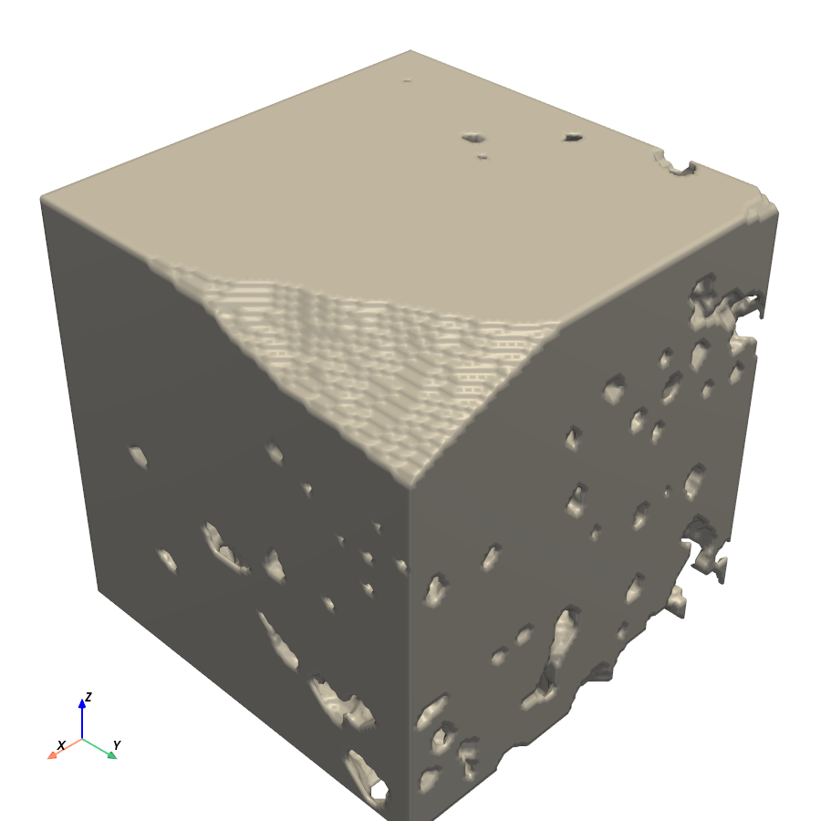
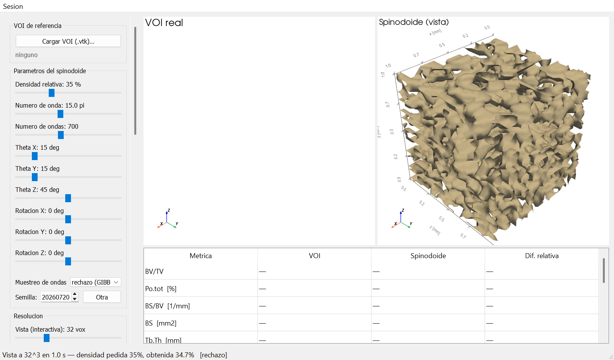
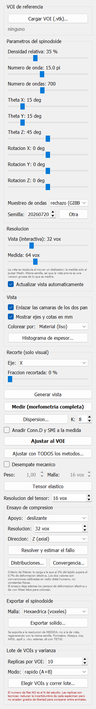
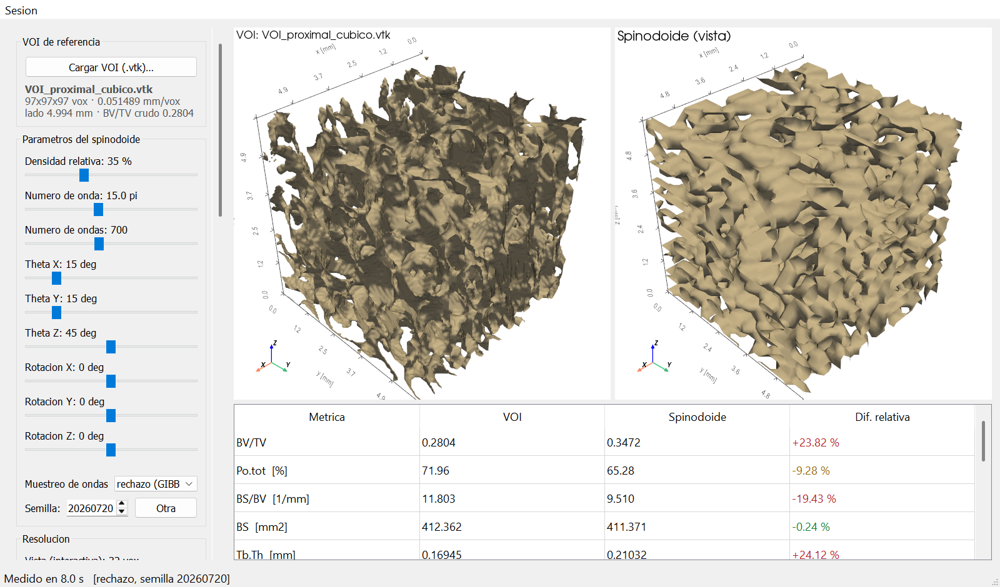
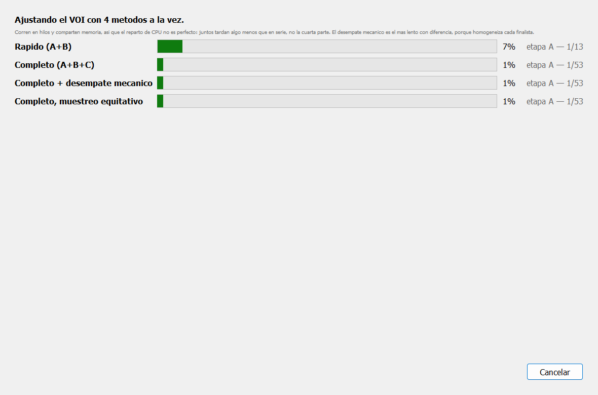
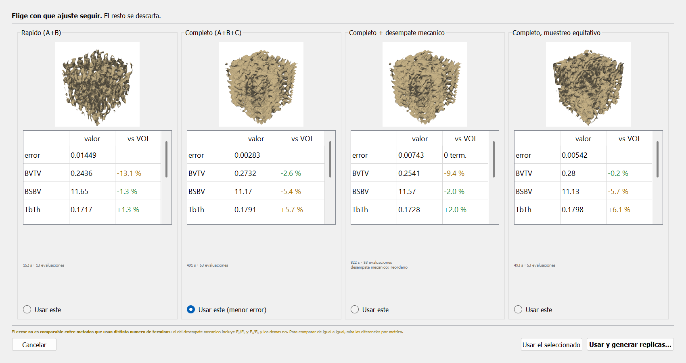

# Spinodoides como sustitutos sintéticos del hueso trabecular

**Qué son, qué métricas morfológicas reproducen y por qué permiten explorar la variabilidad microestructural cuando sólo se dispone de unos pocos VOIs biológicos**

## Qué problema hay detrás

La microtomografía de hueso trabecular entrega, por espécimen, unos pocos volúmenes de interés (VOI) utilizables. En este proyecto son cubos de 97³ vóxeles a 51,489 µm/vóxel —4,994 mm de lado— extraídos de sesamoideos equinos (H1–H8), y por hueso se toman tres sitios: proximal, medio y distal.

Ese número es suficiente para describir el material, pero no para responder preguntas del tipo *¿cuánto cae la rigidez si BV/TV baja un 10 % manteniendo la anisotropía?*. Esa pregunta exige variar un factor dejando los demás fijos, y el hueso real no se deja: en el propio sesamoideo, BV/TV y DA cambian **juntos** al recorrer los tres sitios (tabla 1). No hay especímenes con las combinaciones intermedias, y no se pueden fabricar.

Un spinodoide sí. Es una microestructura sintética con tres o cuatro mandos independientes que reproduce las métricas morfológicas del hueso trabecular, se genera en segundos y se puede llevar a cualquier punto del espacio de parámetros, incluidos los que la biología no ofrece.

> **En palabras sencillas.** Tenemos pocos trozos de hueso real y no podemos pedirle al caballo uno con la porosidad que nos convenga. El spinodoide es una imitación numérica del hueso esponjoso, con unos mandos que sí podemos girar: lo ajustamos hasta que se parezca a un trozo real y, a partir de ahí, generamos todas las variantes que el experimento necesite.

---

## Qué es un spinodoide

### Origen físico

La descomposición espinodal es el proceso por el que una mezcla inestable se separa en dos fases entrelazadas, sin nucleación: la separación arranca a la vez en todo el volumen. El resultado es una morfología bicontinua, de superficie suave, sin extremos sueltos y con una escala característica única. Congelada, y con una de las fases eliminada, esa morfología es un sólido celular abierto.

Kumar, Tan, Zheng y Kochmann (2020) observaron que no hace falta simular la cinética de Cahn-Hilliard para obtener esa geometría: basta con una construcción estadística que comparte su estructura de correlación. A la familia resultante la llamaron **spinodoides**.

### Definición operativa

Un spinodoide es el conjunto de nivel de un campo aleatorio gaussiano (GRF) construido como suma de ondas planas de una única longitud de onda y direcciones aleatorias restringidas:

```
GRF(x) = sqrt(2/N) * SUM_i  cos( beta * <n_i , x> + gamma_i )

fase solida = { x : GRF(x) <= phi_0 }
phi_0       = sqrt(2) * erf^-1( 2*rho - 1 )
```

donde `n_i` son N direcciones unitarias, `gamma_i` fases uniformes en [0, 2*pi), `beta` el número de onda y `rho` la densidad relativa objetivo. El umbral `phi_0` sale de exigir que la fracción de volumen del conjunto de nivel sea exactamente `rho` para un campo N(0,1): **la densidad se impone, no se busca**.

La anisotropía entra por las direcciones. Los vectores de onda no se muestrean sobre toda la esfera, sino dentro de **conos** de semiángulo `theta_x`, `theta_y`, `theta_z` alrededor de los ejes. Un cono estrecho concentra las ondas en un eje: el campo oscila rápido a lo largo de él y despacio en el plano perpendicular, de modo que el sólido resulta **blando** en la dirección del cono y rígido en las demás. Con esto se obtienen las tres clases clásicas —laminar, columnar y cúbica— y todo lo intermedio.

Los parámetros son, por tanto:

| Parámetro | Control en la aplicación | Qué gobierna |
|---|---|---|
| Densidad relativa | *Densidad relativa* | BV/TV, directamente y sin error |
| Número de onda | *Número de onda* (en múltiplos de pi) | la escala: Tb.Th y Tb.Sp a la vez |
| Semiángulos de cono | *Theta X / Y / Z* | la anisotropía: DA y su eje |
| Número de ondas | *Número de ondas* | la suavidad estadística del campo, no la geometría media |
| Rotación | *Rotación X / Y / Z* | la orientación del conjunto respecto a los ejes del VOI |
| Semilla | *Semilla* | qué realización concreta de la familia se obtiene |

Dos advertencias que este proyecto documenta y que conviene no perder:

- **Tb.Th y Tb.Sp no son independientes.** Las dos las fija la misma escala del campo: no se puede engrosar la trabécula sin separar más los poros. Cualquier diseño experimental que pretenda variarlas por separado está mal planteado.
- **Hay dos convenciones de muestreo de ondas** y no son equivalentes. Por *rechazo* (la de GIBBON y `AppFinal_V2.m`) se acepta un candidato isótropo si cae en cualquier cono, con lo que el reparto resulta proporcional al ángulo sólido: con thetas = (15, 45, 0) grados el cono ancho se lleva cerca del 90 % de las ondas. Por reparto *equitativo* (la del repositorio TPMS-Scaffolds-generator) cada cono recibe `num_waves / n_conos`, es decir 50/50. Producen anisotropías distintas para los mismos ángulos nominales. Ninguna es la correcta; lo que no se puede es cruzar resultados sin declarar cuál se usó. La aplicación expone las dos en el desplegable *Muestreo de ondas*.

> **En palabras sencillas.** El spinodoide se construye sumando muchas ondas con direcciones al azar y cortando el resultado por un nivel. Cuánto material queda lo decide el nivel de corte; cómo de finas son las trabéculas, la longitud de onda; y hacia dónde se orientan, los conos dentro de los que se permite que apunten esas ondas.

### Por qué esta familia y no otra

Frente a las alternativas habituales para generar andamios o sustitutos de hueso:

- **Es bicontinua y sin extremos sueltos por construcción.** No hay que limpiar islas ni muñones: la fracción portante —material en caminos que atraviesan la probeta— vale 0,999 en los tres VOIs reales de H4 y 0,987 en el spinodoide ajustado al proximal. El 1,3 % que falta son islas y muñones ciegos que el corte del campo deja sueltos dentro del cubo, no un defecto de la familia.
- **Es suave.** No tiene las aristas ni las concentraciones de tensión de las celdas unitarias tipo *lattice*, que contaminan cualquier estimación de resistencia.
- **No es periódica.** A diferencia de las TPMS (giroide, Schwarz), no repite una celda: el desorden es del tipo del que tiene el hueso, y las métricas no dependen de dónde se corte el VOI.
- **Tiene pocos parámetros y son interpretables.** Tres mandos gobiernan las tres familias de métricas que la morfometría ósea usa de verdad: cuánto material hay, a qué escala está repartido y hacia dónde se orienta.

---

## Las métricas morfológicas que reproduce

Todas se calculan con **un único motor** (`morfometria`, port de `localMorphometryFromVoxels`) aplicado igual al VOI real y al candidato sintético. Esto no es un detalle de implementación: en versiones anteriores de la aplicación el VOI y el candidato se medían con métodos distintos y sus valores se restaban como si fueran homologables. Midiéndolos igual, el sesgo del método se cancela al restar.

| Métrica | Unidad | Definición usada | Papel en el ajuste |
|---|---|---|---|
| BV/TV | — | fracción de vóxeles óseos | objetivo principal (peso 3) |
| Po.tot | % | (1 − BV/TV)·100 | redundante con BV/TV (peso 0,5) |
| BS | mm² | área por marching cubes, **sin las seis tapas del cubo** | insumo |
| BS/BV | 1/mm | BS / BV | objetivo (peso 1) |
| Tb.Th | mm | **2·BV/BS** (modelo de placas de Parfitt) | objetivo (peso 1) |
| Tb.Sp | mm | Tb.Th · (1/(BV/TV) − 1) | objetivo (peso 1) |
| Tb.N | 1/mm | (BV/TV) / Tb.Th | objetivo (peso 1) |
| DA | — | del **tensor MIL** (Harrigan y Mann 1984) | objetivo (peso 2) |
| DA2 | — | raíz de lambda2/lambda1 del mismo elipsoide | diagnóstico: separa columnar de laminar |
| Fracción portante | — | material en caminos que cruzan la probeta | se mide, no se optimiza |
| Conn.D, SMI | 1/mm³, — | Odgaard; Hildebrand | opcionales (casilla de métricas extra) |

Tres invariantes que el código protege explícitamente porque versiones anteriores de la aplicación las rompieron:

1. **Tb.Th = 2·BV/BS**, no 4·BV/BS. El segundo es el modelo de barras y duplica el valor; CTAn y Scanco publican el de placas.
2. **El DA sale del tensor MIL**, nunca de la covarianza de la nube de puntos —que mide la forma del recorte y da DA ~ 1 casi siempre, convirtiendo el segundo objetivo del ajuste en ruido. El MIL tiene un **suelo de ruido de DA ~ 1,07**: diferencias menores no son interpretables. En estructuras muy laminares el elipsoide degenera; el código acota el autovalor y marca el resultado como cota inferior.
3. **La superficie excluye las seis tapas planas del cubo**, que no son interfase ósea.

### La función de error

El ajuste minimiza un promedio ponderado de diferencias relativas al cuadrado sobre esas métricas, con pesos 3 (BV/TV), 2 (DA), 1 (BS/BV, Tb.Th, Tb.Sp, Tb.N) y 0,5 (Po.tot). El detalle que importa: la suma se divide por el peso **efectivamente utilizado**. Si un término no se puede calcular, no se salta en silencio —hacerlo premiaba justamente a las geometrías degeneradas, que son las que más métricas hacen fallar.

---

## Los VOIs reales de partida

Las tres figuras siguientes son los VOIs cúbicos del sesamoideo H4, tal como los lee la aplicación: 97³ vóxeles a 51,489 µm, 4,994 mm de lado.

Una aclaración sobre el dibujo. El área **se mide sin las seis tapas del cubo**, porque no son interfase ósea; pero dibujar esa superficie sin tapas es engañoso a densidad alta: sólo quedan las paredes de los poros y la pieza parece mucho más porosa de lo que es. Para estas tres figuras el volumen se rodea de una capa de fondo antes de contornear, de modo que el sólido aparece cerrado contra las caras. Cambia la figura, no la medida: las tapas añaden 55,8 mm² sobre los 412,4 mm² del VOI proximal, y la tabla 1 está calculada sin ellas.







**Tabla 1 — morfometría medida de los tres VOIs de H4**, con el motor único y sin métricas extra:

| Métrica | proximal | medio | distal |
|---|---|---|---|
| BV/TV | 0,2804 | 0,5430 | 0,7652 |
| Po.tot [%] | 71,96 | 45,70 | 23,48 |
| BS [mm²] | 412,36 | 370,22 | 297,20 |
| BS/BV [1/mm] | 11,803 | 5,473 | 3,118 |
| Tb.Th [mm] | 0,1694 | 0,3654 | 0,6415 |
| Tb.Sp [mm] | 0,4348 | 0,3076 | 0,1969 |
| Tb.N [1/mm] | 1,655 | 1,486 | 1,193 |
| DA (MIL) | 1,509 | 1,367 | 1,208 |
| DA2 | 1,181 | 1,117 | 1,093 |
| Fracción portante | 0,9988 | 0,9999 | 1,0000 |

Esta tabla es, por sí sola, el argumento del documento: **BV/TV y DA recorren el hueso acopladas**. Del proximal al distal la densidad se multiplica por 2,7 mientras la anisotropía cae de 1,51 a 1,21, y no hay ningún espécimen con densidad alta y anisotropía alta, ni al revés. Con tres puntos, y los tres correlacionados, no se puede separar el efecto de una variable del de la otra sobre la rigidez.

---

## Cómo trabaja la aplicación

La interfaz muestra siempre **dos paneles enlazados**: el VOI real a la izquierda y el candidato sintético a la derecha, con las cámaras sincronizadas y a la misma escala física, y debajo la tabla de métricas comparadas con su diferencia relativa.



El panel de control reúne todas las opciones en el orden en que se usan: cargar el VOI, mover los parámetros, elegir la resolución, generar y medir, ajustar, homogeneizar, ensayar a compresión, exportar y correr un lote.



Al cargar un VOI, el candidato se reescala al tamaño físico del VOI para que las métricas en milímetros sean comparables. La medición se lanza aparte y llena la tabla:



La búsqueda del mejor candidato es escalonada, en tres etapas: (A) rejilla de densidad por número de onda, (B) barrido de presets de ángulos de cono —incluidas las permutaciones, porque el ángulo grande marca el eje **blando** y sin permutar sólo se podía orientar la estructura de una manera— y (C) refinado. Dos correcciones recientes gobiernan su alcance: el número de onda se recorre en todo su rango útil [8, 25] —antes se quedaba en una ventana alrededor del deslizador y nunca llegaba a 25, lo que sobreestimaba Tb.Th en torno al 43 % en trabéculas finas— y los ángulos se barren en vez de quedarse fijos —antes el candidato salía casi isótropo, DA ~ 1,1-1,2, incapaz de alcanzar el DA ~ 1,5 del proximal equino.

---

## Ajustar con todos los métodos a la vez

El botón *Ajustar con TODOS los métodos* abre una ventana que lanza cuatro variantes del ajuste **a la vez**, cada una en su propio hilo y con su barra de progreso.



Las cuatro variantes no son cuatro optimizadores distintos disfrazados; son cuatro decisiones distintas sobre el mismo algoritmo:

| Variante | Qué cambia |
|---|---|
| **Rápido (A+B)** | rejilla gruesa y 4 presets de ángulos, sin refinado. Para cuando hacen falta muchos ajustes. |
| **Completo (A+B+C)** | rejilla fina, 14 presets y etapa de refinado. Es el método de referencia del proyecto. |
| **Completo + desempate mecánico** | además homogeneiza cada finalista y los reordena por rigidez, para que no gane uno que reproduce la morfometría pero no el comportamiento elástico. Es el más lento con diferencia. |
| **Completo, muestreo equitativo** | el mismo algoritmo con el otro reparto de ondas entre conos. Con conos desiguales da anisotropías distintas para los mismos ángulos. |

Al terminar, la ventana pasa a la comparativa: una columna por método, con su vista previa, sus métricas frente al VOI y su error. Se elige uno y el resto se descarta; los parámetros del elegido pasan a los deslizadores de la ventana principal.



**Tabla 2 — resultado de la ejecución de la figura** (VOI proximal de H4, semilla 20260720, 700 ondas):

| Método | Error | Evaluaciones | Tiempo | BV/TV vs VOI | Tb.Th vs VOI |
|---|---|---|---|---|---|
| Rápido (A+B) | 0,01449 | 13 | 152 s | −13,1 % | +1,3 % |
| **Completo (A+B+C)** | **0,00283** | 53 | 491 s | −2,6 % | +5,7 % |
| Completo + desempate mecánico | 0,00743 | 53 | 822 s | −9,4 % | +2,0 % |
| Completo, muestreo equitativo | 0,00542 | 53 | 493 s | −0,2 % | +6,1 % |

Dos lecturas de esta tabla. La primera: el modo rápido cuesta la tercera parte del tiempo y da cinco veces más error, lo que fija para qué sirve cada uno —el rápido para barrer muchos VOIs, el completo para producir un resultado. La segunda: el muestreo equitativo acierta mejor la densidad (−0,2 %) y peor el espesor (+6,1 %) que el de rechazo con los mismos ángulos nominales, que es exactamente la consecuencia esperable de repartir las ondas de otra manera.

Esta ejecución se repitió dos veces y los cuatro errores salieron **idénticos hasta el último dígito**; sólo cambiaron los tiempos. Es la comprobación de que la semilla fija hace reproducible un generador que es estocástico.

Una advertencia sobre esa columna de error: **no es comparable entre métodos que usan distinto número de términos**. El error del desempate mecánico incluye los dos términos elásticos y el de los demás no; por eso la ventana muestra el número de términos junto al error. Compararlos sin mirar esa columna lleva a elegir el método que menos términos consiguió calcular.

Elegido el candidato, sus parámetros pasan a los deslizadores y la ventana principal muestra el resultado del ajuste frente al VOI real:


**Tabla 3 — VOI proximal de H4 frente al spinodoide ajustado** (método completo, error 0,00283):

| Métrica | VOI real | Spinodoide ajustado | Diferencia |
|---|---|---|---|
| BV/TV | 0,2804 | 0,2732 | −2,6 % |
| BS/BV [1/mm] | 11,803 | 11,167 | −5,4 % |
| Tb.Th [mm] | 0,1694 | 0,1791 | +5,7 % |
| Tb.Sp [mm] | 0,4348 | 0,4764 | +9,6 % |
| Tb.N [1/mm] | 1,655 | 1,526 | −7,8 % |
| DA (MIL) | 1,509 | 1,446 | −4,2 % |
| Fracción portante | 0,9988 | 0,9866 | — |

El DA alcanzado, 1,45 frente al 1,51 del hueso, es la medida de hasta dónde llega la familia en este caso: la diferencia (0,06) es del orden del suelo de ruido del propio MIL (~0,07), de modo que **no es distinguible del ruido del estimador**. Con la versión anterior del ajuste, que no barría los ángulos de cono, el candidato se quedaba en DA ≈ 1,1–1,2 y la diferencia sí era real.

Nótese también que Tb.Sp se va un +9,6 % en la dirección contraria a Tb.Th: es la manifestación del acoplamiento entre las dos, que comparten la escala del campo y no se pueden ajustar por separado.

---

## Para qué sirve todo esto cuando hay pocos VOIs

Aquí está el argumento completo, y también su límite.

### Lo que las realizaciones sintéticas sí compran

Ajustado un spinodoide a un VOI real, se dispone de un **generador** de estructuras estadísticamente equivalentes a ese VOI, con parámetros conocidos y reproducibles bit a bit desde la semilla. Eso permite cuatro cosas que el material real no permite:

1. **Experimentos numéricos controlados.** Variar BV/TV manteniendo DA fijo, o al revés, y medir el efecto sobre el tensor elástico homogeneizado y sobre la carga de fallo estimada. Es exactamente lo que la tabla 1 impide hacer con los VOIs reales, porque en ellos las dos variables van juntas.
2. **Rellenar los huecos del muestreo.** Entre BV/TV = 0,28 y 0,54 no hay ningún espécimen; sintéticamente se puebla ese intervalo con la densidad que se quiera.
3. **Reducir la incertidumbre de la estimación de cada espécimen.** Promediando K realizaciones del mismo ajuste, la componente de varianza del generador se divide por K.
4. **Alimentar un modelo sustituto estructura → propiedad.** Con suficientes pares (parámetros, rigidez) se puede ajustar una superficie de respuesta y predecir sin volver a homogeneizar.

El recorrido completo dentro de la aplicación es: ajustar, homogeneizar (tensor elástico periódico sobre la malla de vóxeles), ensayar a compresión con el criterio de Pistoia para estimar la carga de fallo y, si hace falta un análisis mayor, exportar el sólido a Abaqus o ANSYS. El panel de lote automatiza ese recorrido sobre varios VOIs y varias réplicas, y produce una tabla con las columnas de animal, sitio y réplica separadas —sin esa estructura no se puede descomponer la varianza después.

### Lo que NO compran, y hay que decirlo antes

**Generar K réplicas de un VOI no da N = K. Da N = 1 con K réplicas técnicas.** Tratarlas como especímenes independientes es pseudorreplicación: infla los grados de libertad, estrecha artificialmente los intervalos de confianza y convierte cualquier diferencia en significativa.

La razón es que la varianza total se descompone en dos:

```
sigma^2_total = sigma^2_entre + sigma^2_dentro
```

`sigma^2_entre` es la variabilidad biológica entre especímenes; `sigma^2_dentro`, el ruido del generador. Promediar K réplicas divide la segunda por K y **deja la primera intacta**. Para una afirmación sobre "el hueso sesamoideo equino", los grados de libertad los ponen los caballos, no las realizaciones. Por eso la aplicación calcula el **N efectivo** y el ICC junto a cualquier tabla de réplicas, y la ventana de réplicas avisa expresamente de que esas filas no son especímenes.

Para sostener que los sintéticos **sustituyen** a los reales en alguna métrica no basta con no rechazar la hipótesis nula —con N pequeño no se rechaza nunca y con N grande se rechaza siempre—: hay que demostrar equivalencia con una prueba TOST contra un margen declarado de antemano. El margen razonable es el propio suelo de ruido del generador: pedir más sería exigir que el sintético se parezca al real más de lo que el real se parece a sí mismo.

> **En palabras sencillas.** Los spinodoides sirven para hacer experimentos que con el hueso real no se pueden hacer, y para medir mejor cada trozo que sí tenemos. Lo que no hacen es multiplicar el número de caballos. Si se generan mil estructuras sintéticas a partir de tres VOIs, el estudio sigue teniendo tres VOIs.

### Límites de la propia familia

- **Tb.Th y Tb.Sp están acopladas** por la escala del campo: no hay diseño experimental que las separe.
- El DA alcanzable tiene techo, y el **suelo de ruido del MIL (~ 1,07)** marca el mínimo por debajo del cual dos estructuras no se distinguen en anisotropía.
- El generador es **estocástico**: dos llamadas con los mismos parámetros y distinta semilla dan realizaciones distintas. Todo lo que se publique debe declarar la semilla; la aplicación fija 20260720 en los optimizadores y guarda la semilla en cada fila de resultados.
- A densidades altas —el VOI distal, BV/TV = 0,77— la descripción trabecular pierde sentido para el hueso y para el spinodoide por igual. Los ajustes en ese régimen se leen con cautela.

---

## Referencias

- Kumar, S., Tan, S., Zheng, L., Kochmann, D. M. (2020). *Inverse-designed spinodoid metamaterials.* npj Computational Materials 6.
- Parfitt, A. M. et al. (1987). *Bone histomorphometry: standardization of nomenclature, symbols and units.* Journal of Bone and Mineral Research 2, 595-610.
- Harrigan, T. P., Mann, R. W. (1984). *Characterization of microstructural anisotropy in orthotropic materials using a second rank tensor.* Journal of Materials Science 19, 761-767.
- Odgaard, A. (1997). *Three-dimensional methods for quantification of cancellous bone architecture.* Bone 20, 315-328.
- Hildebrand, T., Rüegsegger, P. (1997). *Quantification of bone microarchitecture with the structure model index.* Computer Methods in Biomechanics and Biomedical Engineering 1, 15-23.
- Andreassen, E., Andreasen, C. S. (2014). *How to determine composite material properties using numerical homogenization.* Computational Materials Science 83, 488-495.
- Pistoia, W. et al. (2002). *Estimation of distal radius failure load with micro-finite element analysis models.* Bone 30, 842-848. Sus dos parámetros —2 % del tejido, 0,7 % de deformación— se calibraron en radio distal humano y **no son constantes físicas**.
- Hurlbert, S. H. (1984). *Pseudoreplication and the design of ecological field experiments.* Ecological Monographs 54, 187-211.
